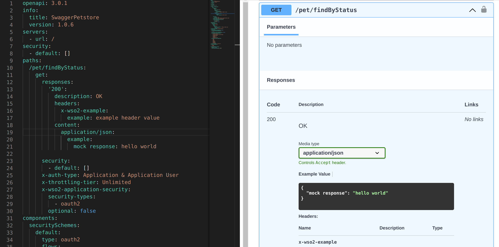

# Deploying a REST API with a Mock Implementation

In addition to exposing an existing backend implementation as an API, Choreo Connect is also capable of responding to HTTP requests even without a backend. By changing the endpoint type to **Mock Implementation**, you can make Choreo Connect read the examples you have provided in the OpenAPI definition and respond to each HTTP request accordingly. While it supports default responses, you can also request specific responses using the HTTP headers `Prefer` and `Accept`.

Pick a method given below to start creating an API with a Mock Implementation.

|**Mode**         | **Method**    |
|--------------|-----------|
|[Choreo Connect with WSO2 API Manager as a Control Plane](../concepts/apim-as-control-plane)   | [Via WSO2 API Manager Publisher Portal](#via-wso2-api-manager-publisher-portal)  |
|[Choreo Connect as a Standalone Gateway](../concepts/as-a-standalone-gateway)  |[Via apictl for Standalone Mode](#via-apictl-for-standalone-mode) |

### Mock Implementation with OpenAPI examples

!!! abstract
    --8<-- "api-manager/4.2.0/includes/design/add-oas-example.md"
    
## Via WSO2 API Manager Publisher Portal
### Step 1 - Create a REST API

1. Start the WSO2 API Manager server with Choreo Connect as the Gateway.

2. Open API Publisher in the browser and create a REST API with the following values. 

    | **Field**    | **Value**                        |
    |----------|-------------------------------------|
    | Name     | SwaggerPetstore                     |
    | Context  | /v3                                 |
    | Version  | 1.0.6                               |
    | Endpoint | Leave the endpoint field empty. |

### Step 2 - Implement the API

<a name="step-21-update-the-openapi-specification"></a>
#### Step 2.1 - Update the OpenAPI Specification

1. Navigate to **API Definition** under **API Configurations** to view the OpenAPI specification.

2. Click **edit** to add mock examples to required resources.

    [](../../../../assets/img/learn/prototype-api/mock-impl-edit-api-definition.png)

    Replace the default resources with the resource definitions given below.

3. Add response examples to OpenAPI Specification.    

    Update the OpenAPI definition referring to the examples given in [Mock Implementation with OpenAPI examples](#mock-implementation-with-openapi-examples). You could also directly copy paste the sample for [OpenAPI definition for Mock Implementation](https://github.com/wso2/product-microgateway/blob/main/samples/openAPI-definitions/mock-impl-sample.yaml).

4. After adding examples to the OpenAPI specification, remember to click **Update Content** and **Save**.

#### Step 2.2 - Change the Endpoint Type

1. Navigate to **Endpoints** under **API Configurations**.

2. Select **Mock Implementation** as the endpoint type by clicking **Add**. 

3. Select Choreo Connect as the gateway type. 

4. Click **proceed** if a dialog box appears to disregard "mock endpoint implementation scripts". 

5. View the mock examples that would be returned for each resource. If you need to modify the examples, you have to edit the API definition as mentioned before.

6. Click **Save** to enable mock implementation with OAS examples.

### Step 3 - Deploy the API

Deploy the API from the **Deployments** tab from the left menu.

### Step 4 - Invoke the API

Invoke the API using the commands given in the [Invoke the API](#invoke-the-api) section.

## Via apictl for Standalone Mode

1. Initialize an API Project.

    Use the following command to initialize an API. This is a sample OpenAPI definition containing example responses that will be referred by Choreo Connect to respond to API calls. Refer to [Updating the OpenAPI definition to generate a Mock Implementation](#step-21-update-the-openapi-specification) for more information.

    ```bash
    apictl init petstore --oas https://raw.githubusercontent.com/wso2/product-microgateway/main/samples/openAPI-definitions/mock-impl-sample.yaml
    ```

2. Update the API Project.

    Open the **api.yaml** file inside the API project and update `endpointImplementationType` to `MOCKED_OAS`.

    ```
    endpointImplementationType: MOCKED_OAS
    ```

3. Deploy the API using the commands given in [Deploy REST API - Standalone Mode](deploy-rest-api-in-choreo-connect#via-apictl-for-standalone-mode)

4. Invoke the API the using the commands given below. 

## Invoke the API

--8<-- "api-manager/4.2.0/includes/obtain-jwt.md"

Use the command given below to get the default response for the resource `/pet/findByStatus`.

```bash
curl -X GET "https://localhost:9095/v3/1.0.6/pet/findByStatus" -H "Accept: application/json" -H "Authorization:Bearer $TOKEN" -k 
```

!!! example

    Execute the following commands to get different responses based on the examples you provided.
   
    **Default response** for `/pet/findByTag`

    ```bash
    curl -X GET "https://localhost:9095/v3/1.0.6/pet/findByTag" -H "Accept: application/json" -H "Authorization:Bearer $TOKEN" -k
    ```

    Response based on **example Reference 1** for `/pet/findByTag`

    ```bash
    curl -X GET "https://localhost:9095/v3/1.0.6/pet/findByTag" -H "Prefer: example=ref1" -H "Accept: application/json" -H "Authorization:Bearer $TOKEN" -k
    ```

    Response based on **example for response code 50X** for `/pet/findByTag`

    ```bash
    curl -v -X GET "https://localhost:9095/v3/1.0.6/pet/findByTag" -H "Prefer: code=503" -H "Accept: application/json" -H "Authorization:Bearer $TOKEN" -k
    ```

    Response based on **example reference 1** of **response codes 50X**  for `/pet/findByTag`

    ```bash
    curl -v -X GET "https://localhost:9095/v3/1.0.6/pet/findByTag" -H "Prefer: code=503, example=ref1" -H "Accept: application/json" -H "Authorization:Bearer $TOKEN" -k
    ```

## See Also

- [Mock Implementation with Choreo Connect](../../../../design/prototype-api/create-mocked-oas-api)
- [Prototyped APIs (Pre-Released APIs)](../../../../design/prototype-api/overview)
- [Enforcer Test Key (JWT)](../security/generate-a-test-jwt)