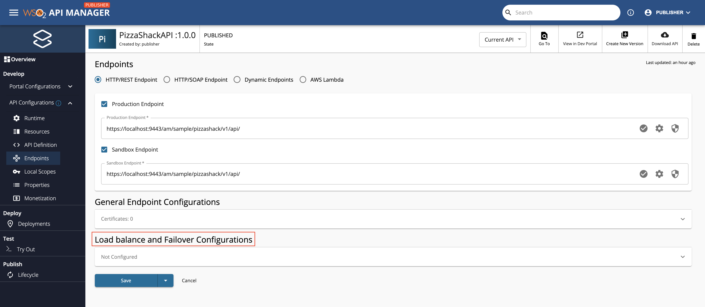
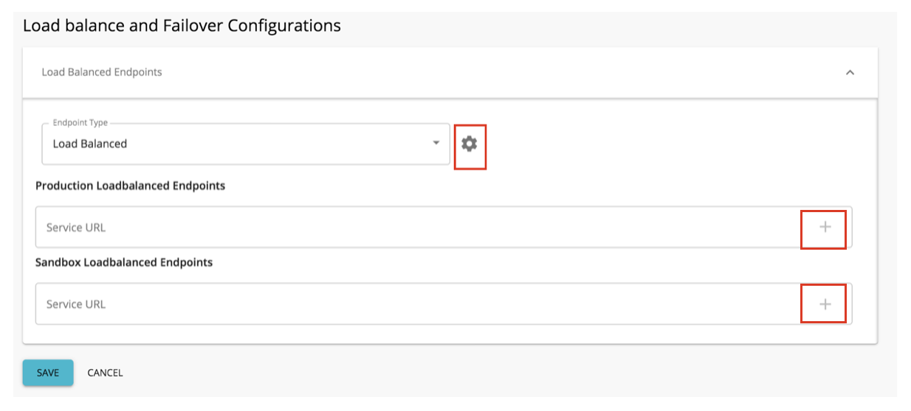

# Load Balanced Endpoints

When you use Load Balanced API Endpoints, the traffic that comes to the resource is routed to the mentioned endpoint addresses based on the round-robin algorithm. You can enable load balancing capabilities when working with Choreo Connect (CC) in the following two modes.

- [Load Balanced Endpoints With WSO2 API Manager](load-balanced-endpoints#choreo-connect-with-wso2-api-manager-as-a-control-plane)
- [Load Balanced Endpoints With APICTL (WSO2 API Controller)](load-balanced-endpoints#choreo-connect-as-a-standalone-gateway)

## Choreo Connect with WSO2 API Manager as a Control Plane

Follow the instructions below to enable load balancing capabilities when using Choreo Connect with WSO2 API Manager as the Control Plane:

!!! Important
    Currently WSO2 API Manager allows to add load balanced endpoints only to the API level.

### Step 1 - Define the Load Balanced Endpoints in the Publisher

After creating an API in the APIM publisher, select the API you want to apply load balanced capability.
 
1.  Click **Develop -> API Configurations -> Endpoints**.

    1. Under the **Load balanced and Failover Configurations** and select the endpoint type as **Load Balanced**.

    2. Provide the service URLs that you want to handle load balancing.

    !!! info
        Click the + sign in the text box after adding each service URL to provide multiple service endpoints.

    [](../../../../assets/img/learn/load-balance-and-fail-over.png)

    [](../../../../assets/img/learn/load-balanced-configurations.png)
    
2.  Click **Save & Deploy**.

!!! warning
    The endpoint URLs that you provide as the load balance endpoints should have the same base path as in the `x-wso2-production-endpoints`.
    If you define some other base path, it will not result in the expected behaviour.

### Step 2 - Invoke API Endpoint Via The Choreo Connect

After obtaining a valid JWT token, you can invoke APIs as described [here](../getting-started/quick-start-guide-docker-with-apim#step-7-invoke-the-api-from-developer-portal). 
When invoking the API, traffic will route to the load balanced endpoints you defined above.

Example is given below:

``` java
curl -k -X GET "https://localhost:9095/pizzashack/1.0.0/menu" -H "accept: application/json" -H "Authorization: Bearer <COPIED_TOKEN>"
```

## Choreo Connect as a Standalone Gateway

Follow the instructions below to enable load balancing capabilities when using Choreo Connect as a standalone gateway:

In this approach you can define load balanced endpoints in API level as well as in resource level. The below section demonstrates how load balanced endpoints can be defined in those two levels.

### Step 1 - Define Load Balanced Endpoints In The OpenAPI Definition file

### Load Balanced Endpoints In API Level

Below section demonstrates how to define load balanced endpoints for API level in an OpenAPI definition file.

=== "Format"
    ``` yaml
    openapi: <version>
    ...
    x-wso2-production-endpoints:
      urls:
        - <URL1>
        - <URL2>
      type: load_balance
    ...
    ```

=== "Example"
    ``` yaml
    ...
    x-wso2-production-endpoints:
      urls:
        - http://localhost:2380/v2
        - http://localhost:2381/v2
      type: load_balance
    ...
    ```

### Load Balanced Endpoints In Resource Level

Below section demonstrates how to define load balanced endpoints for resource level in an OpenAPI definition file.

=== "Format"
    ``` yaml
    openapi: <version>
    ...
    paths:
      "/<path>":
        <operation>:
        x-wso2-production-endpoints:
        urls:
          - <URL1>
          - <URL2>
        type: load_balance
    ```

=== "Example"
    ``` yaml
    paths:
      "/pet/findByStatus":
        get:
          responses:
            '200':
              description: OK
        ...
        x-wso2-production-endpoints:
        urls:
          - http://localhost:2380/v1
          - http://localhost:2380/v1
        type: load_balance
      "/pet/{petId}":
        get:
          responses:
            '200':
              description: OK
    ...
    ```

!!! warning
    The endpoint URLs that you provide as load balance endpoints should have the same base path as in the `x-wso2-production-endpoints`.
    If you define some other base path, it will not result in the expected behaviour.

### Step 2 - Deploy the API Project And Invoke With Load Balanced Endpoints

After defining API in the OpenAPI definition file, you can deploy it and invoke as explained [here](../getting-started/deploy/cc-as-a-standalone-gateway-on-docker#step-1-download-and-setup-the-choreo-connect-distribution-and-apictl).