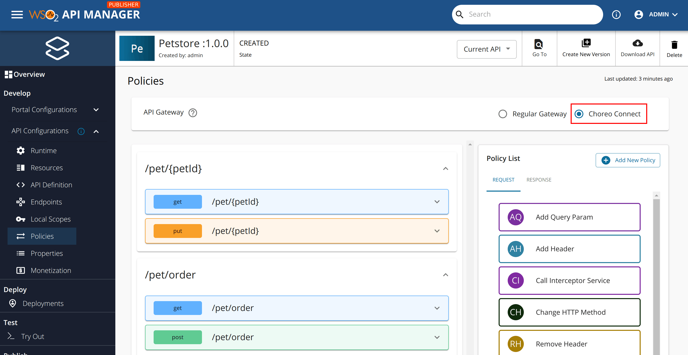

# Choreo Connect API Policies

Choreo Connect supports API policies at the HTTP method level for request and response flows. Follow the steps given below to add policies to an API.

1. Open the API Manager Publisher Portal.
2. Select the API.
3. Click **Policies** under **API Configurations** in the left menu.
4. Select **Choreo Connect** as the Gateway type. 
5. Then, drag and drop the policies to the relevant flow in the required order.
6. Scroll to the bottom of the page, click the arrow next to **Save**, and click **Save and deploy**.

[{: style="width:90%"}](../../../assets/img/design/api-policies/choreo-connect-policy.png)

Following are the policies supported by Choreo Connect.

## Request flow policies

- Add header
- Remove header
- Remove Query Parameter
- Rewrite Resource Path
- Change HTTP Method
- Validate Request with OPA
- Call Interceptor Service

## Response flow policies

- Add header
- Remove header
- Call Interceptor Service

## See also

- [Attaching Policies](../attach-policy)
- [API Policies Overview](../overview)
- [Policy to Validate Request with Open Policy Agent](../../../deploy-and-publish/deploy-on-gateway/choreo-connect/security/api-authorization/opa-validation)
- [Custom Policies](create-custom-cc-policy)
- [Message Transformation with Interceptors](../../../deploy-and-publish/deploy-on-gateway/choreo-connect/message-transformation/message-transformation-overview)
- [Request Flow Custom Filters](../../../deploy-and-publish/deploy-on-gateway/choreo-connect/extensions/custom-filters)