# Applying Security to a Proxy Service

Follow the instructions below to apply security to a proxy service via WSO2 Integration Studio:

## Prerequisites

Be sure to [configure a user store](../../../install-and-setup/setup/mi-setup/user_stores/setting_up_a_userstore) for the Micro Integrator and add the required users and roles.

## Step 1 - Create the security policy file

Follow the instructions given below to create a **WS-Policy** resource in your registry project. This will be your security policy file.

1. Create a [registry resource project](../create-integration-project#sub-projects).

2. Right-click on the registry resource project in the left navigation panel, click **New**, and then click **Registry Resource**. 
    
     The **New Registry Resource** window appears.

    [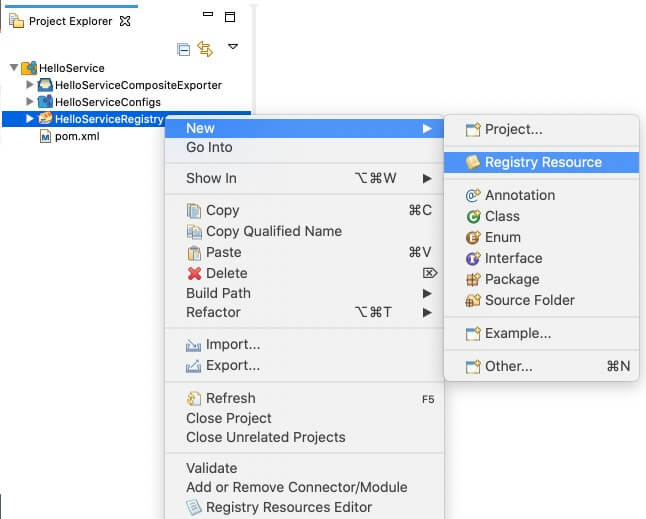](../../../assets/img/integrate/apply-security/119130870/119130887.jpg)

3.  Select **From existing template** and click **Next**.

    [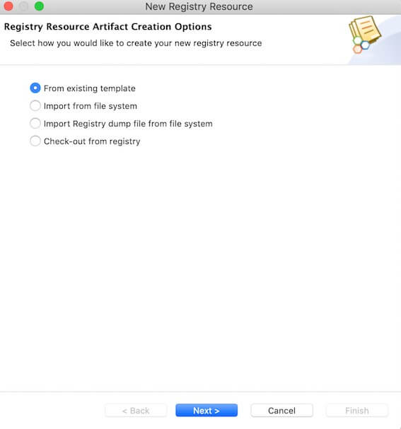](../../../assets/img/integrate/apply-security/119130870/119130886.jpg)

4.  Enter a resource name and select the **WS-Policy** template along with the preferred registry path.  

    [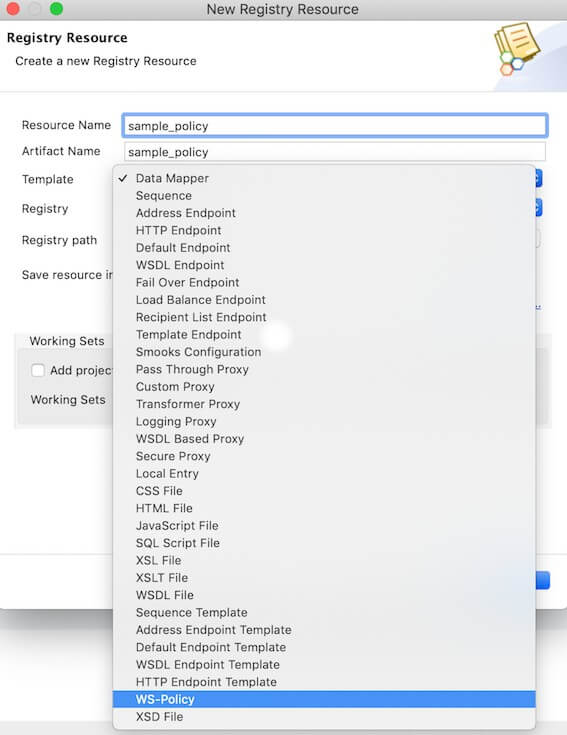](../../../assets/img/integrate/apply-security/119130870/119130885.jpg)

    [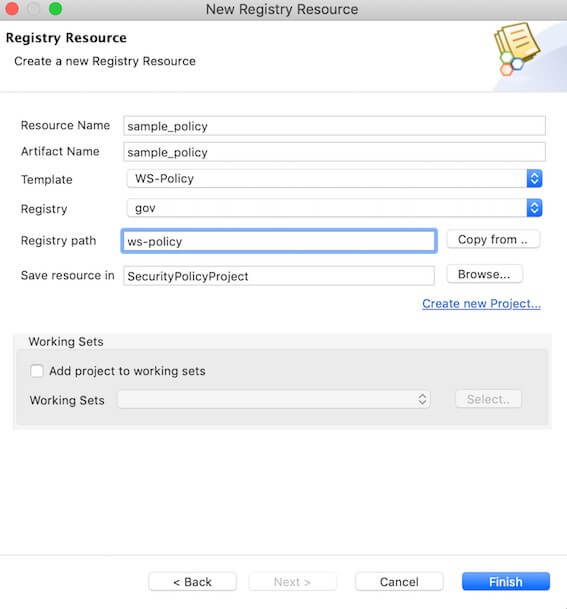](../../../assets/img/integrate/apply-security/119130870/119130884.jpg)

5.  Click **Finish**. 

     The policy file is now listed in the project explorer as shown below.

    [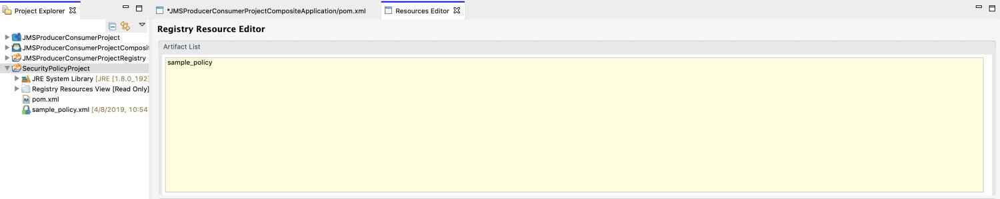](../../../assets/img/integrate/apply-security/119130870/119130883.jpg)
      
6.  Double-click on the policy file to open the file. 

     Note that you get a **Design View** and **Source View** of the policy.

7.  Let's use the **Design View** to enable the required security scenario. 

     For example, enable the **Sign and Encrypt** security scenario as shown below.

    !!! Tip
        Click the icon next to the scenario to get details of the scenario.
    
    [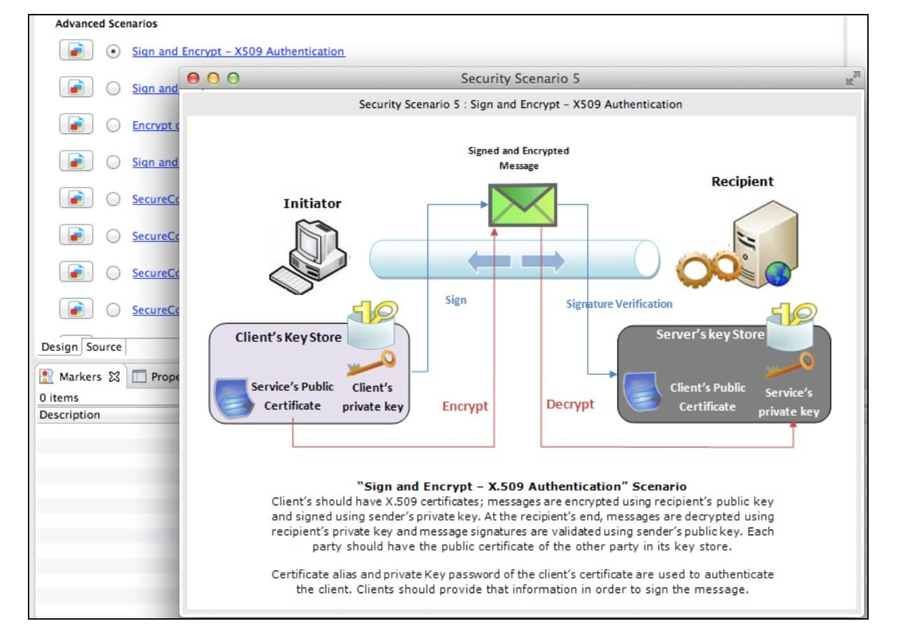{: style=width:90%}](../../../assets/img/integrate/apply-security/119130870/119130882.jpg)

8.  You can also provide encryption properties, signature properties, and advanced rampart configurations as shown below.

    **Encryption/Signature Properties**

    [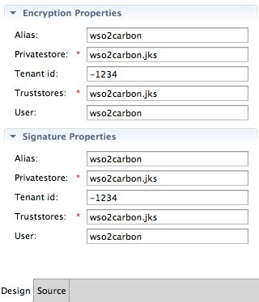](../../../assets/img/integrate/apply-security/119130870/119130890.jpg)

    **Rampart Properties**

    [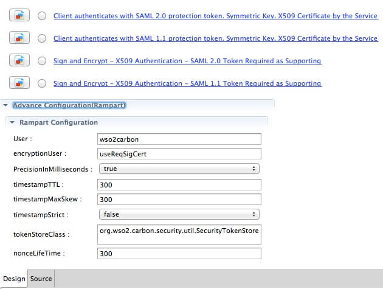](../../../assets/img/integrate/apply-security/119130870/119130889.jpg)
    
    !!! Info 
        - Change the tokenStoreClass in the policy file to `org.wso2.micro.integrator.security.extensions.SecurityTokenStore`
        
        - Replace ServerCrypto class with `org.wso2.micro.integrator.security.util.ServerCrypto` if present.
        
<!--
#### Specifying role-based access?

For certain scenarios, you can specify user roles. After you select the
scenario, scroll to the right to see the **User Roles** button.

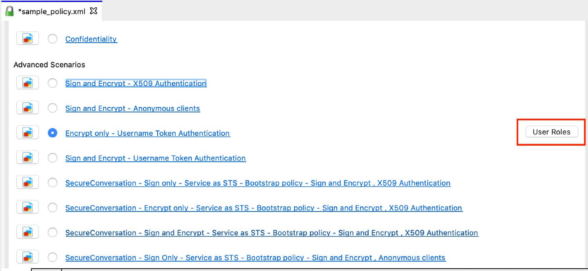

Either define the user roles inline or retrieve the user roles from the server.

-   **Define Inline**
    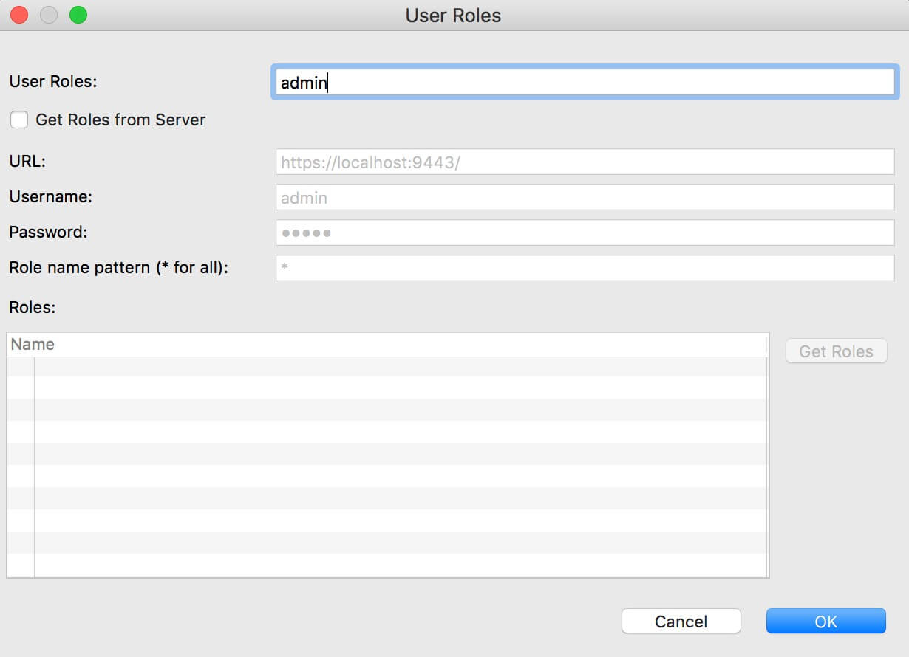

-   **Get from the server**
    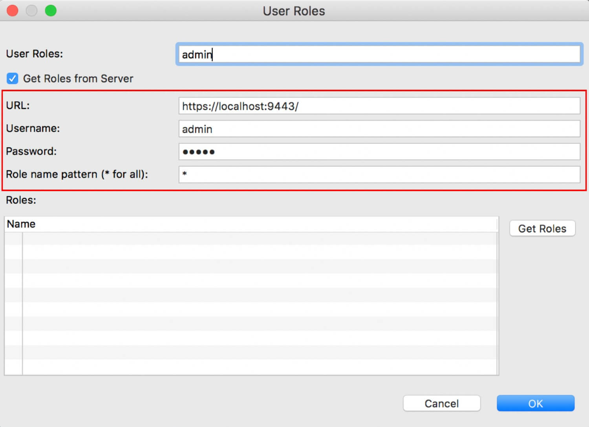

!!! Info
    By default, the role names are not case sensitive. If you want to make them case sensitive, add the following property in the `<MI_HOME>/conf/deployment.yaml` file.        
     ```toml
     [authorization_manager]
     properties.CaseSensitiveAuthorizationRules = "true"
     ```
-->

## Step 2 - Add the security policy to the proxy service

1.  Add a proxy service to your workspace.

     You can do either one of the following actions for this purpose.

    - [Create a new proxy service](../creating-artifacts/creating-a-proxy-service)
    - [Import an existing proxy service](../importing-artifacts)

2.  Double-click the proxy service on the project explorer to open the file and click on the service on design view.

3.  Select the **Security Enabled** property in the **Properties** tab.

    [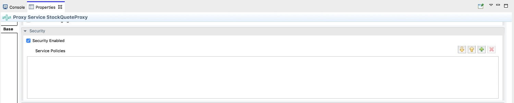](../../../assets/img/integrate/apply-security/119130870/119130879.jpg)

4.  Select the **Browse** icon for the **Service Policies** field. In the dialog box that opens, create a new record and click the **Browse** icon to open the **Resource Key** dialog as shown below.  

    [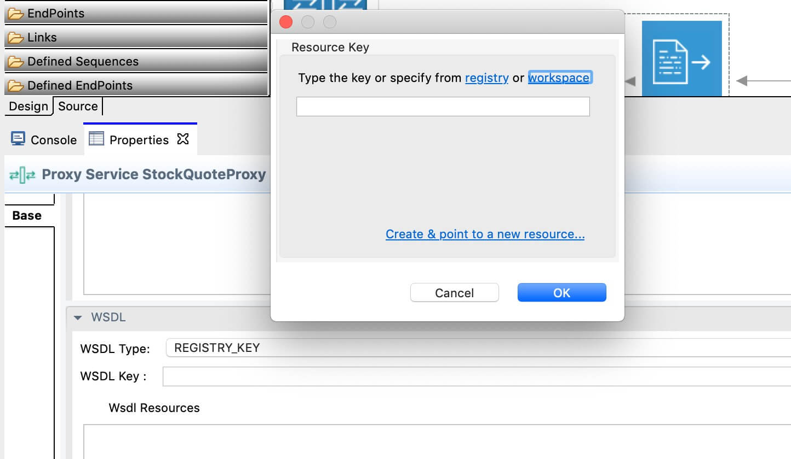{: style=width:80%}](../../../assets/img/integrate/apply-security/119130870/119130877.jpg)

5.  Click **workspace**, to add the security policy from the current workspace. You can select the path to the `sample_policy.xml` file that you created in the previous steps.  

    [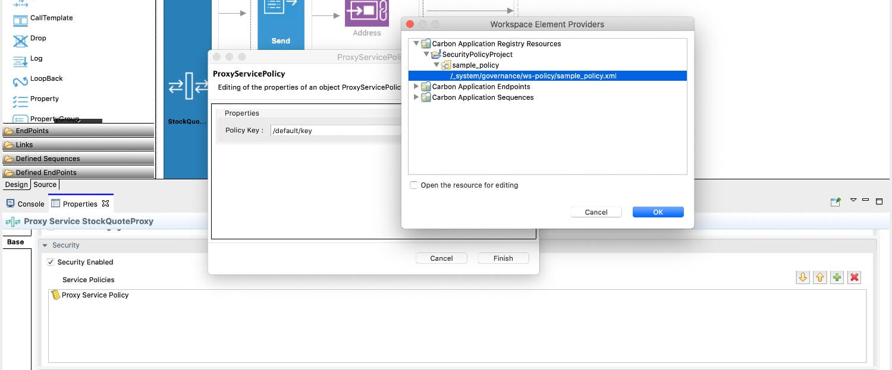](../../../assets/img/integrate/apply-security/119130870/119130876.jpg)

6.  Save the proxy service file.

## Step 3 - Package the artifacts

[Package the artifacts into a composite application project](../packaging-artifacts).

## Step 4 - Build and run the artifacts

[Deploy the artifacts](../deploy-artifacts).

## Step 5 - Testing the service

Create a Soap UI project with the relevant security settings and then send the request to the hosted service.

### General guidelines on testing with SOAP UI

1.  Create a "SOAP Project" in SOAP UI using the WSDL URL of the proxy service.

     Example: `http://localhost:8280/services/SampleProxy?wsdl`

    

2.  Double click on the created SOAP project, click on **WS-Security-Configuration**, **Keystores**, and add the WSO2 keystore.

    
    
3.  Enter the keystore password for the keystore configuration.

4.  Click on **Outgoing WS-Security Configuration**, and add a new policy by specifying a name. 

     The name can be anything.

    
    
5.  Add the required WSS entries for the created configuration.
   
     What you need add will vary according to the policy you are using. The explanation about adding three main sections is given below.

    - **Adding a Signature**  
    
         <a href="../../../../assets/img/integrate/apply-security/soapui/adding-signature-entry.jpg"></a>
    
    - **Adding a Timestamp**
    
         <a href="../../../../assets/img/integrate/apply-security/soapui/adding-timestamp-entry.jpg"></a>
    
    - **Adding an Encryption**
    
         <a href="../../../../assets/img/integrate/apply-security/soapui/adding-encryption-entry.jpg"></a>
    
    !!! Note
        The order of the WS entries matters. So always add the above one after the other. If you are adding only two sections, you need to maintain the order.
        
6.  Specify the created WS-policy under **Outgoing WSS** at the request **Authorization**.

    <a href="../../../../assets/img/integrate/apply-security/soapui/invoking-with-out-policy.jpg"></a>
   
7.  Invoke the Proxy Service.

!!! Info

    When defining the Outgoing WS-Security Configuration, you need to pick the WS entries based on your WS policy.
    
    Eg:
    
    - A Non Repudiation policy needs only Timestamp and Signature. 
    - A Confidentiality policy needs all three: Timestamp, Signature and Encryption.
    - You do not need to provide an Outgoing WS-Security Configuration for a Username Token policy. Providing the basic auth configuration is enough.
    
        <a href="../../../../assets/img/integrate/apply-security/soapui/invoking-username-token.jpg"></a>