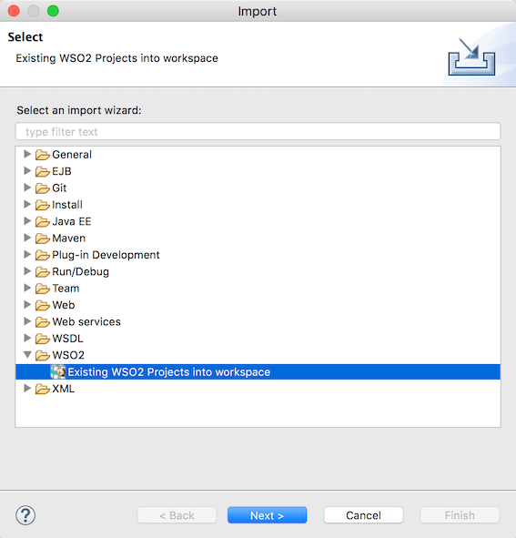
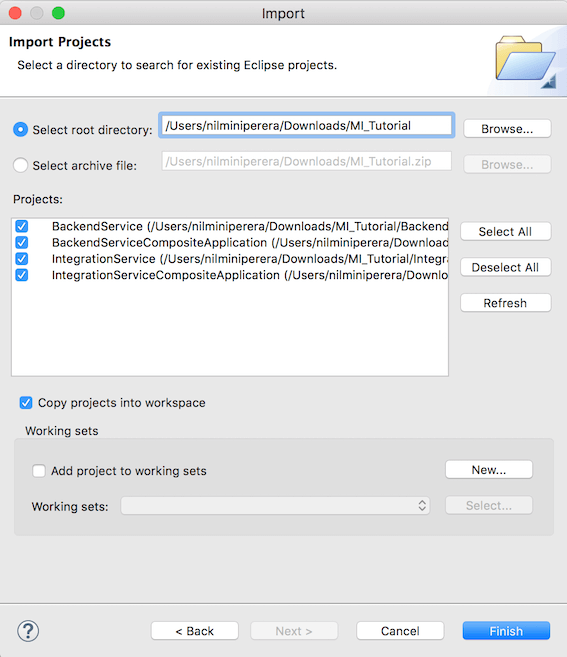

# Importing projects

If you have an already created Integration project file, you can import it to
your WSO2 Integration Studio workspace.

1.  Open WSO2 Integration Studio, navigate to **File -> Import**, select **Existing WSO2 Projects into workspace,** and click **Next**:  
    
2.  If you have a ZIP file of your project, browse for the **archive file**, or if you have an extracted project folder, browse for the
    **root directory**:  
    

    !!! Info
    	Select **Copy projects into workspace** check box if you want to save the project in the workspace.
    
3.  Click **Finish** , and see that the project files are imported in the project explorer.  