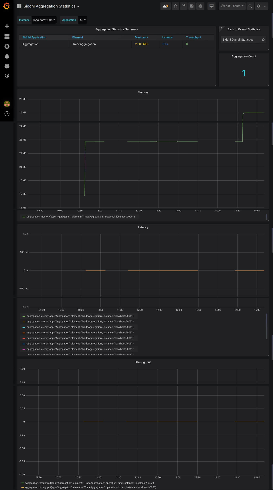

!!! note
    **This page is still a work in progress!**
    
# Viewing Aggregation Statistics

The information displayed in this dashboard is as follows.



## Aggregation Statistics Summary Table

```IMAGE HERE```

This lists all the defined aggregations from all the Siddhi applications in your WSO2 Streaming Integrator server. The table displays the following for each defined aggregation:

- The Siddhi application in which the defined aggregation is included

- The name of the defined aggregation

- The amount of memory used by the defined aggregation

- Latency of events in the defined aggregation

- Throughput of events to the defined aggregation
   
## Memory

```IMAGE```

This shows the memory usage of each defined aggregation in your WSO2 Streaming Integrator server.

## Latency

```IMAGE```

This shows the latency of each defined aggregation in your WSO2 Streaming Integrator server.

## Throughput

```IMAGE```

This shows the throughput of each defined aggregation in your WSO2 Streaming Integrator server.