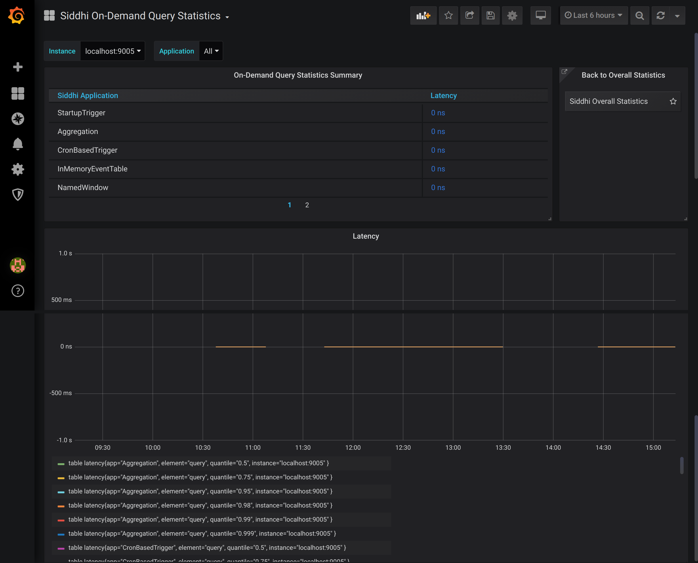

!!! note
    **This page is still a work in progress!**
    
# Viewing On Demand Query Statistics

This dashboard displays the following information for your current Streaming Integrator deployment:
