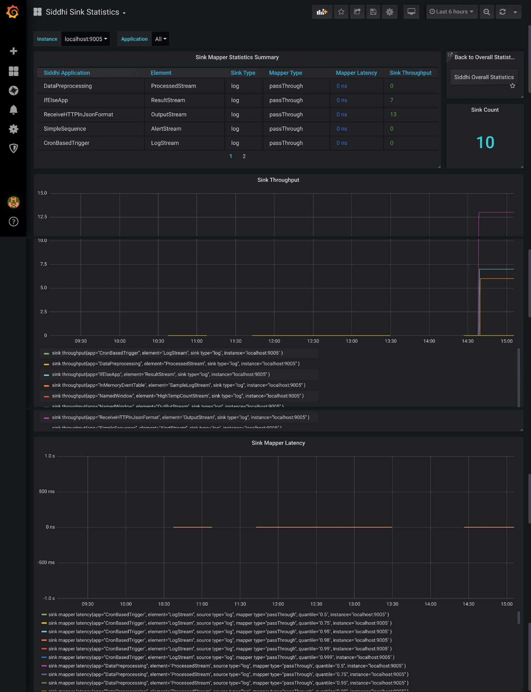
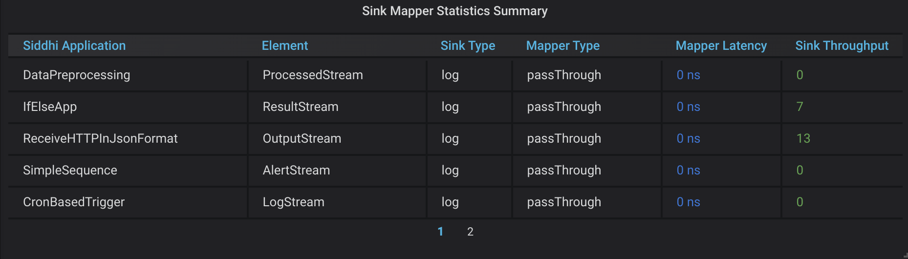
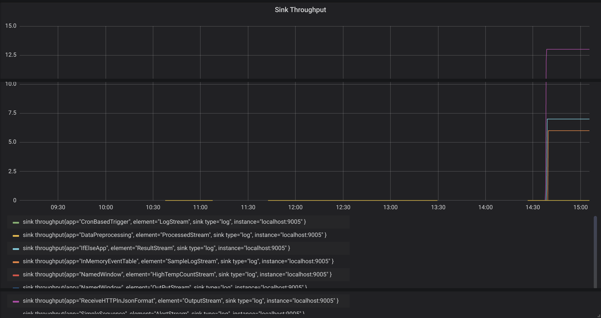
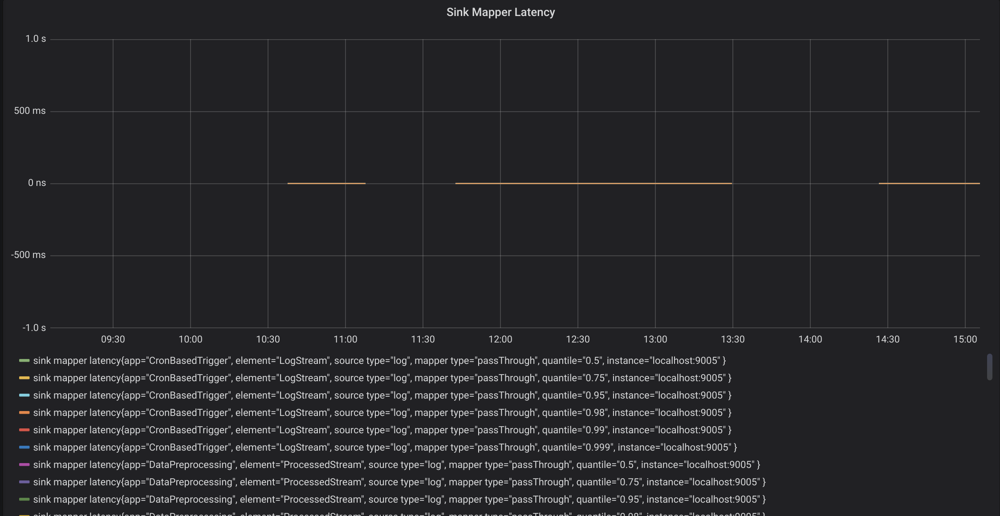

# Viewing Query Statistics

This dashboard displays the following information for your current WSO2 Streaming Integrator deployment:

## Sink Mapper Statistics Summary Table

This lists all the sink mappers from all the Siddhi applications in your Streaming Integrator server. The table displays the following for each sink mapper:

- The Siddhi application in which the sink mapper is included

- The stream to which the sink mapper is connected

- The type of the sink to which the mapper is connected

- The type of the mapper

- Latency of events in the mapper

- The throughput of events to the sink to which  the mapper is connected
   
## Sink Throughput

This shows the throughput of each sink mapper in your Streaming Integrator server.

## Sink Mapper Latency

This shows the latency of each sink mapper in your Streaming Integrator server.