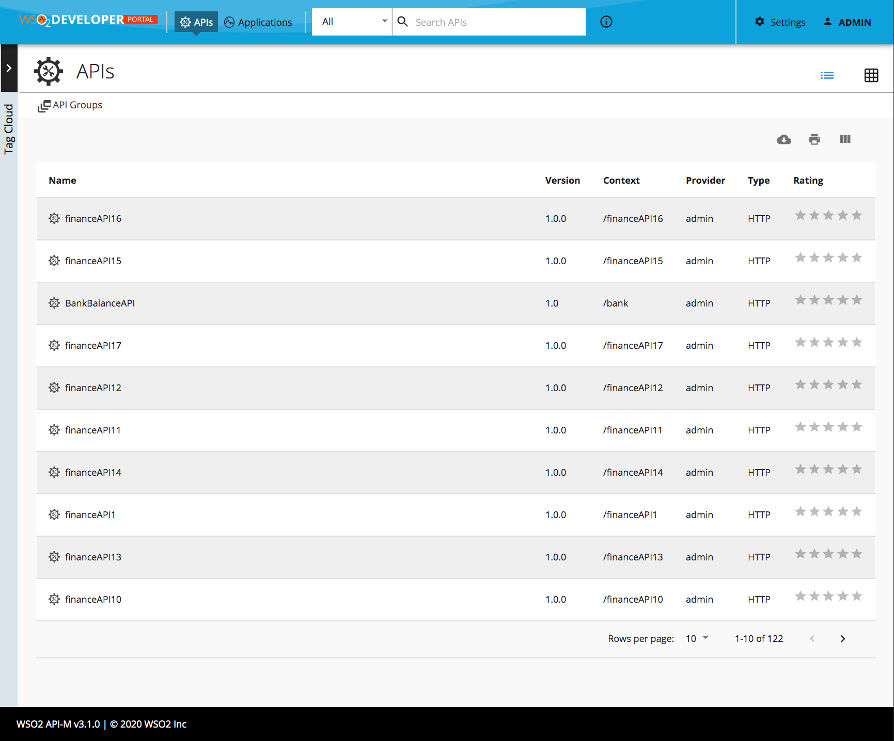

# Change Default View

By default the API Listing view is a grid view. You can follow the steps below to change the default API listing to a table view by configuring `userTheme.json`.

The `defaultTheme.js` file has all the parameters defining the look and feel of the developer portal. To learn more about `defaultTheme.js` refer [here](../overriding-developer-portal-theme#global-theming).

1. Open the `<API-M_HOME>/repository/deployment/server/webapps/devportal/site/public/theme/userTheme.json` file in a text editor.

    You can add the following configuration to the `userTheme.json` to change the default API listing to a table view.

    ```js
    {
        "custom": {
            "defaultApiView" : "list"
        }
    }
    ```

    Changes done in the `defaultTheme.js` will be reflected directly in the developer portal. (It is not required to restart the server or rebuild the source code) 

2. Refresh the Developer Portal to view the changes.

    