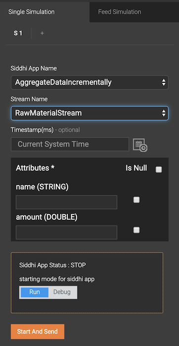

# Publishing and Receiving CSV Events via Files

## Purpose

This example demonstrates how to calculate the distance between two locations via the `siddhi-gpl-execution-geo` extension.

!!!info "Before you begin:"
    1. Download the [siddhi-gpl-execution-geo-x.x.x.jar](http://maven.wso2.org/nexus/content/repositories/wso2gpl/org/wso2/extension/siddhi/gpl/execution/geo/siddhi-gpl-execution-geo/5.0.0/siddhi-gpl-execution-geo-5.0.0.jar) and place it in the `<SI_TOOLING_HOME>/lib` directory.<br/>
    2. Save this sample in Streaming Integrator Tooling.

## Executing the Sample

To execute the sample open the saved Siddhi application in Streaming Integrator Tooling, and start it by clicking the **Start** button (shown below) or by clicking **Run** => **Run**.


If the Siddhi application starts successfully, the following message appears in the console.

`GeoDistanceCalculation.siddhi - Started Successfully!`

## Testing the Sample

To test the sample application, simulate a single event for it as follows:

1. To open the Event Simulator, click the **Event Simulator** icon.

    

    This opens the event simulation panel.

2. To simulate events for the `LocationPointsStream` stream of the `GeoDistanceCalculation` Siddhi application, enter information in the **Single Simulation** tab of the event simulation panel as follows.

    | **Field**              | **Value**                  |
    |------------------------|----------------------------|
    | **Siddhi App Name**    | `GeoDistanceCalculation`   |
    | **StreamName**         | `LocationPointsStream`     |

    

    As a result, the attributes of the `GeoDistanceCalculation` stream appear in the panel.

3. Enter attribute values as follows.

   | **Attribute**         | **Value**      |
   |-----------------------|----------------|
   | **latitude**          | `8.116553`     |
   | **longitude**         | `77.523679`    |
   | **prevLatitude**      | `9.850047`     |
   | **prevLongitude**     | `98.597177`    |


4. Send the event

## Viewing the Results

The following output is logged in the Streaming Integrator console for the single event you simulated.

`INFO {io.siddhi.core.query.processor.stream.LogStreamProcessor} - GeoDistanceCalculation: Event :, StreamEvent{ timestamp=1513616078228, beforeWindowData=null, onAfterWindowData=null, outputData=[2322119.848252557], type=CURRENT, next=null}`

???info "Click here to view the sample Siddhi application."

    ```sql
    @App:name("GeoDistanceCalculation")

    @App:description('This will demonstrate the distance between two locations')

    define stream LocationPointsStream (latitude double, longitude double, prevLatitude double, prevLongitude double);

    @sink(type='log')
    define stream DistanceStream (distance double);

    @info(name = 'query1')
    from LocationPointsStream
    select geo:distance(latitude, longitude, prevLatitude, prevLongitude) as distance
    insert into DistanceStream;
    ```