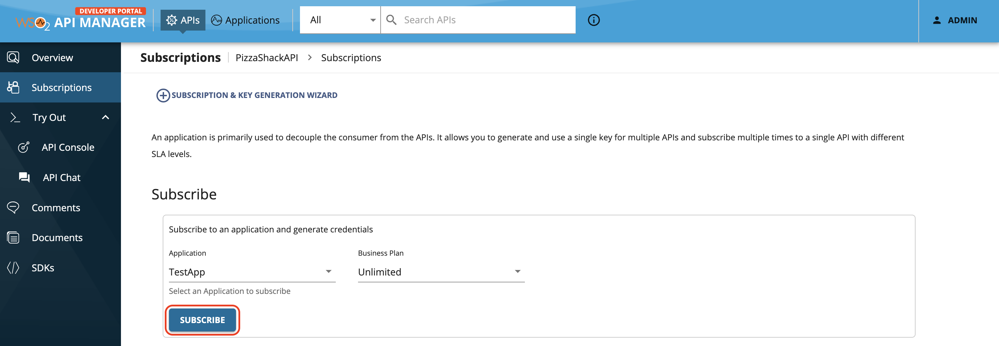
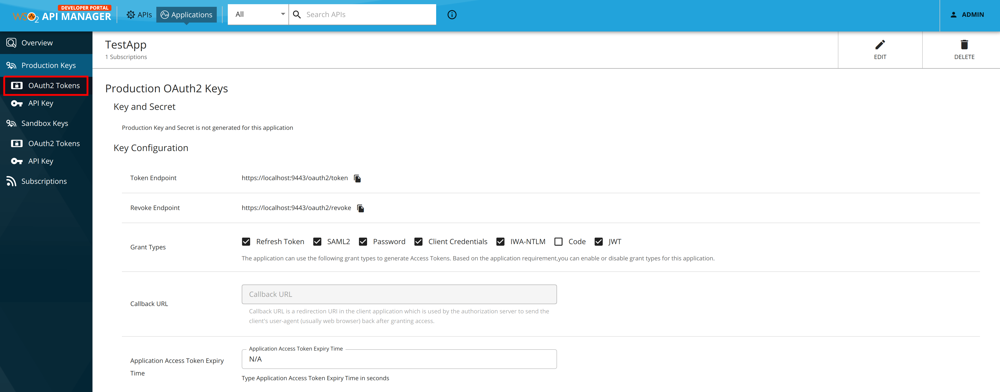
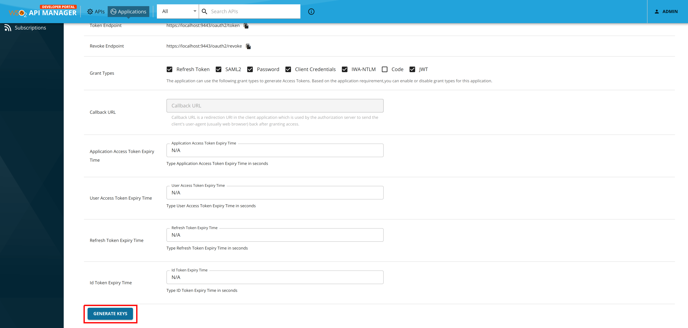
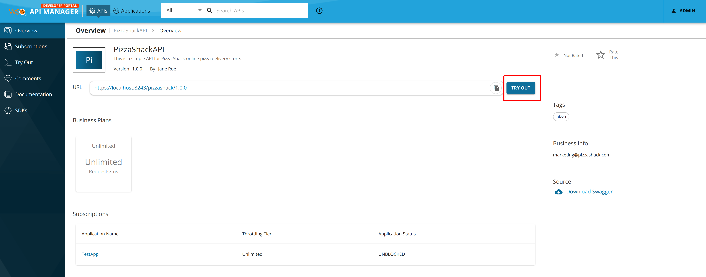
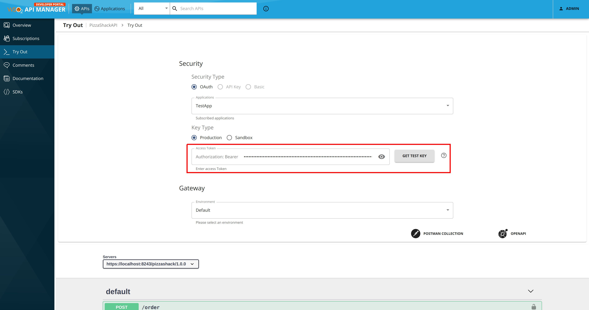
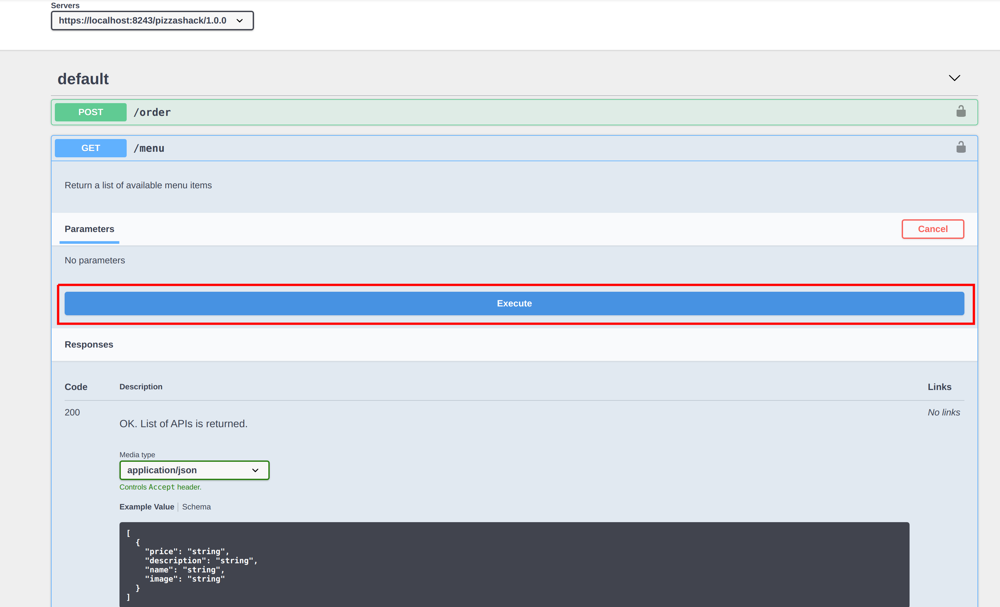
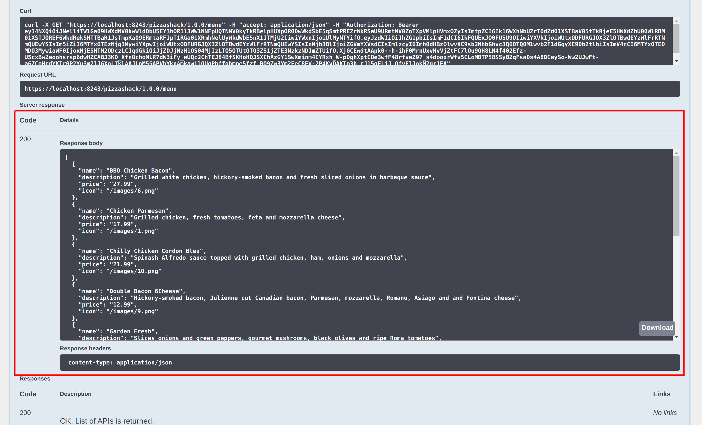
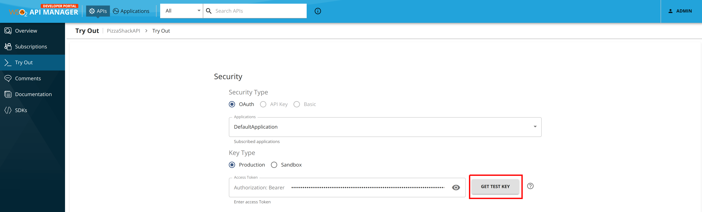

# Test a REST API Using the Integrated API Console

WSO2 API Manager has an Integrated API Console, which allows you to visualize the API contract and interact with API's resources without being aware of the backend logic.

Follow the instructions below to use the API Console, which is available in the WSO2 API Manager Developer Portal, to test a REST API by invoking it:

!!! Note
    You can only try out HTTPS-based APIs via the API Console because the Developer Portal runs on HTTPS.

The examples here use the `PizzaShack` REST API, which was created in [Create a REST API](../../../design/create-api/create-rest-api/create-a-rest-api.md).

1. Sign in to the WSO2 Developer Portal (`https://<hostname>:9443/devportal`) and click an API (e.g., `PizzaShack`).

2. Subscribe to the API (e.g., `PizzaShackAPI` 1.0.0) using an application and an available throttling policy.

    

3. Click **Applications** and then click on the application that you used to subscribe to the API. Click **Production Keys** and navigate to **OAuth2 Tokens**.
   
    

4. Scroll down and generate a production key
   
    
   
    !!! tip
            **Production and Sandbox Tokens**
    
            To generate keys for the Sandbox endpoint, go to the **Sandbox Keys** tab. For more information, see [Maintaining Separate Production and Sandbox Gateways](../../../deploy-and-publish/deploy-on-gateway/api-gateway/maintaining-separate-production-and-sandbox-gateways.md#multiple-gateways-to-handle-production-and-sandbox-requests-separately).
    
    !!! tip
            **JWT tokens**
    
            As the application is self-contained (JWT), **copy the generated access token** before proceeding to the next step.

5. Click **APIs**, and click on the API that you need to invoke.

6. Click **Try Out** in API Overview tab.
   
    

    The OpenAPI UI (API Console) to test the PizzaShack API appears.

7.  Enter the copied access token in the **Authorization** field.

     

8. Expand the GET method and click **Try it out**. Click **Execute**.
 
     

    !!! Note "Troubleshooting"
        If you **cannot invoke the API's HTTPS endpoint** (this causes the **SSLPeerUnverified exception**), it could be because the security certificate issued by the server is not trusted by your browser. To resolve this issue, access the HTTPS endpoint directly from your browser and accept the security certificate.
        
        If WSO2 API Manager has a **certificate signed by a Certificate Authority** (CA), the HTTPS endpoints should work out-of-the-box.

Note the successful response for the API invocation.
        

You have now successfully invoked an API using the Open API Console

!!! Note
    When using the Swagger UI's tryout feature to send large payloads, there's a risk that the interface may hang or not function properly. This is because the Swagger client isn't designed as a production-ready tool for handling substantial requests. For testing large payloads, it's advisable to use alternatives like Curl, or other custom clients. The Swagger tryout is intended mainly for simple testing workloads.
        
## Get a test key to invoke an API

When you want to test out the process of invoking an API resource, you can easily get a test key from the API console rather than going back to the Applications page and generating a key. Click **Try Out** to navigate to the API Console, click on the `GET TEST KEY` button to generate a test key.

!!! tip

    TEST KEY will be generated with default scopes attached to the API. If you need to generate a token with specific scopes, go to the application view and generate a token.