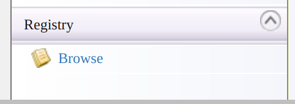
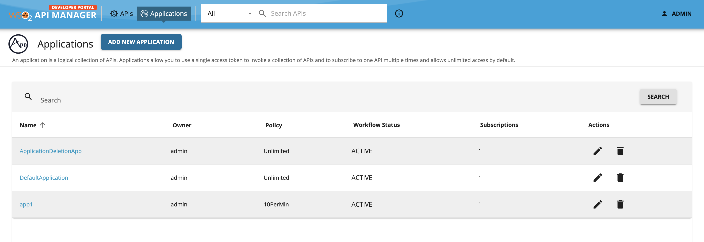
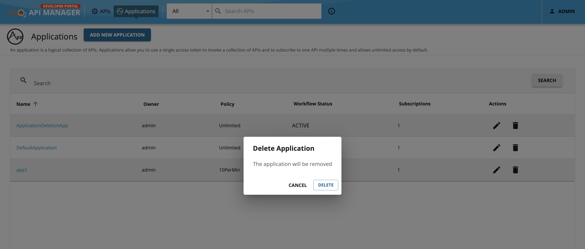
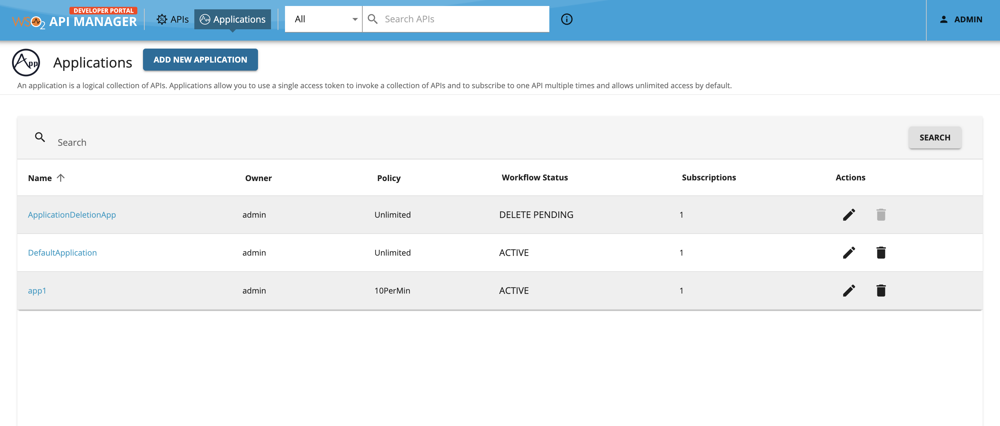
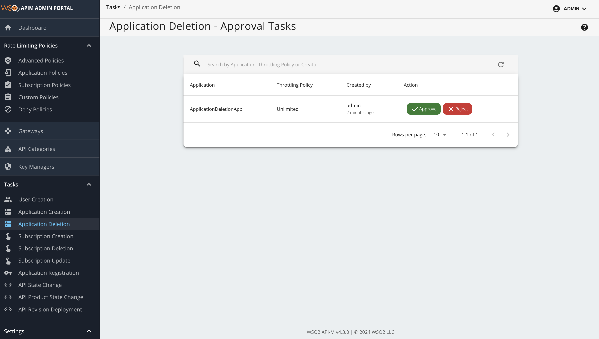

# Adding an Application Deletion Workflow

Attaching a custom workflow to application deletion, enables an admin to approve/reject application deletion requests made for existing applications. Note that only an admin is able to approve/reject an application deletion request.

After application deletion workflow is enabled, when an application deletion request is made, the application workflow status is changed to the `DELETE PENDING` state. In this state, a consumer can still use the application to subscribe to APIs, generate production and sandbox keys until the application deletion is approved. Once the application deletion request is approved the application will be deleted.

### Engaging the Approval Workflow Executor in the API Manager

1.  Sign in to the API Manager Management Console (`https://<Server Host>:9443/carbon`) and go to **Browse** under **Registry**.

    [](../../../assets/img/learn/navigate-main-resources.png)


2.  Open the `/_system/governance/apimgt/applicationdata/workflow-extensions.xml` resource and click **Edit as text**. Disable the `ApplicationDeletionSimpleWorkflowExecutor` and enable `ApplicationDeletionApprovalWorkflowExecutor`. 
    ``` 
        <WorkFlowExtensions>
        ...
            <!--ApplicationDeletion executor="org.wso2.carbon.apimgt.impl.workflow.ApplicationDeletionSimpleWorkflowExecutor"/-->
            <ApplicationDeletion executor="org.wso2.carbon.apimgt.impl.workflow.ApplicationDeletionApprovalWorkflowExecutor"/>
        ...
        </WorkFlowExtensions>
    ```

    The application deletion approval workflow executor is now engaged.


3.  Sign in to the WSO2 API Developer Portal (`https://<hostname>:<port>/devportal`) and click **Applications**.

    [](../../../assets/img/learn/application-listing.png)


4. Click the **Delete** icon under **Actions** column to open the **Delete Application** popup to delete the desired application. Confirm the delete request by clicking the **Delete** button.
    
    [](../../../assets/img/learn/application-delete.png)


5.  You will see the workflow status as **DELETE PENDING**.

    [](../../../assets/img/learn/application-delete-before-approval.png)
    
6.  Sign in to the Admin Portal (`https://<Server Host>:9443/admin`), list all the tasks for Application delete from **Tasks** --> **Application Deletion** and click on approve (or reject) to approve (or reject) the workflow pending request.

    [](../../../assets/img/learn/application-delete-admin-entry.png)

7.  After approving go back to the API Developer Portal Application listing page. The application will be removed.

    