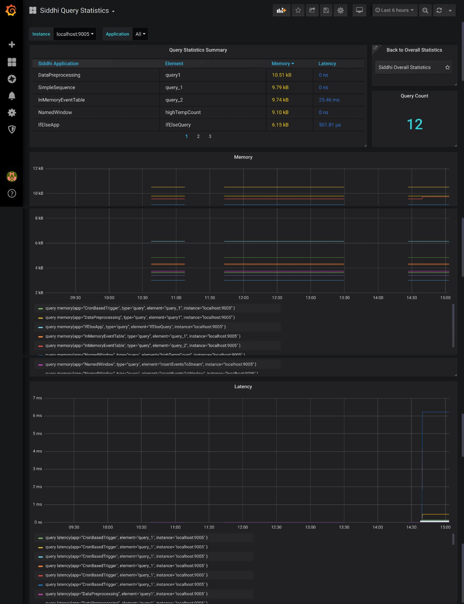
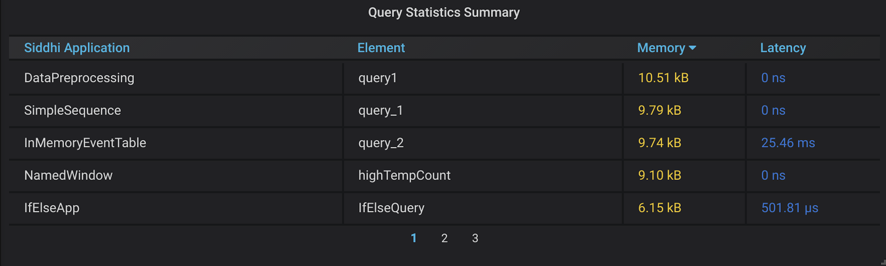
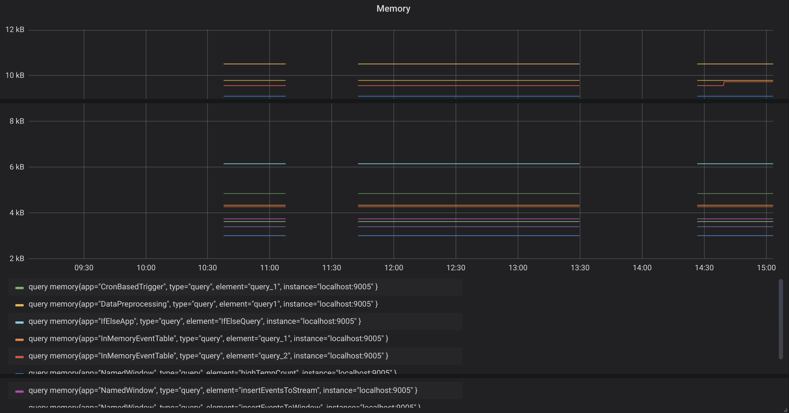
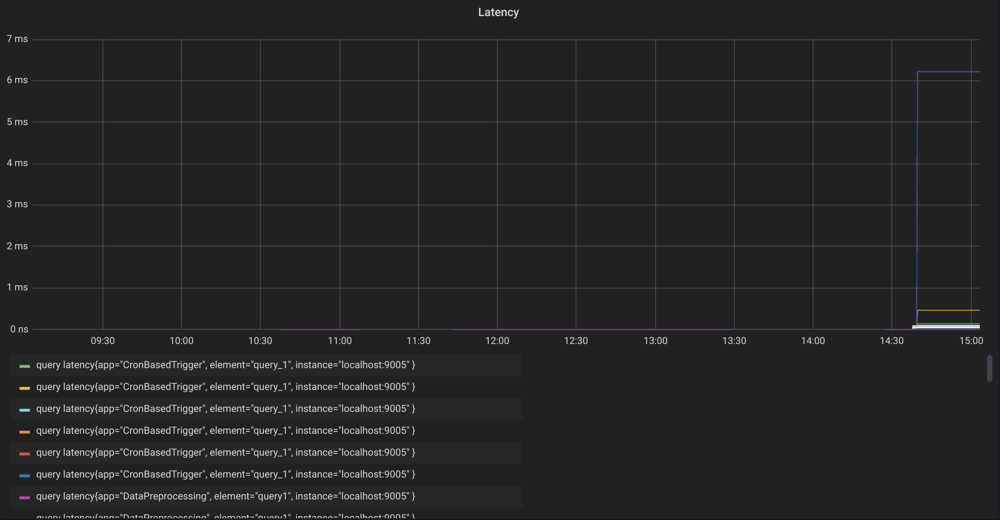

# Viewing Sink Statistics

## Query Statistics Summary Table

This lists all the queries from all the Siddhi applications in your Streaming Integrator server. The table displays the following for each query:

- The Siddhi application in which the query is included

- The name of the query

- The amount of memory used by the query

- Latency of events in the query
   
## Memory

This shows the memory usage of each query in your Streaming Integrator server.

## Latency

This shows the latency of each query in your Streaming Integrator server.