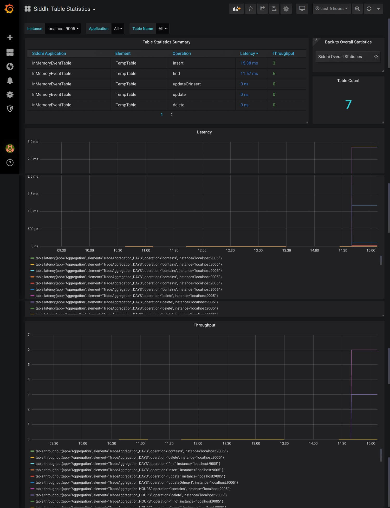
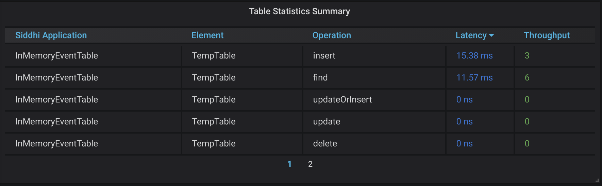
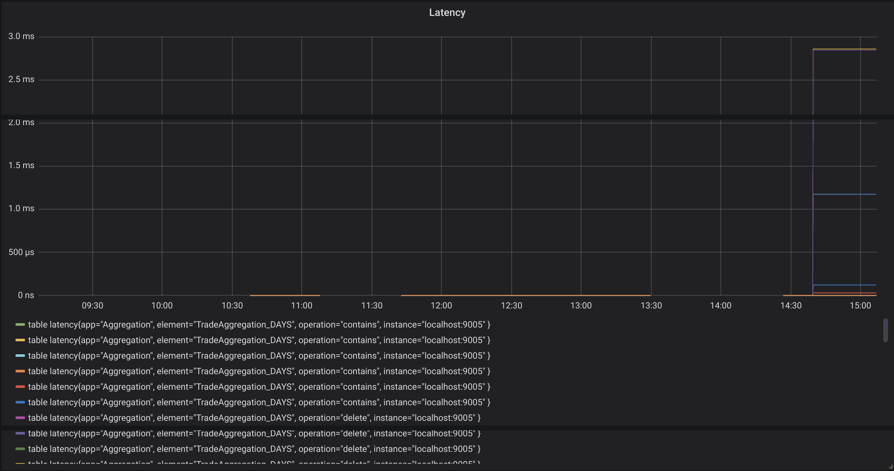
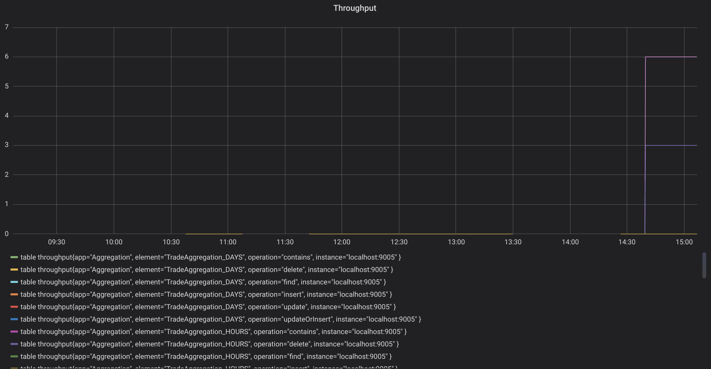

# Viewing Table Statistics

This dashboard displays the following information for your Streaming Integrator deployment:

## Table Statistics Summary Table

This lists all the table operations defined in all the Siddhi applications in your Streaming Integrator server. The table displays the following for each operation:

!!! info
    When multiple operations are performed on the same table, each operation appears as a separate entry.
   
   - The Siddhi application in which the table is included
   
   - The name of the table
   
   - The operation that was performed on the table
   
   - Latency of events in the table
   
   - The throughput of events to/from the table
   
## Latency

This shows the latency of each table operation in your Streaming Integrator server.

## Throughput

This shows the throughput of each table operation in your Streaming Integrator server.