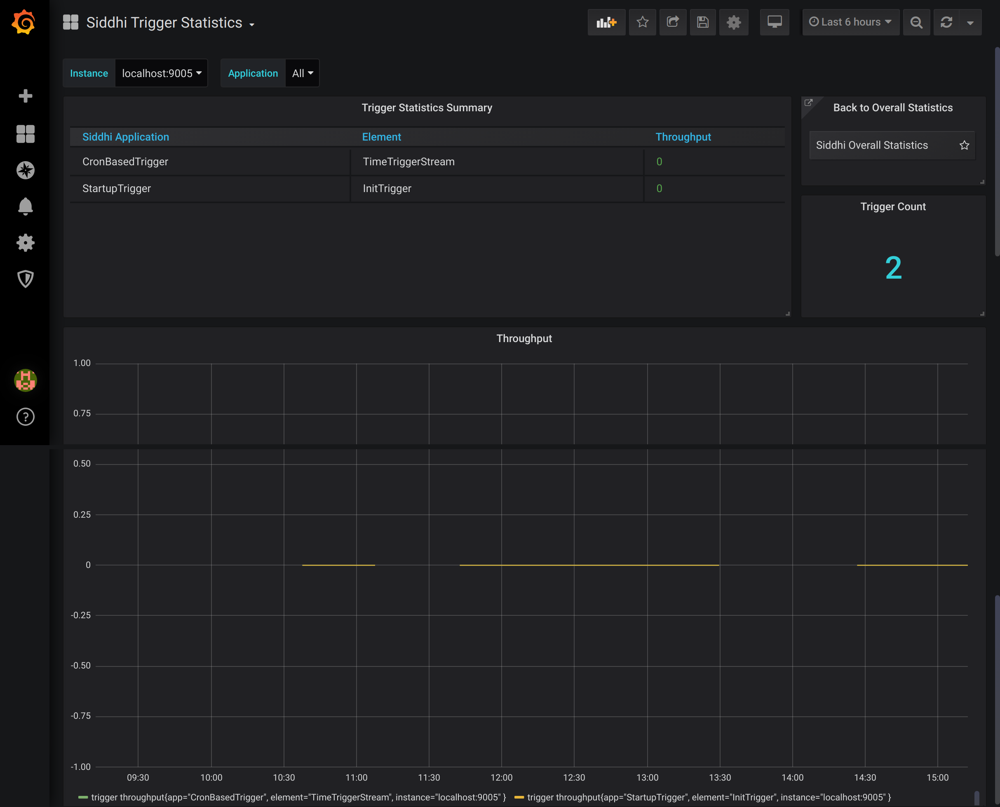
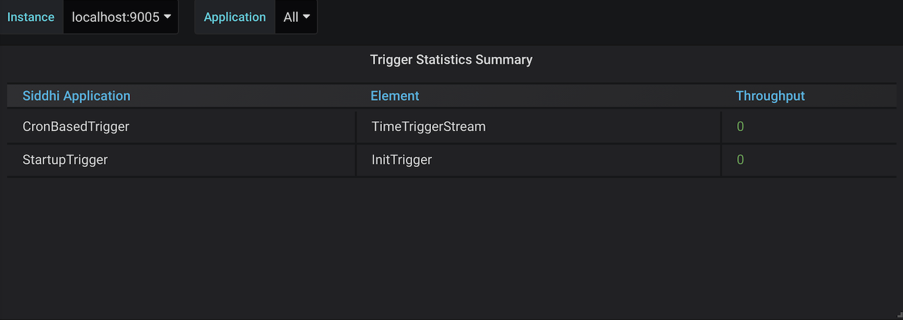
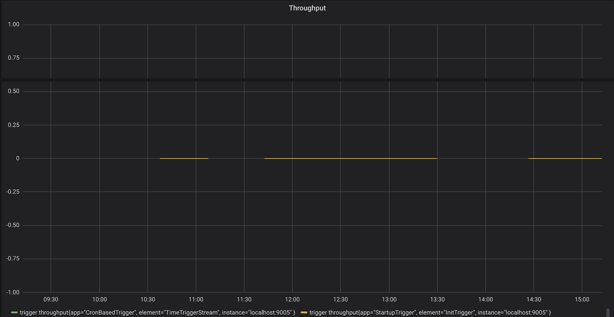

# Viewing Trigger Statistics

This dashboard displays the following information for your Streaming Integrator deployment:

## Trigger Statistics Summary Table

This lists all the triggers from all the Siddhi applications in your Streaming Integrator server. The table displays the following for each trigger:

- The Siddhi application in which the trigger is included

- Name of the stream to which the trigger is connected

- The throughput of events to the trigger
   
## Throughput

This shows the throughput of each trigger in your Streaming Integrator server.