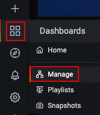
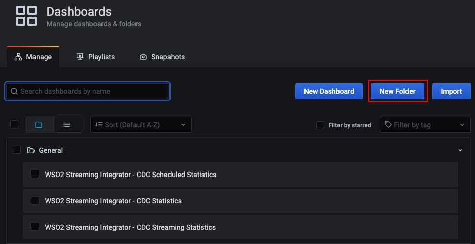
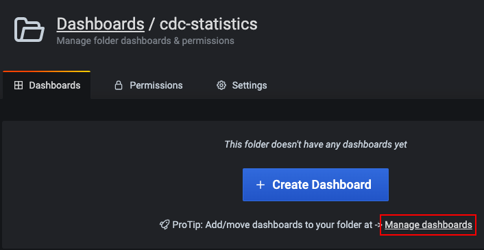
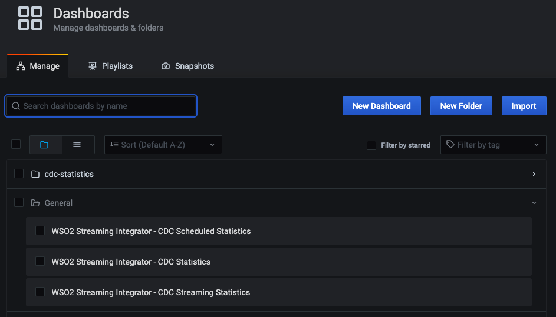
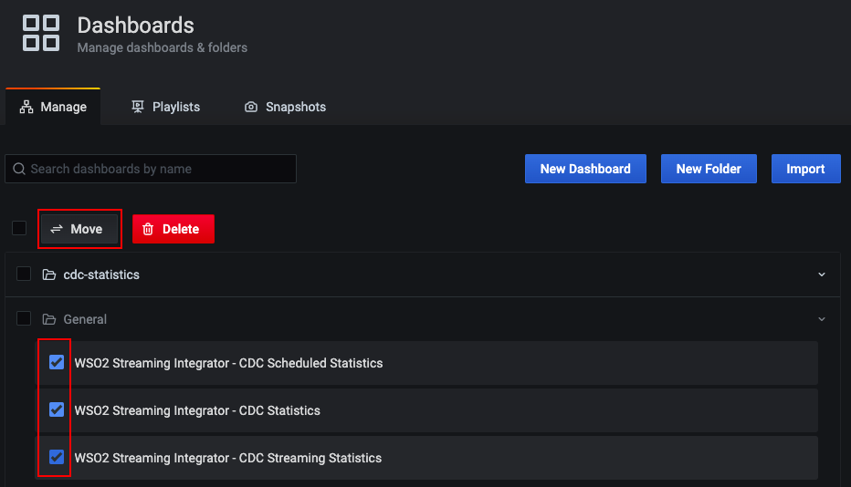
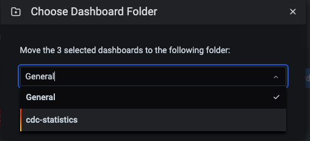
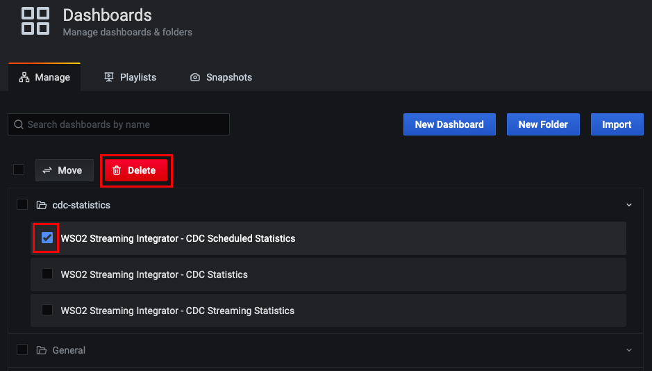

# Managing Dashboards

WSO2 Streaming Integrator uses Grafana to host and view its pre-configured dashboards that are designed to view statistics relating to its performance as well as streaming activities. The pre-configured dashboards are imported to Grafana as JSON files. Once they are imported, you can organize them in folders, view them, and/or delete them.

## Organizing the dashboards in folders
    
The dashboards you import are saved in the **General** folder by default. If required, you can create a design a folder structure that matches your requirement and save the dashboards in the different folders of the structure based on your categorization of the dashboards.

!!! note
    When working with the dashboards related to ELT Flows, create new folders named `overview-statistics`, `file-statistics`, `rdbms-statistics`, `cdc-statistics`, `http-statistics`, and `kafka-statistics`.

### Creating new folders

Follow the instructions below to create a new folder:

1. Start and access Grafana via `http://localhost:3000/`.

2. In the left pane, click the **Dashboards** icon, and then click **Manage**.

     [{: style="width:20%"}](../../assets/img/streaming/managing-grafana-dashboard/manage-grafana-dashboard.png)
    
     This opens the **Dashboards**/**Manage** tab. 
    
     [{: style="width:80%"}](../../assets/img/streaming/managing-grafana-dashboard/managing-dashboards.png)
    
3. Click **New Folder**. In the **Folder Name** field that appears, enter a name (e.g., `cdc-statistics`) for the new folder that you are creating. Then click **Create**.

4. Navigate back to the **Dashboards**/**Manage** tab. You can do this by clicking **Manage Dashboards** in the message that appears in the page of your new folder.

     [{: style="width:60%"}](../../assets/img/streaming/managing-grafana-dashboard/new-folder-page.png)
    
     The new folder you created appears as shown in the following image.
    
     [{: style="width:80%"}](../../assets/img/streaming/managing-grafana-dashboard/view-new-folder.png)
    
### Moving dashboards between folders

Follow the instructions below to move selected dashboards to a specific folder:

1. In the **Dashboards**/**Manage** tab, select the dashboards you want to move. Then click **Move**.

     [{: style="width:80%"}](../../assets/img/streaming/managing-grafana-dashboard/move-dashboard.png)
    
2. In the **Choose Dashboard Folder** dialog box that appears, select the folder to which you want to move the selected dashboards.
    
     
    
3. Click **Move** to move the selected dashboards. A message appears to inform that the selected dashboards are successfully moved, and the **Dashboards**/**Manage** tab displays the selected dashboards under the folder you selected to move them.

## Deleting dashboards

!!! note "Before you begin:"
    Download the related JSON file(s) of one or more dashboards from [here](https://github.com/wso2/streaming-integrator/tree/master/modules/distribution/carbon-home/resources/dashboards), and import them to Grafana. For instructions, see [Importing dashboards](#importing-dashboards).

In the **Dashboards**/**Manage** tab, select the dashboard(s) you want to delete. Then click **Delete**.

[{: style="width:80%"}](../../assets/img/streaming/managing-grafana-dashboard/delete-dashboard.png)

In the message that appears to confirm whether you want to delete the dashboard, click *Delete*.