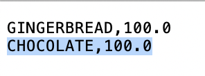

# Step 4: Run the Siddhi Application

In this step, let's run the `SweetFactoryApp` Siddhi application that you created, tested and deployed.

## Installing the required extensions

In [Step 2: Create the Siddhi Application](../../streaming/getting-started/create-the-siddhi-application.md), you installed the `cdc-mysql` Siddhi extension in Streaming Integrator Tooling to test the `SweetFacoryApp` Siddhi application. Now let's install it in the Streaming Integrator server so that you can run the same Siddhi application there.

1. Start the Streaming Integrator server by navigating to the `<SI_HOME>/bin` directory from the CLI, and issuing the appropriate command based on your operating system: 
   
   - For Windows: `server.bat --run` 
   - For Linux/Mac OS:  `./server.sh`
   
2. To install the `cdc-mysql` extension, issue the following command from the `<SI_HOME>/bin` directory. 

    - For Windows: `extension-installer.bat install cdc-mysql` 
    - For Linux/Mac OS:  `./extension-installer.sh install install cdc-mysql`
    
    Once the installation is complete, a message is logged to inform you that the extension is successfully installed.
    
3. Restart the Streaming Integrator server.

## Generating an input event

To generate an input event, insert a record in the `production` database table by issuing the following command in the MySQL console.

`insert into SweetProductionTable values('chocolate',100.0);`

Then open the `/Users/foo/productioninserts.csv` file. The following record should be displayed.

    
!!! tip "What's Next?"
    Now you can try extending the `SweetFactoryApp` Siddhi application to perform more streaming integration activities. To try this, proceed to [Step 5: Update the Siddhi Application](../../streaming/getting-started/update-the-siddhi-application.md).