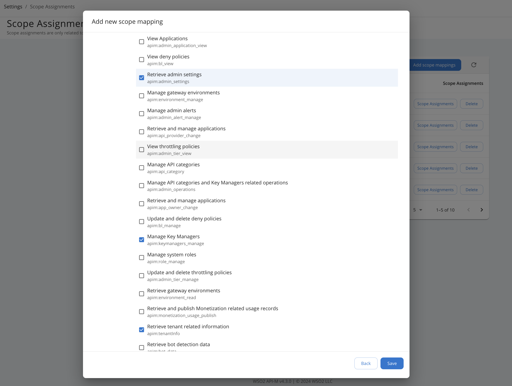
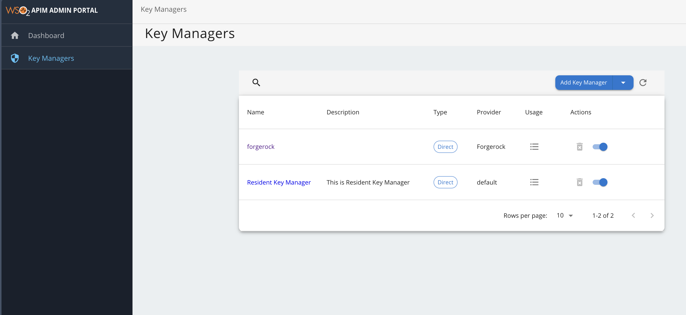

# **Role based access control for Admin Portal**

Super admin can restrict each section in the admin portal based on the scopes. Please follow the
below scopes  chart to define scopes.

## Step 1 - Create a new role

1. Sign in to WSO2 Management Console ( `https://<Server Host>:9443+<port offset>/carbon` )
2. Click `Add` under `Users and Role`  and click on `Add New Role`.
3. Give a name for the role and click `next`.
4. In the permissions screen give the necessary permissions. For example we can enable the `Login` permission.

## Step 2 - Create a new user

1. Click `Add` under `Users and Role` and click on `Add New User`.
2. Give an username, password and click `next`.
3. On the `Users of role` screen, choose and assign the role previously created to the new user.

## Step 3 - Assign scopes for the user

1. Sign in to WSO2 the Admin portal ( `https://<Server Host>:9443+<port offset>/admin` ) as the super admin or tenant admin
2. Click `Scope Assignments` in the left sidebar and click on `Add scope mappings` .
3. In the `Provide role name` text input give the role name which was previously created in step 1 and then click `next`.
4. In the `Select Permissions` menu, select the `Custom scope assignments` option. And select the scopes that you want to assign for the newly created role. You can refer the following table when assigning the scopes. For example, If the admin wants the newly created user to access the key managers settings in the admin portal he can assign `apim:keymanagers_manage`, `apim:tenantInfo`, and `apim:admin_settings`.
   
    

5. Finally, login to the admin portal as the newly created user which was created in step 2. The user can only access the `Key Managers` settings page.

    

| **Admin portal Menu**  | **scopes**                                                                                                                                   |
|------------------------|----------------------------------------------------------------------------------------------------------------------------------------------|
| Rate Limiting Policies | apim:admin_tier_view, apim:admin_tier_manage,  apim:tenantInfo, apim:bl_view, apim:bl_manage, apim:admin_settings         |
| Gateways               | apim:environment_manage, apim:admin_settings, apim:environment_read                                                                          |
| API Categories         | apim:api_category, apim:tenantInfo, apim:admin_settings                                                                                      |
| Key Managers           | apim:keymanagers_manage, apim:tenantInfo, apim:admin_settings                                                                                |
| Tasks                  | apim:api_workflow_view, apim:api_workflow_approve, apim:tenantInfo, apim:admin_setting                                                       |
| Settings               | apim:app_owner_change, apim:api_provider_change, apim:admin_application_view, apim:scope_manage, apim:admin_settings, apim:tenantInfo          |