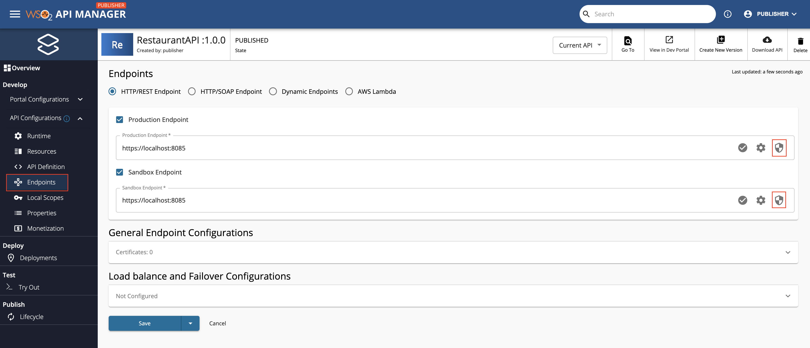
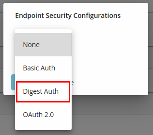
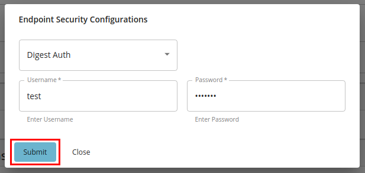
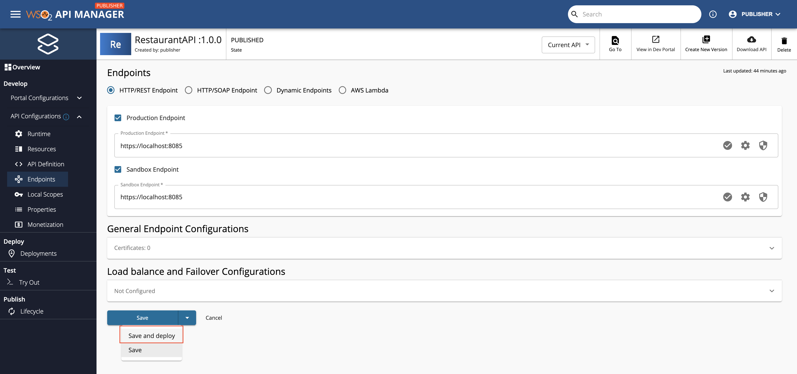

# Secure Endpoint with Digest Auth

A secured endpoint is where we have access-protected resources. You have to specify the username and the password when a request is sent to a secured endpoint.  The endpoint authentication mechanism can either be Basic Authentication or Digest Authentication. They differ on how the credentials are communicated and how access is granted by the backend server. 

Digest Authentication applies a hash function to the username and the password before sending them over the network. It is a process of applying MD5 cryptographic hashing with the usage of nonce values to prevent replay attacks. It is a simple challenge-response authentication mechanism that may be used by a server to challenge a client request and by a client to provide authentication information for the secured endpoint.

!!! info
    The following is the sample format of the header that will be sent to the backend when Digest Auth is specified as the endpoint authentication type. The attributes added to the authorization header depends on the challenge header sent from the backend server.
    
    ``` java
    Authorization: Digest username="Admin", realm="admin@wso2.com", nonce="dcd98b7102dd2f0e8b11d0f600bfb0c093", uri="/dir/index.html", qop=auth, nc=00000001, cnonce="0a4f113b", response="6629fae49393a05397450978507c4ef1", opaque="5ccc069c403ebaf9f0171e9517f40e41"
    ```

Digest Authentication is safer than Basic Authentication, which uses unencrypted base64 encoding instead of a hashing mechanism.

When you [create an API](../../../design/create-api/create-rest-api/create-a-rest-api.md) using the API Publisher, you can specify the endpoints of the API backend implementation via the **Endpoints** page as Production and Sandbox endpoints respectively.

Follow the instructions below to use Digest Auth as the endpoint authentication type when using a secured endpoint:

1. Click **Endpoints** in the API Publisher.

2. Click the Endpoint Security symbol of the endpoint you want to secure with Digest Auth.

      [](../../../assets/img/design/endpoints/endpoint-security/endpoint-security-symbol.png)

3. Select **Digest Auth** as the endpoint authentication type from the drop-down menu.

     [](../../../assets/img/learn/digest-auth-dropdown.png)

4. After entering your credentials, click **Submit** to confirm the details of the respective endpoint and then click **Save and deploy** in the Endpoints page to save all the changes made in the **Endpoints** page.

      [](../../../assets/img/learn/digest-auth-submit-button.png)

      [](../../../assets/img/design/endpoints/endpoint-security/endpoints-save-button.png)

!!! info
     The selected Endpoint Auth Type should match with the authentication mechanism supported by the secured endpoint.