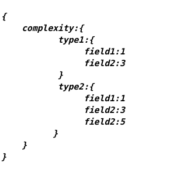
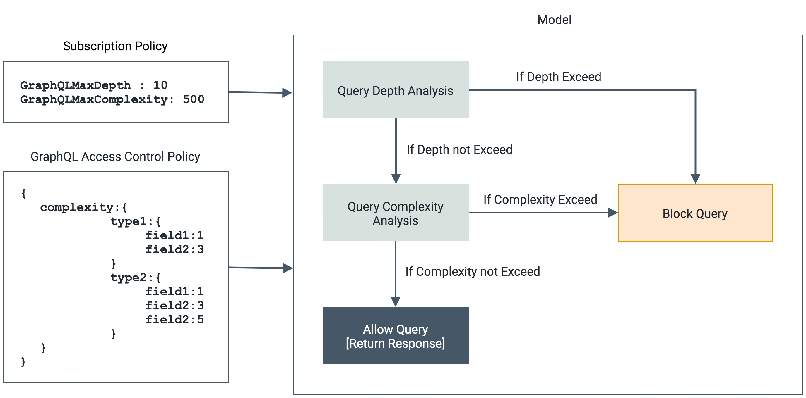
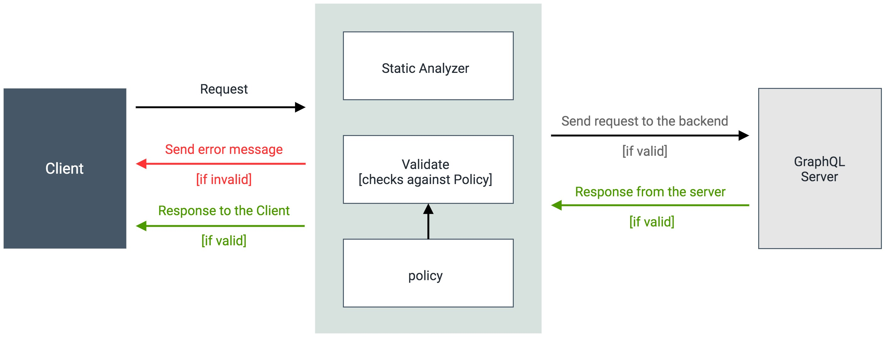

# GraphQL Rate Limiting Overview 

GraphQL is an open-source data query & manipulation language for APIs. It provides a common interface between the client and the server for data fetching and manipulations.

With GraphQL queries, the client which requests data has more flexibility compared to REST where it can request any amount of data it wishes. This flexibility comes at a cost since now the GraphQL service might have to perform complex operations to serve each type of query it receives. To overcome this hardship, the query needs to be analyzed before execution. Without any protection, backends are vulnerable to DoS attacks(which can cause excessive load on the server, database or network), which are caused by the execution of malicious and complex queries that are passed either intentionally or unintentionally. 

Since clients have the possibility to request very complex queries, servers must be ready to handle them properly. 
**WSO2 API-Manager introduces Static Query Analyzer to Secure GraphQL APIs** to address such issues.

### Static Query Analyzer

The Static Query Analyzer detects complex queries based on a predefined policy and prevents them from reaching the backend. A basic outline of such a policy is shown below.

   - [Query Depth Limitation](../../../design/rate-limiting/graphql-api/query-depth-limitation.md)
    
   - [Query Complexity Limitation](../../../design/rate-limiting/graphql-api/query-complexity-limitation.md)

To implement applicable query limits for the GraphQL APIs, two optional fields, **GraphQL Max Depth** and **GraphQL Max Complexity**, were introduced to Subscription Policies.

The **GraphQL Max Depth** and **GraphQL Max Complexity** values can be set through the Subscription Policy UI in the admin portal. Once done, the corresponding subscription plan can be chosen via the business plans to engage these validations for an API.

Also, the policy for the custom complexity values would be as follows;

   

The following diagram illustrates how a given policy is enforced at runtime.

  

The following diagram illustrates the overall request/response flow of a GraphQL API invocation.

  