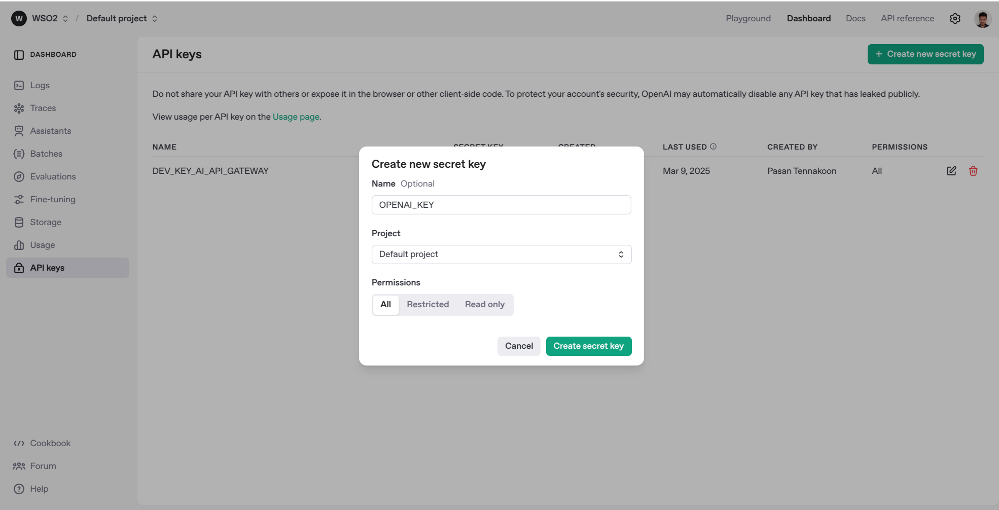
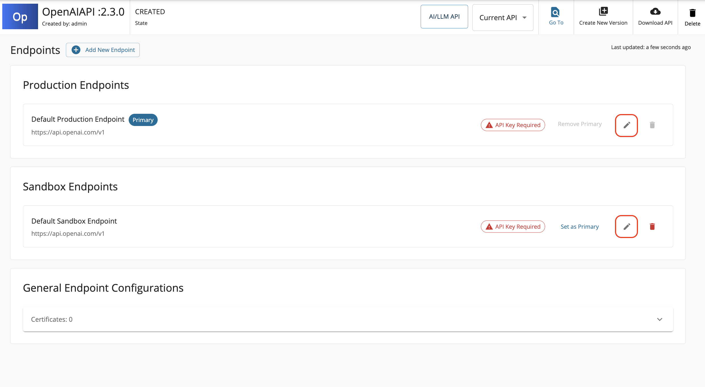

# AI Backend Security

Let's configure backend security for your AI APIs in order to ensure secure communication with AI service providers. Note that you do not have to worry about this step if the AI vendor you have used is unsecured.

### Step 1: Get API Key from AI Vendor

The first step is to obtain an **API Key** from the AI vendor you selected while creating the AI API. This key is required to authenticate requests and securely connect to the AI service.

You can do so for OpenAI by following the steps mentioned below:

1. Login to OpenAI and go to <a href='https://platform.openai.com/api-keys'>OpenAI Dashboard.</a>
2. Navigate to **API keys** section from the left menu. Then, click on **Create new secret key**. Provide a name for the key and click on **Create secret key**.

    [{: style="width:90%"}](../assets/img/learn/ai-gateway/openai-api-key-generation.png)

### Step 2: Configure obtained API Key with your AI API

1. Navigate to **API Configurations** --> **Endpoints**.
2. Notice the **API Key Required** warning against the `Default Production Endpoint` and `Default Sandbox Endpoint`. Click on **Edit** icon and fill in the API Key value which you obtained from Step 1 above and click on **Update** to save the changes.

    !!! Note
            API Manager supports three AI/LLM vendors by default. The authorization approach of each is mentioned below: 
        - **MistralAI**: `Authorization` header
        - **AzureOpenAI**: `api-key` header
        - **OpenAI**: `Authorization` header

        Note that we prepend "Bearer " to the header value that you provide when it comes to MistralAI and OpenAI since they are expecting an Authorization header.

    [{: style="width:90%"}](../assets/img/learn/ai-gateway/ai-api-configure-backend-security.png)