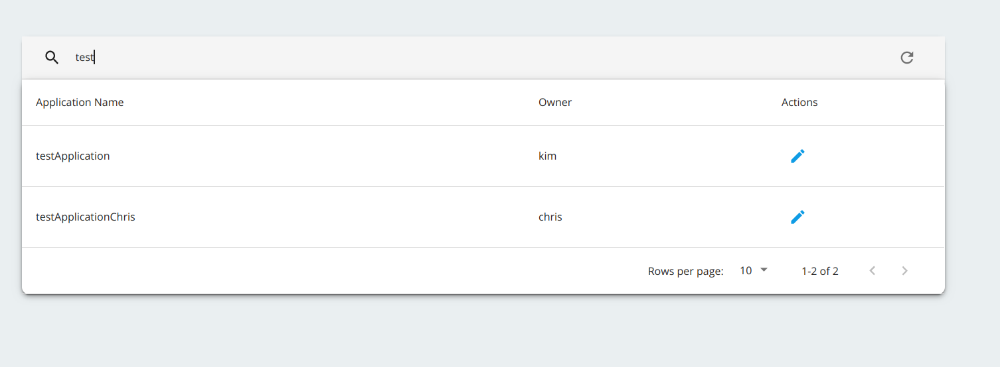
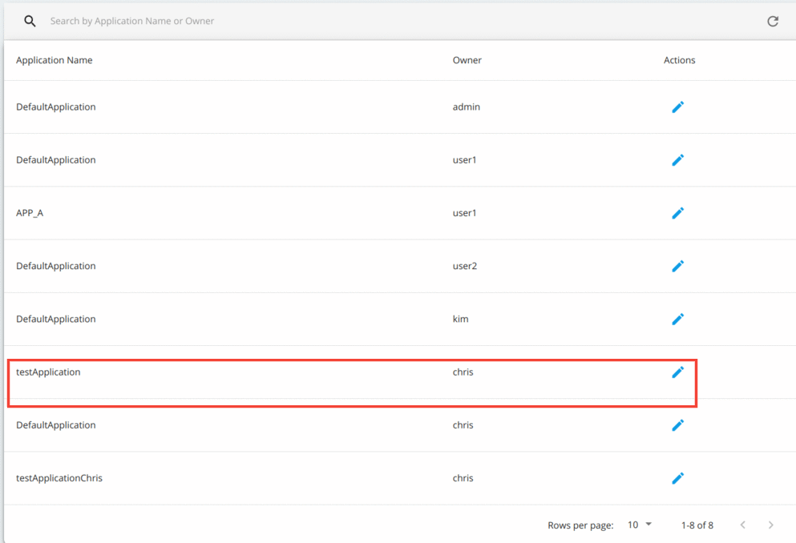
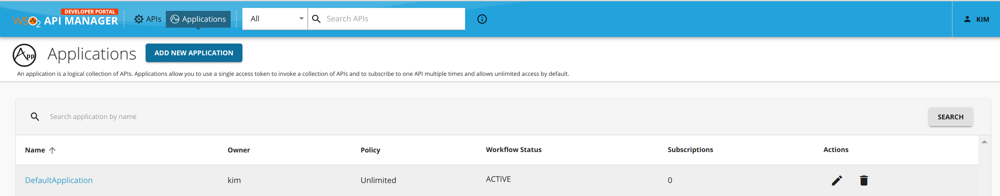
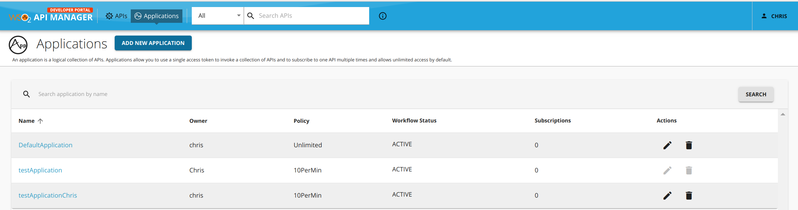

# Changing the Owner of an Application

If required, you can transfer the ownership of your application to another user in your organization. Thereby, when transferring ownership, the new owner will have the required permission to delete or edit the respective application.

For example, let's consider that **Chris** and **Kim** are in the same organization and that **Kim** owns testApplication and he wants to transfer the ownership of testApplication to **Chris**.

Follow the instructions below to change the ownership of an application:

1.  Start the WSO2 API-M Server.
2.  If the users do not exist in the system, create them.

     1. Sign in to the WSO2 API-M Management Console.

         `https://<APIM-hostname>:9443/carbon`

     2. Create two users named **Chris** and **Kim** with the `Internal/subscriber` role.
        Refer [Create New Users](../../../administer/managing-users-and-roles/managing-users.md#adding-a-new-user) for more information.

3.  Check the details of the application that you wish to share in the Developer Portal (e.g., testApplication).

    1.  Sign in to the WSO2 API-M Developer Portal using the application owner's (Kim's) user credentials.

         `https://<APIM-hostname>:9443/devportal`

    2.  If the application does not exist, create it in the Developer Portal.

4.  Change the ownership of the application.

    1.  Sign in to the WSO2 API-M Admin Portal using admin credentials.
        
         `https://<APIM-hostname>:9443/admin`

    2.  Click **Change Application Owner** under **Settings**.
        This shows you the list of applications together with the respective owners.

    3.  Search for the application that you want to share and click **Edit**.
        

    4.  Update the **Owner** field with the new owner's username (Chris).

        !!! Troubleshooting
            If you get a "`Error while updating ownership to <username> `" error (e.g., Error while updating ownership to Kim) in the Admin Portal, make sure to request that specific user (e.g., Kim) to sign in to the WSO2 Developer Portal, because users are not added as subscribers until they sign in to the Developer Portal at least once.

         The application page shows the new ownership.

           
        
        Now, when Kim signs in to the Developer Portal, the application named "testApplication" does not appear.
        
        And when Chris signs in to the Developer Portal the application named "testApplication" appears under the application list.
        

