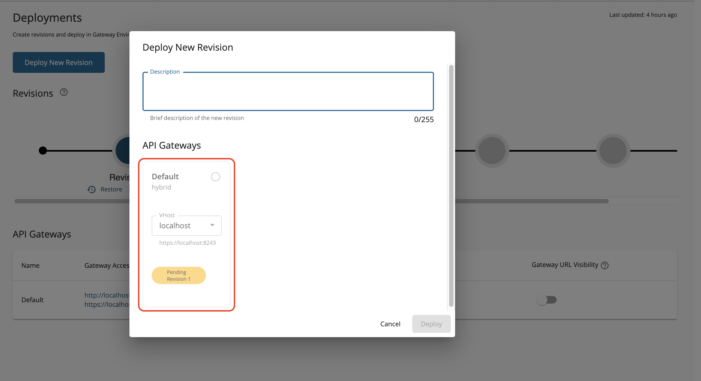
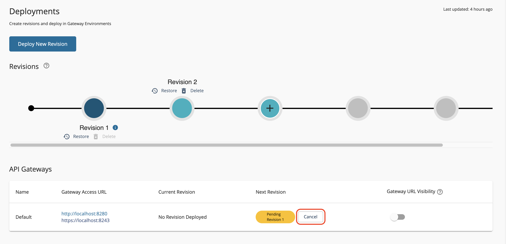
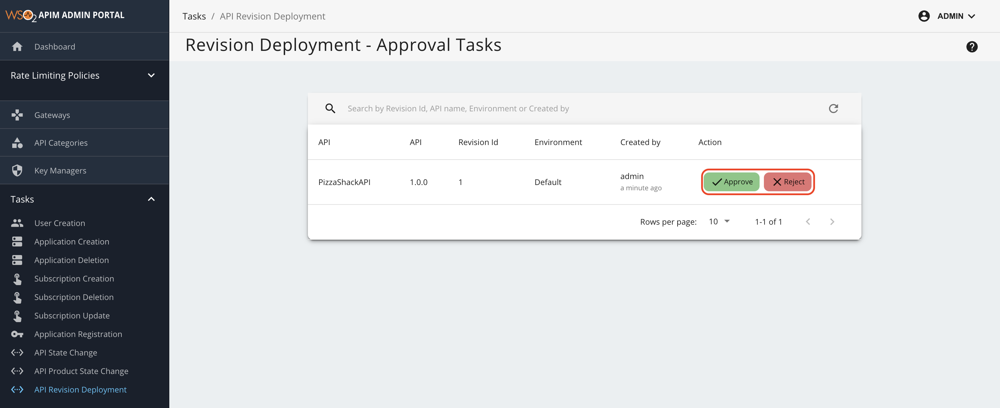
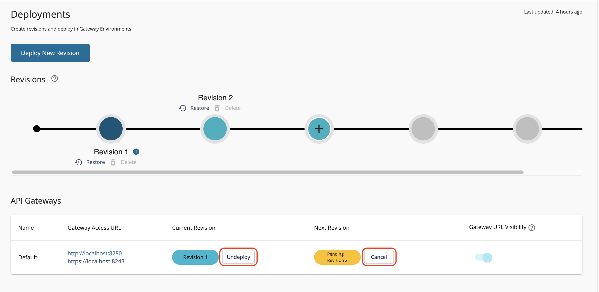

# Revision Deployment Workflow

In this section let's see how to add an approval workflow to control the deployment of revisions in WSO2 API Manager. When the revisions deployment workflow is activated, the API publisher can submit a revision deployment request to the administrator. If approved, the revision is deployed on the gateway. If declined, the gateway stays unchanged.

## Engaging the Approval Workflow Executor in API Manager

1. Enable the API revision deployment workflow configuration for the **Approval Workflow Executor**.

    1. Sign in to the API-M management console(`https://<Server Host>:9443/carbon`).

    2. Click **Registry** --> **Browse**.

       [](../../../../assets/img/learn/navigate-main-resources.png)

    3. Go to the `/_system/governance/apimgt/applicationdata/workflow-extensions.xml` resource.

    4. Disable the `Simple Workflow Executor` and enable the `Approval Workflow Executor` by adding the following configuration.

       <a name="config"></a>
       ```xml
       <WorkFlowExtensions>
           ....
       <!--APIRevisionDeployment executor="org.wso2.carbon.apimgt.impl.workflow.
       APIRevisionDeploymentSimpleWorkflowExecutor"/-->
        <APIRevisionDeployment executor="org.wso2.carbon.apimgt.impl.workflow.
       APIRevisionDeploymentApprovalWorkflowExecutor"/>
           ....
       </WorkFlowExtensions>
       ```

       You have now activated the revision deployment approval Workflow.

2.  Deploy a revision

    1. Sign in to the API Publisher (`https://<Server-Host>:9443/publisher`), click the relevant API, and go to deployments tab.

    2. Select a revision and click the deploy button.

    A revision request will be sent to the administrator for approval. A pending chip will be displayed in the **Next Revision** column. The gateway will continue to serve the current revision until the request is approved. 

    

    !!! info
        Note that when clicking the Deploy New Revision button, a gateway with a pending request will be disabled for selection until the workflow task is completed or deleted.
    
    

    4. Optionally, you can revoke the deployment revision change by clicking **Cancel**.

       [](../../../../assets/img/deploy/delete-revision-deployment-request.png)

3. Approve or reject the API revision deployment pending request.

    1. Sign in to the Admin Portal(`https://<Server Host>:9443/admin`)

    2. Click **Tasks** --> **API Revision Deployment**.

       The list of API revision deployment tasks awaiting approval appears.

    3. Click on **Approve** or **Reject** to approve or reject the pending API revision deployment request(s).

    If the request is approved, the existing revision deployed on the gateway will be removed, and the new revision will take its place. If the request is rejected, the currently deployed revision will remain unchanged. 

       [](../../../../assets/img/deploy/revision-deployment-pending-list.png)

4. View the outcome of the updated API revision deployment request.

    1. Navigate to the API Publisher (`https://<Server-Host>:9443/publisher`).

    2. Click **Deployments**.

    Notice that the API revision deployment is updated.

    If the request is approved, the new revision will be shown in the **Current Revision** column.
    If the request is rejected, the **Current Revision** column will remain unchanged.

       [](../../../../assets/img/deploy/revision%20deployment-updated-status.png)
       
    !!! info
         You can send a new pending request even while a deployment to a specific gateway is in progress. The current revision will not be undeployed until the new request is approved. As
         mentioned earlier, you have the option to either cancel the second pending request or undeploy the current revision at your discretion.

    [](../../../../assets/img/deploy/deployed-and-pending-revisions.png)