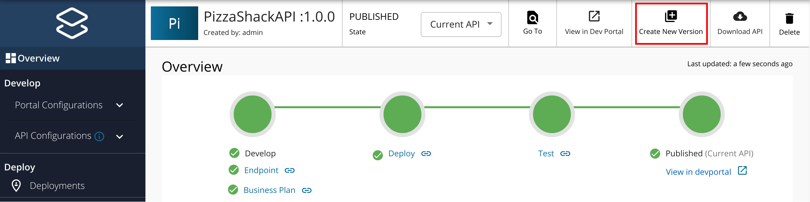
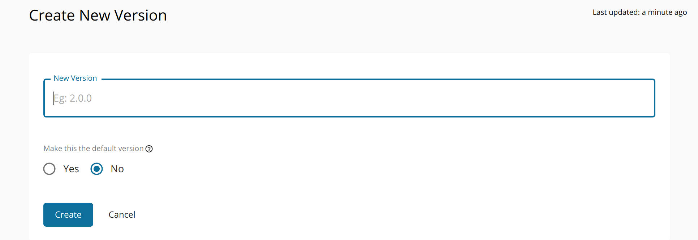

# Create a New API Version

You need to create a new **API version** when you want to change a published API's behavior,
authentication mechanism, resources, [throttling tiers](../../../manage-apis/design/rate-limiting/introducing-throttling-use-cases.md), target audiences, etc. WSO2 does not recommend to modify a published API that has subscribers plugged into it.

After creating a new version, you typically deploy it as a prototype for early promotion.
A prototype can be used for testing, without a subscription, along with the published versions of the API. After a period of time of using the new version of the API in parallel with the older versions, you can publish the prototyped API and deprecate the older versions.

!!! note
    The example here uses the PizzaShack API, which you created in the
    [Create a REST API](../../../manage-apis/design/create-api/create-rest-api/create-a-rest-api.md) section and Published in the [Publish an API](../../../manage-apis/deploy-and-publish/publish-on-dev-portal/publish-an-api.md) section.

Follow the instructions below to create a new version of an existing API:

1.  Sign in to the WSO2 API Publisher.
     
     `https://<hostname>:9443/publisher` 
     
     Create and publish an API. For more information, see [Create a REST API](../../../manage-apis/design/create-api/create-rest-api/create-a-rest-api.md) and [Publish an API](../../../manage-apis/deploy-and-publish/publish-on-dev-portal/publish-an-api.md).

2.  Navigate to the API listing page, and click on the API for which you want to create a new version (e.g., `PizzaShackAPI 2.0.0`). 
                                        
3.  Click **Create New Version**.
     
     [](../../../assets/img/learn/create-new-version-button.png)

4.  Enter a version number and click **Create**. 

     [](../../../assets/img/learn/create-new-api-version.png)

     You are redirected to the API **Overview** page. 

!!! note
    For API Product versioning create an API Product following [Create an API Product](../../../manage-apis/design/create-api-product/create-api-product.md). Then follow the above steps as similar to API versioning.

!!! note
    For more details on the default version, see [Backward Compatibility](../../../manage-apis/design/api-versioning/backward-compatibility.md) section.

!!! note
    By default, only the latest version of an API is shown in the Developer Portal. If you want to display multiple versions, add/change the following configuration in the `<API-M_HOME>/repository/conf/deployment.toml` file, and restart the server.
    ``` toml
       [apim.devportal]
       display_multiple_versions = true
    ```

You have created a new version of an API. In the next tutorial, let's learn how to
[publish the new version and deprecate old API versions](../../../manage-apis/design/api-versioning/deprecate-the-old-version.md).
