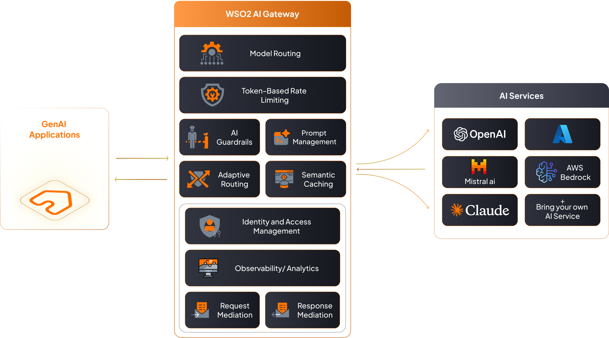
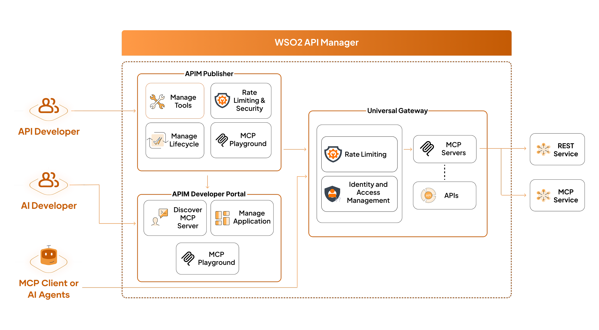

# WSO2 AI Gateway

Production AI deployments face critical challenges: runaway costs from misconfigured agents, reliability issues from provider outages, and security risks from unmonitored data flows to external models.

**WSO2 AI Gateway** provides enterprise-grade AI infrastructure management within the WSO2 API Manager platform.

As an intelligent intermediary between applications and AI services, it delivers:

- **Cost Control**: Smart routing, quotas, and spending limits prevent runaway expenses
- **Provider Independence**: Multi-provider support with seamless switching and failover
- **Enterprise Security**: Centralized data masking, audit logs, and compliance controls  
- **Reliable Performance**: Intelligent caching, load balancing, and automatic retry mechanisms
- **Complete Observability**: Unified monitoring for usage, latency, and errors across providers
- **Centralized Governance**: Role-based access, content filtering, and policy enforcement

The gateway operates in two complementary modes:

- **LLM Gateway**: Direct AI model interactions and multi-provider management
- **MCP Gateway**: Transform existing APIs into AI-discoverable tools for agent workflows

## LLM Gateway

The **LLM Gateway** specializes in managing Large Language Model interactions for traditional AI API patterns. It provides direct integration with major AI service providers, enabling organizations to build conversational AI applications, content generation systems, and AI-powered services.

### Use LLM Gateway when you need
- Direct AI model interactions (chat, completion, embeddings)
- Multi-provider AI service management
- Conversational AI applications with prompt engineering
- AI service cost optimization and performance tuning

### LLM Gateway Features

#### Core LLM Operations

- **[AI API Creation](getting-started-with-ai-gateway.md)**: Create AI APIs by selecting an AI Service Provider and version
- **[AI Service Provider Management](ai-vendor-management/overview.md)**: Manage built-in providers (OpenAI, Azure OpenAI, AWS Bedrock, Anthropic, Google Gemini, Mistral AI, Azure AI Foundry) and integrate custom AI services

#### Traffic Management & Performance
- **[Multi-Model Routing](multi-model-routing/overview.md)**: Dynamically route requests across multiple models within a Service Provider for optimized performance
- **[Load Balancing](multi-model-routing/load-balancing.md)**: Distribute requests across multiple AI models or providers for optimal performance
- **[Failover](multi-model-routing/failover.md)**: Automatically route requests to backup providers when primary services are unavailable
- **[Semantic Caching](semantic-caching.md)**: Reduce latency and cost by serving semantically similar responses via embedding-based cache with similarity thresholds and TTLs

#### Security & Governance
- **[AI Backend Security](ai-backend-security.md)**: Secure AI service access with OAuth2, API keys, and custom authentication methods
- **[AI Guardrails](ai-guardrails/overview.md)**: Enforce safety and policy controls on inputs and outputs using provider-native and custom guardrails (regex, JSON schema, content safety)
- **[Data Privacy Controls](ai-guardrails/regex-pii-masking.md)**: Mask sensitive information in prompts and responses

#### Cost Control & Monitoring
- **[Rate Limiting](rate-limiting.md)**: Protect AI backends by enforcing token-based rate limits to manage resource consumption
- **[Cost Control](rate-limiting.md)**: Monitor and control AI service usage with advanced rate limiting and spending limits
- **[AI API Observability](../monitoring/api-analytics/moesif-analytics/moesif-integration-guide.md)**: Track AI API usage statistics and performance metrics

#### Development & Management
- **[Prompt Management](prompt-management/overview.md)**: Centrally author, version, and reuse prompts and templates with decorators for standardization
- **[AI APIs via SDKs](using-proxy-apis-in-sdks.md)**: Generate and manage SDKs for AI API consumption

## MCP Gateway

The **Model Context Protocol (MCP) Gateway** transforms existing APIs into AI-ready tools that AI agents can discover and invoke. Built on the JSON-RPC–based [Model Context Protocol specification](https://modelcontextprotocol.io/docs/getting-started/intro), it standardizes how applications interact with LLMs by exposing callable tools that AI agents can invoke in workflows, complete with machine-readable schemas for discovery and validation.

The MCP Gateway implements a three-tier architecture:
 
- **Host** : Runtime where the MCP client operates, such as an AI agent or gateway
- **Client** : Mediates communication with MCP servers
- **Servers** : Publish tools, schemas, and metadata for discovery and invocation

This standardized approach enables structured AI workflows where AI agents can seamlessly call your business logic as tools.

### Use MCP Gateway when you need
- Transform existing APIs into AI-callable tools
- Enable AI agents to interact with your business systems
- Structured AI workflows with tool orchestration
- Standardized tool discovery for AI applications

### MCP Gateway Features  

#### Tool Management & Discovery
- **[API-to-Tool Transformation](mcp-gateway/create-from-api.md)**: Transform existing APIs into AI-ready tools with machine-readable schemas
- **[MCP Server Creation](mcp-gateway/create-from-openapi.md)**: Create MCP servers from OpenAPI definitions, existing APIs, or by proxying existing MCP servers
- **[Tool Discovery](mcp-gateway/create-from-mcp-server.md)**: Standardized tool discovery and schema retrieval for AI agents
- **[Versioned Tool Changes](mcp-gateway/update-and-deploy-mcp-server.md)**: Ship tool updates with minimal disruption to AI workflows

#### Execution & Testing
- **[Tool Invocation](mcp-gateway/subscribe-to-a-mcp-server.md)**: JSON-RPC based tool execution through subscriptions and access tokens
- **[MCP Playground](mcp-gateway/invoke-a-mcp-server-using-playground.md)**: Interactive testing environment for MCP servers and tools
#### Security & Analytics
- **[API Security](../api-security/runtime/api-authentication/secure-apis-using-oauth2-tokens.md)**: Leverage platform security policies including OAuth2, JWT, and mutual SSL for tool access
- **[API Analytics](../monitoring/api-analytics/analytics-overview.md)**: Track tool usage patterns and performance metrics through platform analytics
- **[Rate Limiting](../api-design-manage/design/rate-limiting/set-api-level-throttling.md)**: Control tool usage with platform throttling policies and quotas

## Platform Capabilities

Both gateway modes share WSO2 API Manager's enterprise platform capabilities:

- **[Multi-Tenancy](../administer/multitenancy/introduction-to-multitenancy.md)**: Tenant isolation, usage billing, and custom policies per tenant
- **[Enterprise Governance](../api-design-manage/design/api-policies/overview.md)**: Apply governance policies to AI service consumption and tool access
- **[Compliance Monitoring](../monitoring/api-analytics/analytics-overview.md)**: Comprehensive audit logging for regulatory compliance
- **Cloud-Native Operations**: Kubernetes integration, automatic scaling, and rolling updates

## Getting Started

### Choose Your Implementation Path

**New to AI in Production:**
Start with the essentials - deploy the gateway and gain immediate cost visibility.

1. Deploy [LLM Gateway](getting-started-with-ai-gateway.md) for centralized AI access
2. Set up basic cost controls and monitoring

**Migrating Existing Applications:**
Route your current AI traffic through the gateway without disruption.

1. Assess current costs and reliability issues 
2. Gradually migrate traffic through the gateway
3. Add security and governance policies as needed

**Enterprise Scale Deployment:**
Build comprehensive infrastructure for production AI operations.

1. Configure multiple AI providers for resilience
2. Implement advanced security and compliance controls
3. Enable AI agent workflows with [API-to-tool](mcp-gateway/create-from-api.md) transformation

## Best Practices

### Start with Security and Cost Control
Always implement [AI Guardrails](ai-guardrails/overview.md) and cost controls before production deployment. Set conservative usage quotas initially and gradually increase based on actual needs. This prevents unexpected costs and security incidents from day one.

### Avoid Vendor Lock-in Early
Configure [multiple AI providers](ai-vendor-management/overview.md) even if you initially use only one. This provides immediate failover capability and negotiating leverage. Test failover scenarios regularly to ensure seamless switching when needed.

### Optimize Costs with Caching
Enable [semantic caching](semantic-caching.md) to reduce API calls by 40-60%. Start with conservative similarity thresholds (0.95) and adjust based on your application's tolerance for cached responses. Monitor cache hit rates and cost savings regularly.

### Plan for AI Agent Workflows
If building AI agents that need to interact with your business systems, implement [MCP Gateway](mcp-gateway/overview.md) to standardize tool access. Start by exposing read-only APIs as tools, then gradually add write operations with appropriate access controls.
### Use Smart Routing for Production
Implement [smart routing](multi-model-routing/overview.md) to balance cost and performance. Route simple queries to cost-effective models and complex reasoning tasks to premium models. Set up automated failover between providers to maintain availability.

## Next Steps

Choose your path based on your use case:

- **[Getting Started with LLM Gateway](getting-started-with-ai-gateway.md)** - For direct AI model integration (chat, completion, content generation)
- **[Getting Started with MCP Gateway](mcp-gateway/overview.md)** - For transforming APIs into AI-callable tools