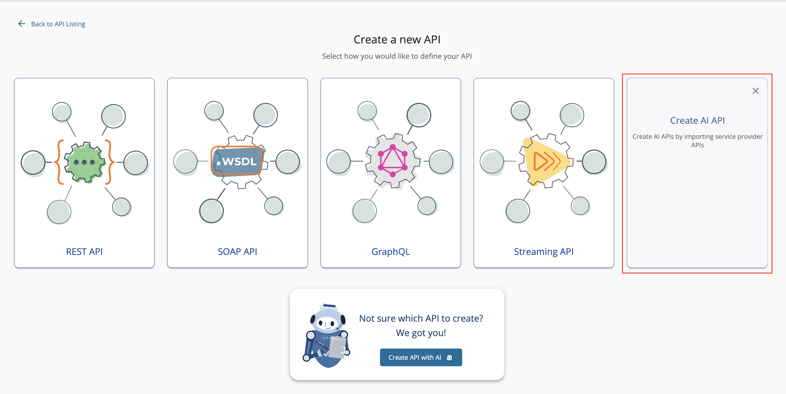
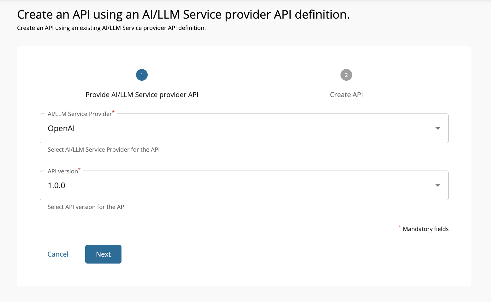
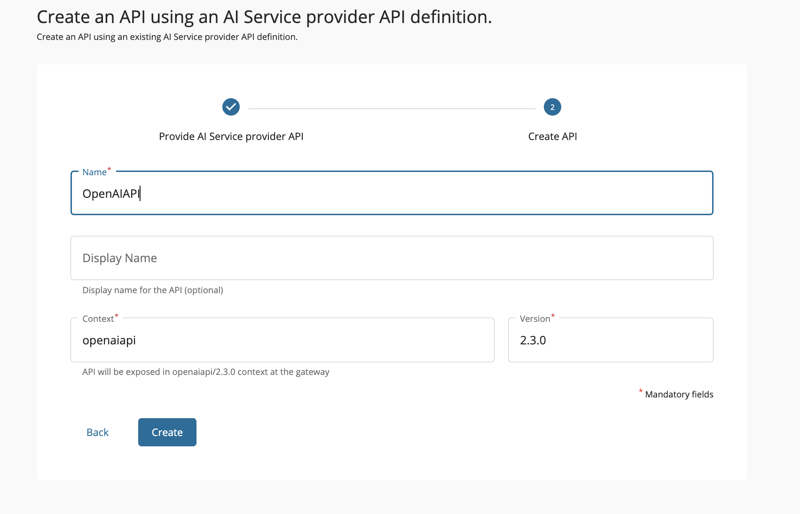
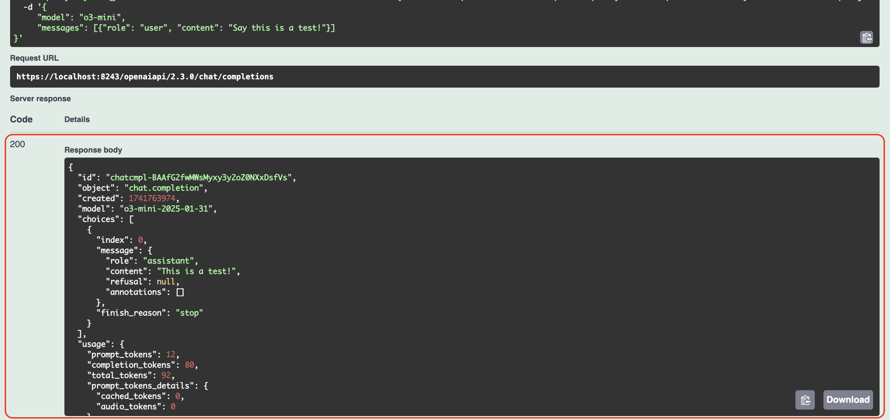

# Getting Started with LLM Gateway

The LLM Gateway in WSO2 API Manager simplifies the integration of AI services into applications by providing a seamless way to manage and expose AI APIs. With built-in support for leading AI Service Providers such as **Anthropic**, **AWS Bedrock**, **Azure AI Foundry**, **Azure OpenAI**, **Gemini**, **Mistral**, and **OpenAI**, as well as the flexibility to configure custom AI providers, LLM Gateway enables organizations to adopt AI securely and efficiently.

LLM Gateway gives you the ability to create AI APIs, which serve as a bridge between your application and AI service providers. These AI APIs allow you to interact with AI models, send requests, and retrieve AI-generated responses.

!!! note
     This Getting Started guide will walk you through creating an OpenAI based AI API.

### Create an AI API

1. Login to the Publisher Portal (`https://<hostname>:9443/publisher`).

2. Create an **AI API** by clicking on **Create AI API**.

    [{: style="width:90%"}](../assets/img/learn/ai-gateway/select-ai-api.png)

3. Select the desired provider and version. Then, click Next.

    [{: style="width:90%"}](../assets/img/learn/ai-gateway/select-service-provider.png)

    <div class="admonition tip">
    <p class="admonition-title">Tip</p>
    <p>The built-in AI service providers and versions will appear on relevant dropdowns. In addition to the default Service Providers, you can add custom AI Service Providers by following the <a href='../../ai-gateway/ai-vendor-management/custom-ai-vendors/overview'>custom AI Service Provider integration</a> documentation.</p>
    </div>

4. Fill in the AI API details and click **Create**.
    
    <table>
        <colgroup>
            <col/>
            <col/>
            <col/>
        </colgroup>
        <tbody>
            <tr>
                <th colspan="2">Field</th>
                <th>Sample value</th>
            </tr>
            <tr>
                <td colspan="2" class="confluenceTd">Name</td>
                <td class="confluenceTd">OpenAIAPI</td>
            </tr>
            <tr>
                <td colspan="2" class="confluenceTd">Context</td>
                <td class="confluenceTd">
                    <div class="content-wrapper">
                        <p><code>openaiapi</code></p>
                        <div>
                            <div class="confluence-information-macro-body">
                                <p>
                                    The API context is used by the Gateway to identify the API. 
                                    Therefore, the API context must be unique. This context is the 
                                    API's root context when invoking the API through the Gateway.
                                </p>
                            </div>
                            <div class="confluence-information-macro confluence-information-macro-tip">
                                <span class="aui-icon aui-icon-small aui-iconfont-approve confluence-information-macro-icon"></span>
                                <div class="confluence-information-macro-body">
                                    <p>
                                        You can define the API's version as a parameter of its context 
                                        by adding the <code>{version}</code> into the context. 
                                        For example, <code>{version}/openaiapi</code>. 
                                        The API Manager assigns the actual version of the API to the 
                                        <code>{version}</code> parameter internally. 
                                        For example, <code>https://localhost:8243/2.3.0/openaiapi</code>. 
                                        Note that the version appears before the context, allowing you 
                                        to group your APIs based on the versions.
                                    </p>
                                </div>
                            </div>
                        </div>
                    </div>
                </td>
            </tr>
            <tr>
                <td colspan="2" class="confluenceTd">Version</td>
                <td class="confluenceTd">2.3.0</td>
            </tr>
        </tbody>
    </table>

    [{: style="width:90%"}](../assets/img/learn/ai-gateway/create-openai-api.png)

    The overview page of the newly created API appears.

### Configure Backend Security

Now that the AI API is successfully created, next step is to configure the backend security to ensure AI provider accessibility. You can follow along the steps mentioned below. For detailed steps, see [AI Backend Security](ai-backend-security.md).

1. Create an **API key** to access the OpenAI API.
2. Navigate to **API Configurations** --> **Endpoints**.
3. Edit `Default Production Endpoint` and add the API key obtained from step 1. Then, click on Update.
4. Repeat step 3 for `Default Sandbox Endpoint`.

### Deploy, Test and Publish your AI API

Following the successful AI API creation and backend security configuration, you can proceed to [deploy](../api-design-manage/deploy-and-publish/deploy-on-gateway/deploy-api/deploy-an-api.md), [test](../api-design-manage/design/create-api/create-rest-api/test-a-rest-api.md), and [publish](../api-design-manage/deploy-and-publish/publish-on-dev-portal/publish-an-api.md) the AI API.

### Invoke AI API

1. Login to the Developer Portal (`https://<hostname>:9443/devportal`) and click on the **OpenAIAPI** that you just published.
2. Click **Try Out** option available under the Overview tab.
3. Click on **Get Test Key** to generate a test key.
4. Expand the `/chat/completions` POST method and click on **Try it out** button.
5. Replace the request body with the following:

    ```json
    {
        "model": "o3-mini",
        "messages": [{"role": "user", "content": "Say this is a test!"}]
    }
    ```

6. Note the successful response for the API invocation.

    [{: style="width:90%"}](../assets/img/learn/ai-gateway/ai-api-invocation-success.png)

Now, you have successfully created, deployed, published and invoked an AI API.

## Next Steps

Now that you've successfully created your first AI API, explore these advanced capabilities to optimize your AI integration:

### Enhance Security and Performance
- **[AI Backend Security](ai-backend-security.md)** - Implement advanced authentication and security configurations
- **[Rate Limiting](rate-limiting.md)** - Control API usage and prevent abuse with token-based limits

### Advanced AI Features
- **[Multi-Model Routing](multi-model-routing/overview.md)** - Route requests across multiple AI models for load balancing and failover
- **[Prompt Management](prompt-management/overview.md)** - Centrally manage and version your AI prompts and templates
- **[AI Guardrails](ai-guardrails/overview.md)** - Implement content filtering and safety measures
- **[Semantic Caching](semantic-caching.md)** - Improve performance and reduce costs with intelligent caching

### AI Service Provider Management
- **[AI Service Provider Management](ai-vendor-management/overview.md)** - Configure additional AI providers beyond OpenAI
- **[Custom AI Service Providers](ai-vendor-management/custom-ai-vendors/overview.md)** - Integrate your custom AI services

### Developer Experience
- **[AI APIs via SDKs](using-proxy-apis-in-sdks.md)** - Generate and use SDKs for your AI APIs

### Explore MCP Gateway
- **[MCP Gateway](mcp-gateway/overview.md)** - Transform your APIs into AI-ready tools for Large Language Models