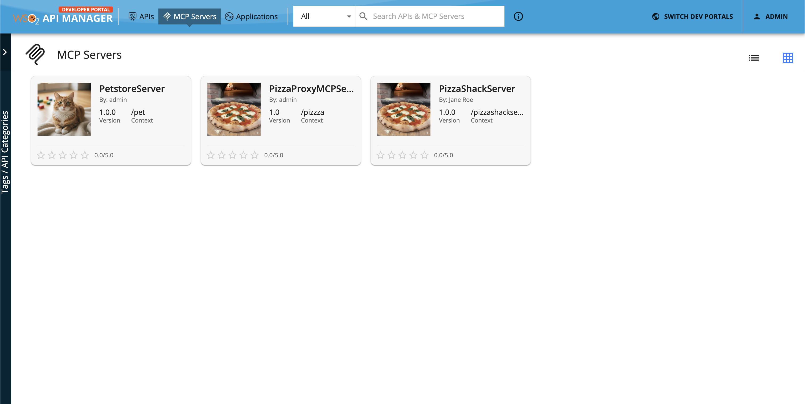

# Subscribe to a MCP Server

You have to **subscribe** to a published MCP Server before using its tools in your applications. The subscription process fulfills the authentication process and provides you with access tokens that you can use to invoke a MCP Server's tools. 

The examples here use the `Petstore` MCP Server, which is created and published to the Developer Portal in WSO2 API Manager.

## Subscribe to an application

If you already have an existing application, follow the instructions below to subscribe to the MCP Server using that application.

1.  Sign in to the Developer Portal (`https://<hostname>:<port>/devportal`) and click on the MCP Server (e.g., `Petstore`) to go to the MCP Server overview.

    
        
2.  Click **SUBSCRIBE TO AN APPLICATION**.

    
    
3.  Select the application, the throttling policy, and click **Subscribe**.

    
    
    You can see the subscriptions list in the **Subscriptions** section.
     
    

If you do not have an existing application, you can create one and then subscribe to the MCP Server. For detailed steps, refer to [Subscribe to an API](../../api-developer-portal/manage-subscription/subscribe-to-an-api.md), as the process is similar.