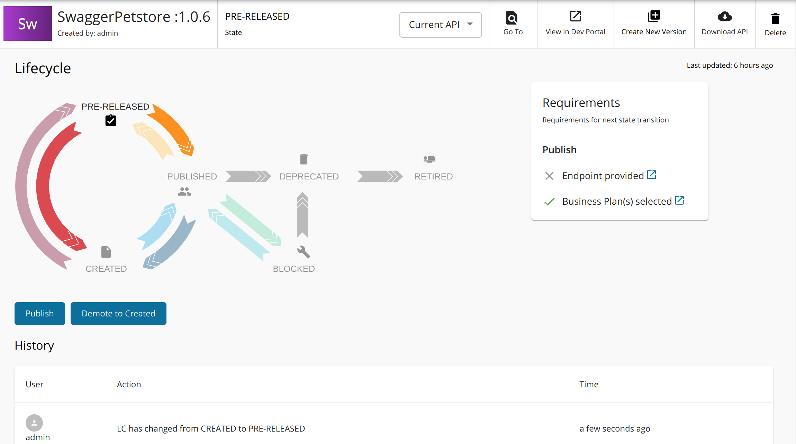
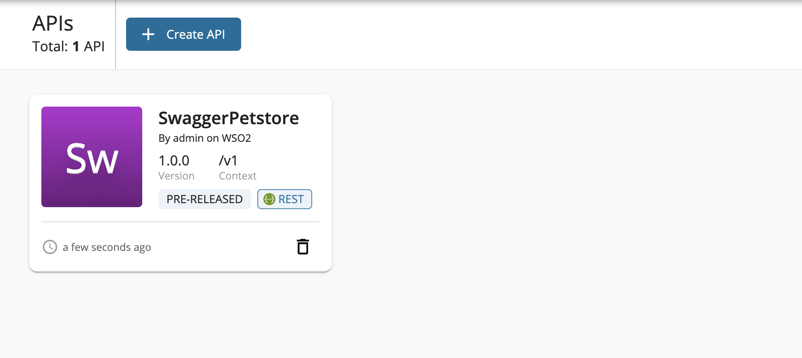
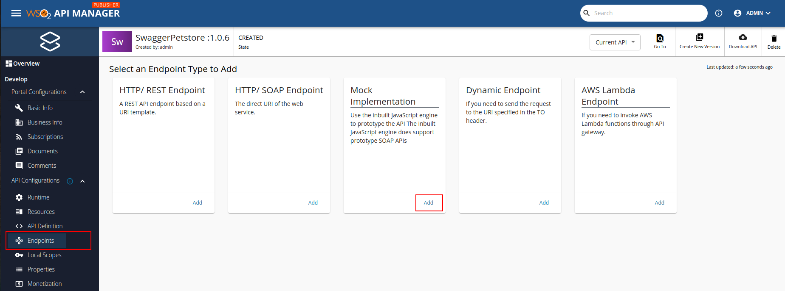

# Prototyped APIs (Pre-Released APIs)

Prototyped APIs (Pre-Released APIs) give publishers the ability to make an API available in the Developer Portal while indicating that it still is a work in progress. Subscribers can try out these APIs and provide feedback for improvements. Additionally, Pre-Released APIs provide mocking capabilities that enables receiving direct responses from the gateway even without a backend.

**PRE-RELEASED** (previously **PROTOTYPED**) is a lifecycle state of the API that disallows adding monetizations to the API. After a period of time, the publishers can make changes requested by the users and publish the API by changing the lifecycle state of the API to *PUBLISHED*, to add monetizations as required.

In the Developer Portal, these APIs will be the labelled as **PRE-RELEASED** and therefore can be clearly identified.

[{: style="width:80%"}](../../../assets/img/learn/prototype-api/prototype-api-devportal.png)

WSO2 API Manager allows prototyping an API at two different stages. 

- At an initial stage, before implementing the actual backend, the backend responses can be mocked by changing the **Endpoint Type** of the Prototype API to **Mock Implementation**. You can use these APIs to get feedback before you start implementing the actual service.

	

- Once a backend is implemented, you can update the endpoint of the API with the actual backend URL (which could be of type HTTP/REST), and continue testing or use the API as an early promotion by keeping API in the state **PRE-RELEASED**.

For more information on prototyping an API, see the following links.

- [Mock responses based on the OpenAPI specification with API Gateway](create-mocked-js-api.md)    
- [Expose an existing backend implementation as a Pre-Released API](backend-url-prototype-api.md)