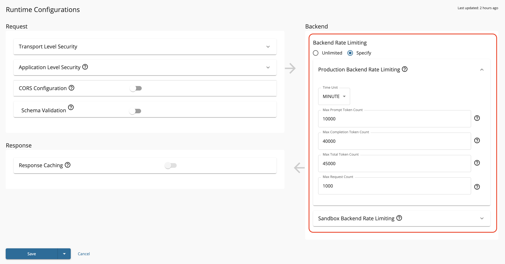

# Protect Backend Services

When you expose an API, you create a proxy to your actual backend service. While subscription tiers and advanced rate limiting policies control how applications and users access your API, Maximum Backend Throughput limits protect your backend service itself from being overwhelmed.

This limit acts as a protective cap on the total number of requests your API forwards to the backend within a given time period, ensuring your backend services remain stable even as API usage grows.

!!! note
    By default, backend throughput limits are enforced locally on each Gateway node. For clustered deployments where you need consistent enforcement across all nodes, you can configure distributed counters using Redis. See [Configuring Distributed Throttling](../../../api-gateway/rate-limiting/configuring-rate-limiting-api-gateway-cluster.md) for details.

## Setting Backend Throughput Limits

To set maximum backend throughput for your API:

1. Log in to the API Publisher.
2. Select your API and navigate to **API Configurations** > **Runtime**.
3. In the **Backend Throughput** section, select **Specify**.
4. Set limits for **Production** and **Sandbox** endpoints separately, as they may have different capacities.

5. Save the API.

## Backend Throughput for AI APIs

AI APIs have different resource consumption patterns based on token usage rather than simple request counts. WSO2 API Manager provides token-based backend throughput limiting specifically designed for AI services.

### Token-Based Limits

For AI APIs, you can set limits based on:

- **Total Token Count**: The combined tokens consumed by the backend
- **Prompt Token Count**: Tokens used in requests sent to the AI model
- **Completion Token Count**: Tokens generated in responses from the AI model

These token-based quotas help manage AI backend resources more effectively than request-count limits.

### Setting Token-Based Limits

To configure token-based backend throughput for AI APIs:

1. Log in to the API Publisher.
2. Select your AI API and navigate to **API Configurations** > **Runtime**.
3. In the **Backend Throughput** section, select **Specify**.
4. Configure the token-based limits:

5. Set limits for both **Production** and **Sandbox** environments separately.
6. Save the API.

This ensures your AI backend resources are protected from overconsumption while allowing appropriate token usage for your API consumers.