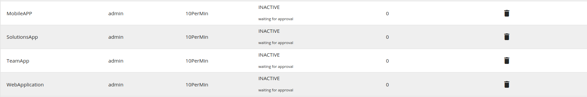
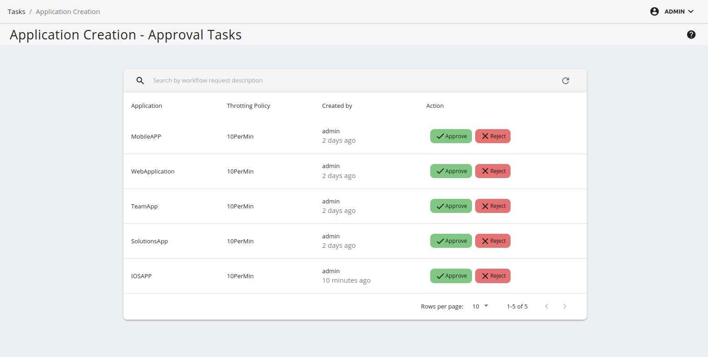

# Adding an Application Creation Workflow

Attaching a custom workflow to application creation provides the ability to control the creation of applications (approve or reject the request for application creation) in the Developer Portal. An application is an entity that holds a set of subscribed APIs, accessed by an authorization key generated for that particular application. Therefore, controlling the creation of these applications would be a decision based on the organization's requirements. 

Example usecase:

-   Review the information that corresponds to an application by a specific reviewer before the application is created.
-   The application creation would be offered as a paid service.
-   The application creation should be allowed only to users who are in a specific role.


## Engage the Approval Workflow Executor in API Manager

First enable the approve workflow executor for application creation.

1.  Sign in to WSO2 API-M Management Console (`https://<Server-Host>:9443/carbon`).

2. Click **Main** --> **Registry** --> **Browse**.

    <a href="../../../../assets/img/learn/navigate-main-resources.png"></a>
    
3.  Go to the `/_system/governance/apimgt/applicationdata/workflow-extensions.xml` resource, click on `Edit as text` to edit the file, disable the Simple Workflow Executor, and enable **Approval Workflow Executor** for application creation.

    ``` xml
    <WorkFlowExtensions>
        <!--ApplicationCreation executor="org.wso2.carbon.apimgt.impl.workflow.ApplicationCreationSimpleWorkflowExecutor"-->
        <ApplicationCreation executor="org.wso2.carbon.apimgt.impl.workflow.ApplicationCreationApprovalWorkflowExecutor"/>
    </WorkFlowExtensions>
    ```

    Once the changes are done, click on `Save Content` .The application creation Approve Workflow Executor is now engaged.

4.  Create an application via the Developer Portal.
    
    1. Sign in to the Developer Portal.

         (`https://localhost:9443/devportal`)

    2. Click **Applications** --> **ADD NEW APPLICATION** and create a new application.
                  
         Note that the **Status** field of the application states **INACTIVE** (Waiting for approval)

    

5.  Sign in to the Admin Portal (`https://localhost:9443/admin`), list all the tasks for application creation  from **Tasks** --> **Application Creation** and approve or reject the task. 
     
    

6.  Go back to the **Applications** page in the WSO2 Developer Portal and see the created application.

    Check whether the status is updated to **ACTIVE** or **REJECTED**.