# Subscribe to an API

You have to **subscribe** to a published API before using it in your applications. The subscription process fulfills the authentication process and provides you with access tokens that you can use to invoke an API. 

The examples here use the `PizzaShackAPI` REST API, which is [created](../../api-design-manage/design/create-api/create-rest-api/create-a-rest-api.md) and [published](../../api-design-manage/deploy-and-publish/publish-on-dev-portal/publish-an-api.md) to Developer Portal in WSO2 API Manager.

The following are the two methods available in the Developer Portal to subscribe an API to an application. 

- Subscribe to an existing application

    You can subscribe to a current API by selecting an existing application. 

- Subscribe to an API using Key Generation Wizard

    You can use the **SUBSCRIPTION & KEY GENERATION WIZARD** option to start the subscription process from scratch. It guides you through the process of creating and configuring an application, generating application keys and access tokens, and finally navigates you to the try out page.

## Subscribe to an API using Key Generation Wizard

1.  Sign in to the WSO2 API Developer Portal (`https://<hostname>:<port>/devportal`) and click on the API (e.g., `PizzaShackAPI`) to go to the API overview.

     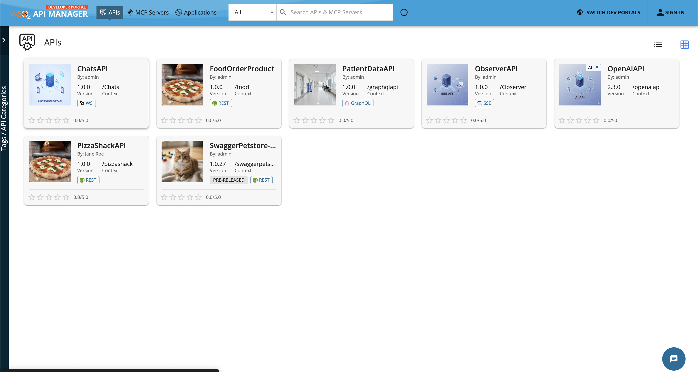](../../assets/img/get_started/architecture/developer-portal-overview.png)
 
2.  Click **SUBSCRIPTION & KEY GENERATION WIZARD** to start the key generation wizard.

    

3.  Enter the application details in the **Create application** process and click **Next** to continue.

    [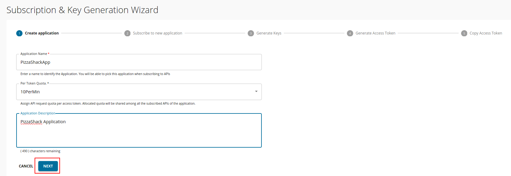](../../assets/img/learn/key-gen-wizard-create-app.png)

4.  Subscribe the API to the application that you created in the above step by selecting the preferred throttling policy. Thereafter, click **Next** to go to the next step.
     
     [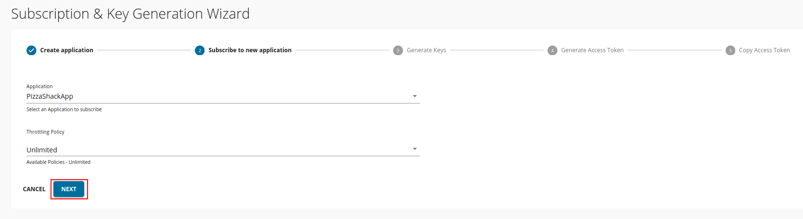](../../assets/img/learn/key-gen-wizard-subscribe.png)
    
5. [Generate application keys](../manage-application/generate-keys/generate-api-keys.md) (Production or sandbox) by clicking on the **Next** button. 

     The application keys are generated in this step.

     [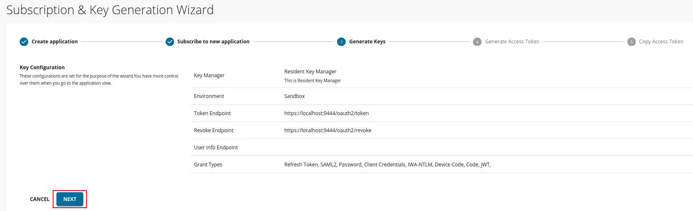](../../assets/img/learn/key-gen-wizard-generate-keys.png)
    
    !!! note
        - By default, the __Client Credentials__ grant type is used to generate the access token in Developer Portal.
        - If you want to select different grant types for this application, you can select the required grant types from the application listing page as shown in the following image:

        [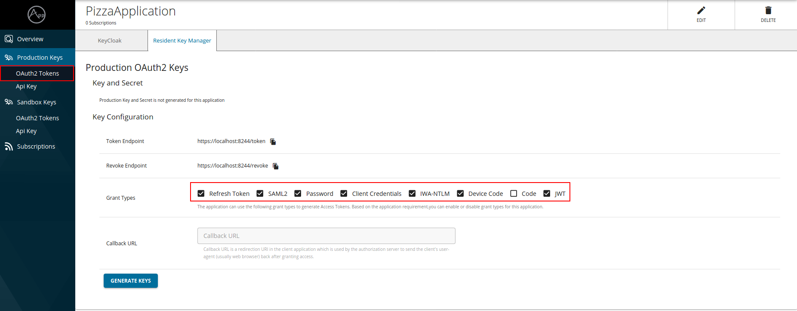](../../assets/img/learn/edit-application-grant-types.png)
        
    
6.  Select the access token validity period and [scopes](../../api-security/runtime/authorization/oauth2-scopes/fine-grained-access-control-with-oauth-scopes.md) to generate an access token to invoke the API, then click **Next** to continue.
    
7.  Copy the generated access token. 

8. Click **Finish** to complete the wizard or click **Test** to navigate to the [API Console](../invoke-apis/invoke-apis-using-tools/invoke-an-api-using-the-integrated-api-console.md) so that you can invoke and try out the API.

    [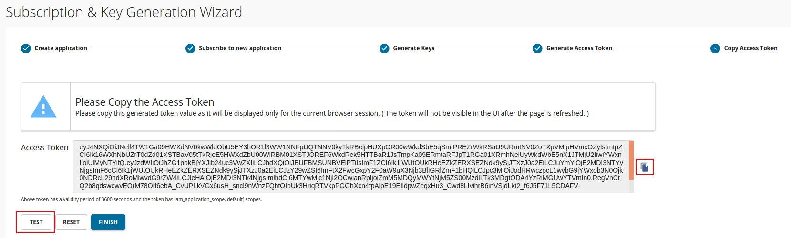](../../assets/img/learn/key-gen-wizard-access.png)
    
## Subscribe to an existing application

If you already have an existing application, follow the instructions below to subscribe to the API using that application.

1.  Sign in to the Developer Portal (`https://<hostname>:<port>/devportal`) and click on the API (e.g., `PizzaShackAPI`) to go to the API overview.

     
        
2.  Click **SUBSCRIBE TO AN APPLICATION**.

     
    
3.  Select the application, the throttling policy, and click **Subscribe**.

     [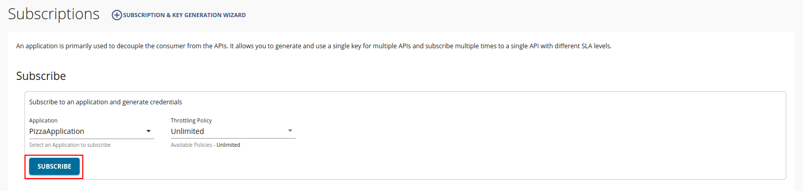](../../assets/img/learn/subscribe-to-app.png)
    
     You can see the subscriptions list in the **Subscriptions** section.
     
     [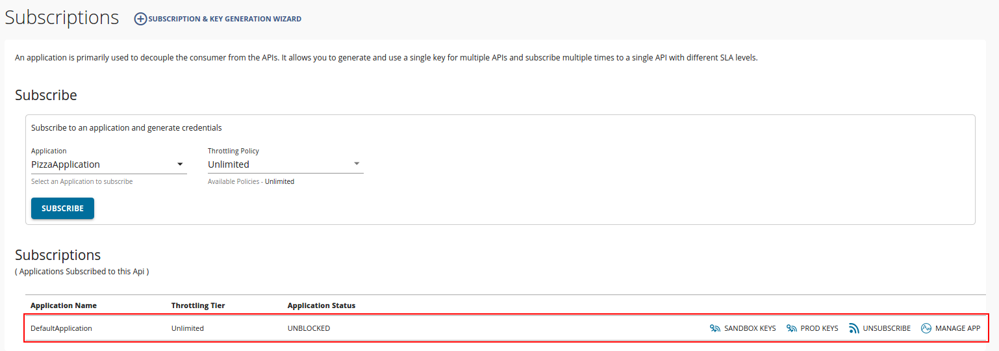](../../assets/img/learn/subscription-list.png)

## Update the subscription tier

1.  Sign in to the WSO2 API Developer Portal (`https://<hostname>:<port>/devportal`). Click on **Applications** and select the relevant application. 

    [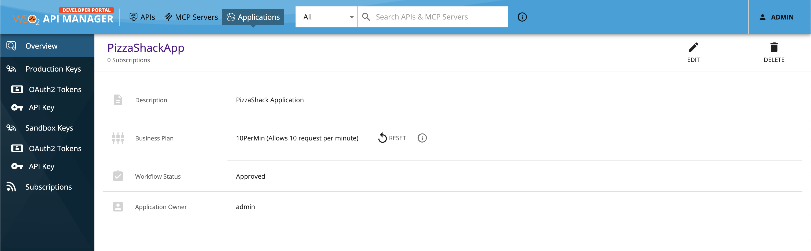](../../assets/img/learn/application-overview.png)

2.  Click **Subscriptions** to list the subscriptions of the application.

    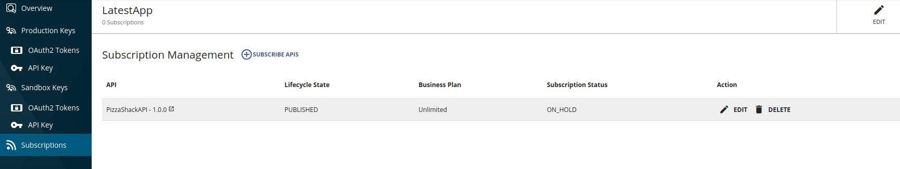
 
3.  Click the **EDIT** icon  of the subscription whose tier needs to be changed, to open the subscription update popup.

    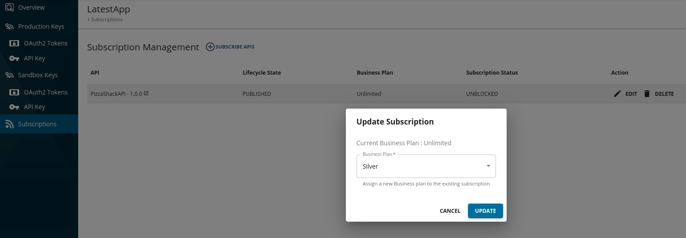

4.  Select the throttling tier that needs to be updated and click **Update**. This will update the existing subscription with the newly selected throttling tier.
    
    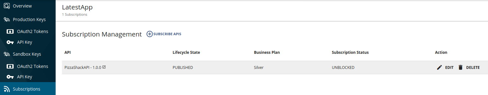

Follow the steps mentioned in [Adding an API Subscription Update Workflow](advanced-topics/adding-an-api-subscription-tier-update-workflow.md) if you need to configure an approval process to update the subscription tier. 

## Unsubscribe from an API

Follow the instructions below to delete the API subscription:

1.  Sign in to the WSO2 API Developer Portal (`https://<hostname>:<port>/devportal`) and click on the API (e.g., `PizzaShackAPI`) for which you need to delete the application subscription.
    
    
    
2.  Click **Subscriptions**.

    [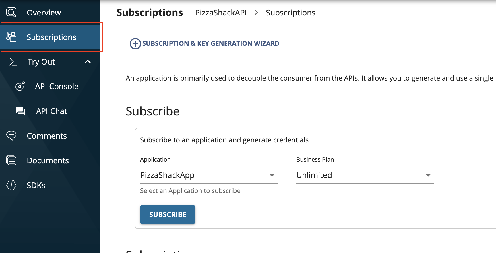](../../assets/img/learn/api-credentials.png)
    
3.  Select the subscription that you need to delete and click **UNSUBSCRIBE**.

    [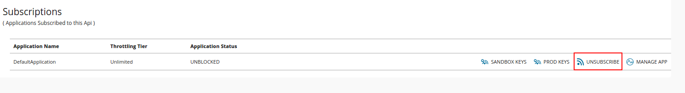](../../assets/img/learn/unsubscribe.png)
    