# Configure the Global Key Manager

This document outlines the steps to enable the global key manager support in WSO2 API Manager (API-M).This feature allows a single token generated by the global key manager to invoke cross-tenant APIs, without needing to generate a token in each tenant's key manager.

The global key manager can be created through the admin portal of the super tenant. This global key manager will be visible in the devportal of all the tenants and this can be used to generate a token which can be used to invoke APIs across tenants. Any third party key manager can be configured as a global key manager.

!!! Note
      It is only possible to create one global key manager which can only be done through the Admin portal of the super tenant

Follow the steps given below to configure the Global Key Manager

1. Start the WSO2 API Manager

2. Sign in to the Admin Portal (`https://<hostname>:9443/admin`)

3. Click **Key Managers**

4. Click the drop-down icon next to the **Add Key Manager** button and Click **Add Global Key Manager** from the drop-down

    [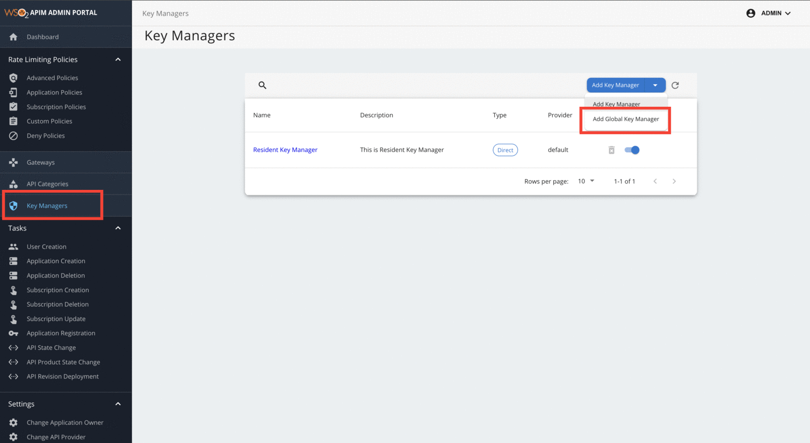](../../../assets/img/administer/global-keymanager/add-global-key-manager-dropdown.png)

5. Click **Add Global Key Manager** button

    [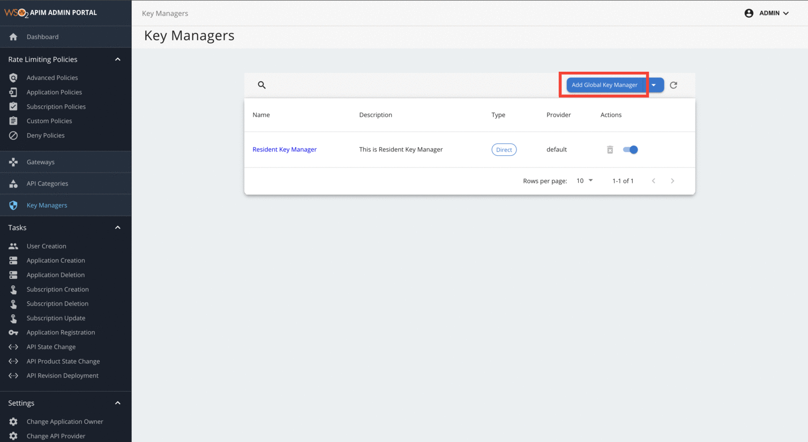](../../../assets/img/administer/global-keymanager/add-global-key-manager.png)

6. Add the Global Key Manager configurations. Refer to the [configurations](overview.md) of the key manager that needs to be added as the global key manager

    [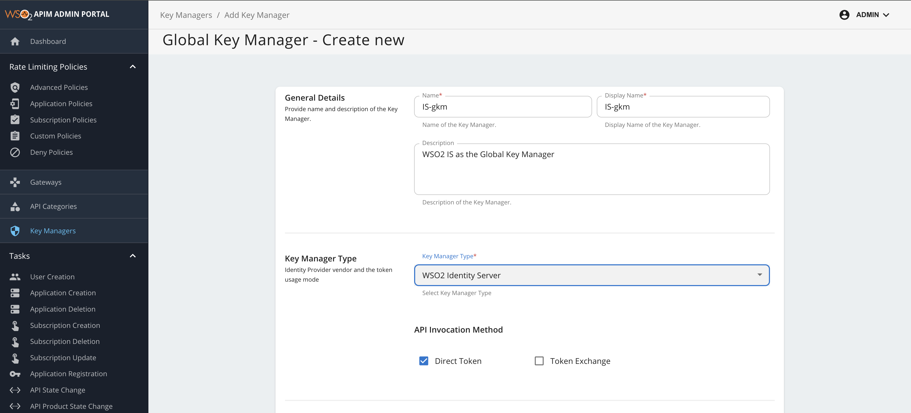](../../../assets/img/administer/global-keymanager/add-global-key-manager-configurations.png)

!!! Note
      Refer to the configurations of the key manager that needs to be added as the global key manager.

7. Click **Add** to register the Global Key Manager

8. The Global Key Manager will be indicated with a chip shown as **Global**

    [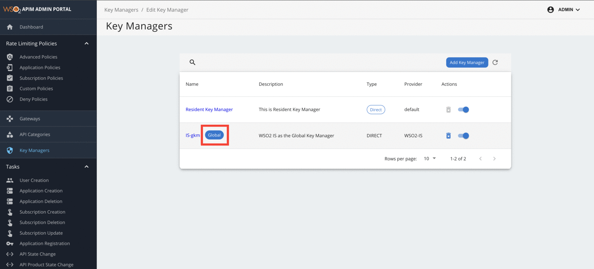](../../../assets/img/administer/global-keymanager/global-key-manager-chip.png)

!!! Note
      After adding the Global Key Manager, the drop-down icon next to the **Add Key Manager** button will be removed since only one Global Key Manager can be added.

## Trying Out the Global Key Manager

Let's look at a scenario where a single access token generated for an application using the Global Key Manager is used to invoke subscribed APIs of different tenants

1. Stop the WSO2 API Manager if it is already running

2. Enable cross-tenant subscriptions by adding the following to the `<API-M_HOME>/repository/conf/deployment.toml`

    ``` toml 
    [apim.devportal]  
    enable_cross_tenant_subscriptions = true
    ```

    !!! Note
        When using cross-tenant subscriptions, if you are generating access tokens with the **Password grant** or the **Code grant**, add the following configuration to the `<API-M_HOME>/repository/conf/deployment.toml` file.

        ``` toml
        [oauth.access_token]
        generate_with_sp_tenant_domain = "true"
        ```

3. Start the WSO2 API Manager.

4. [Create a tenant](../../../administer/multitenancy/managing-tenants.md) (Ex: abc.com)

5. Sign in to the WSO2 API Publisher (`https://<hostname>:9443/publisher`) using the super tenant’s admin credentials

6. [Create an API](../../../api-design-manage/design/create-api/create-rest-api/create-a-rest-api.md) (Eg: SampleAPI)

    [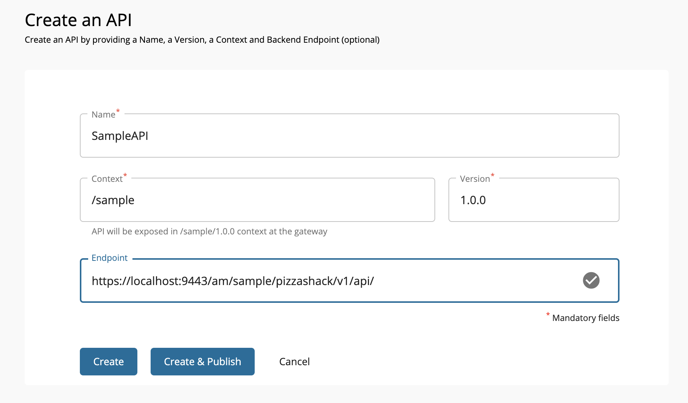](../../../assets/img/administer/global-keymanager/sample-api-creation.png)

7. Go to **Portal Configurations** from the left menu and click **Subscriptions**, click the **Subscription Availability** dropdown, and select the desired subscription availability option. For this scenario, select **Available to all the tenants** and Click Save.

    !!! Note
        The **Subscription Availability** option will only be displayed if there are tenants in your environment.

    [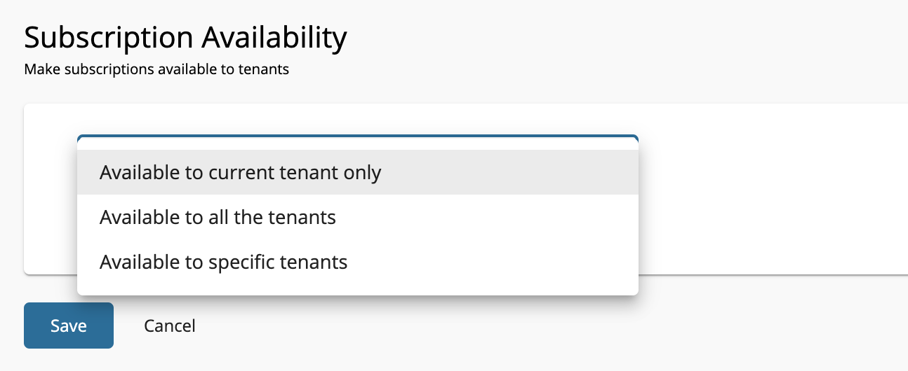](../../../assets/img/learn/api-subscription-availability.png)

8. [Deploy the API](../../../api-design-manage/deploy-and-publish/deploy-on-gateway/deploy-api/deploy-an-api.md)

9. Sign in to the WSO2 API Publisher (`https://<hostname>:9443/publisher`) using the new tenant’s (abc.com) admin credentials and repeat Steps 5 - 7

10. Sign in to the super tenant's Developer Portal using the super tenant’s admin credentials (`https://<hostname>:9443/devportal`)

11. [Create an application](../../../api-developer-portal/manage-application/create-application.md) (Ex: SampleApp)

    [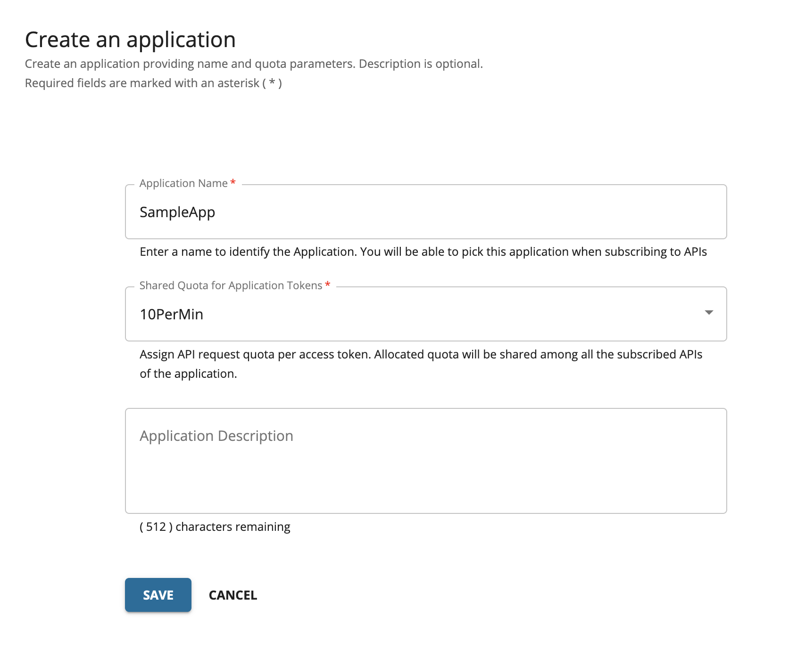](../../../assets/img/administer/global-keymanager/sample-app-creation.png)

12. Click **Production Keys** and Select the Global Key Manager (IS-GKM) which was created from the list of key managers displayed.

    [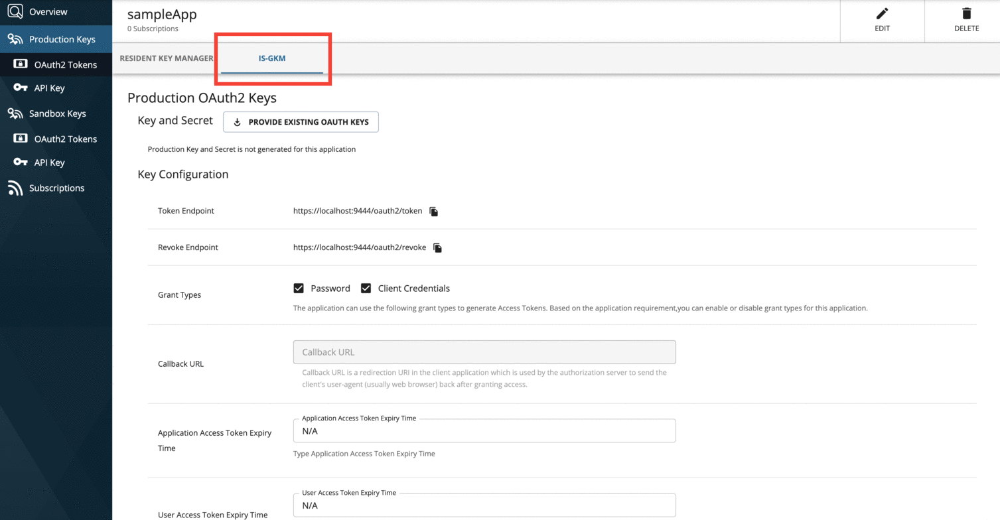](../../../assets/img/administer/global-keymanager/select-global-key-manager.png)

13. Click **GENERATE KEYS**

14. Click **GENERATE ACCESS TOKEN** to generate an application access token. Make sure to copy the generated JWT access token that appears so that you can use it in the future.

15. Go to the Developer Portal landing page, select the SampleAPI and [Subscribe](../../../api-developer-portal/manage-subscription/subscribe-to-an-api.md#subscribe-to-an-existing-application) to the SampleApp

    [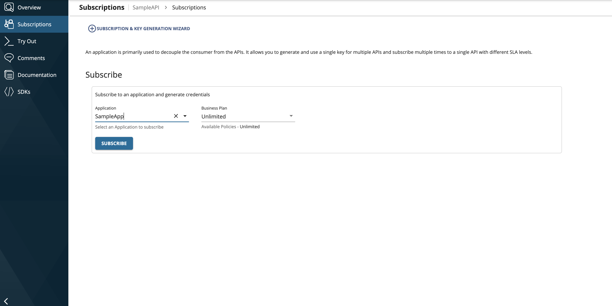](../../../assets/img/administer/global-keymanager/subscribe-sample-api-to-sample-app.png)

16. [Try Out the API](../../../api-developer-portal/invoke-apis/invoke-apis-using-tools/invoke-an-api-using-the-integrated-api-console.md) with the access token generated using the Global Key Manager

    A Successful response indicates that an API of the super tenant can be invoked using an access token generated for an application using the Global Key Manager.

17. Click **SWITCH DEV PORTALS** which is at the top of the navigation bar

    [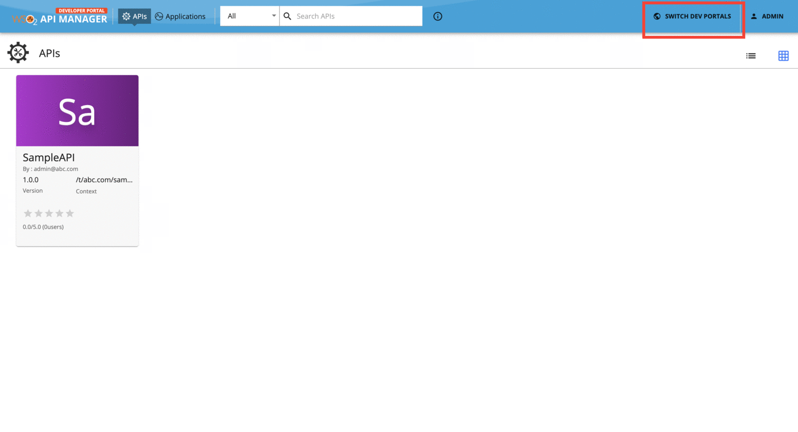](../../../assets/img/administer/global-keymanager/switch-dev-portal.png)

18. Select the tenant which was created in Step 8 from the list of tenants displayed

    [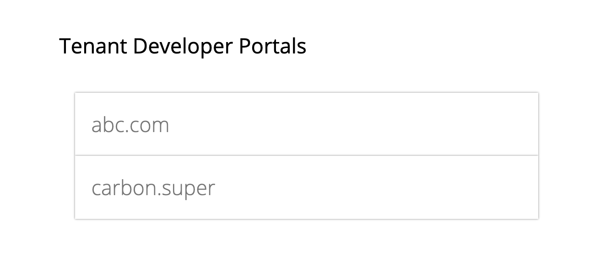](../../../assets/img/administer/global-keymanager/tenant-list.png)

19. Select the SampleAPI and Subscribe to the SampleApp similar to Step 15

    !!! Note
        The keys generated for an application using the Global Key Manager will be displayed across tenants. In this example scenario, the keys for the sampleApp were generated in the Super Tenant’s Developer Portal. These keys are reflected in the Production Keys of the IS-GKM tab of the sampleApp in the abc.com’s Developer Portal

20. Try Out the API with the same access token generated using the Global Key Manager which was used in Step 16.

A Successful response indicates that the API of a tenant can be invoked using an access token generated for an application using the Global Key Manager. Note that the access token was generated in the super tenant’s Developer Portal, but an API in a different tenant was invoked using this access token

!!! note
    Access tokens generated via the Global Key Manager using the client credentials grant type will not contain any scopes.

    ??? note "Why?"
        The Global Key Manager operates within a separate tenant, and the applications created by the Global Key Manager are located in this tenant. This tenant does not have visibility into the user base or roles of other tenants. Consequently, tokens issued through these applications using the client credentials grant cannot be used to validate scopes against user roles from other tenants.