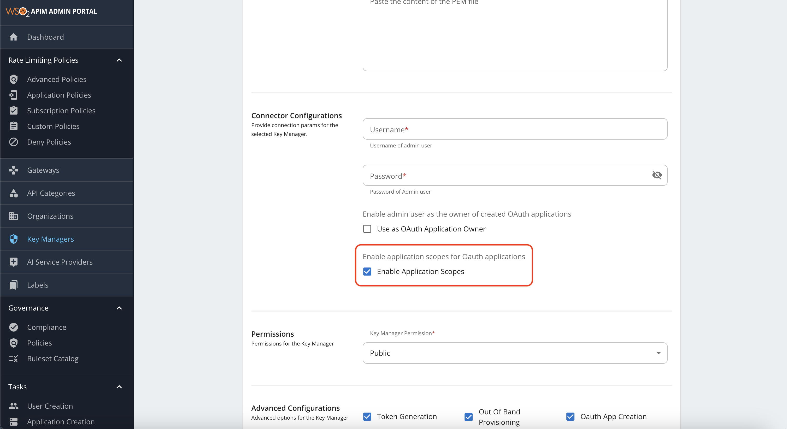
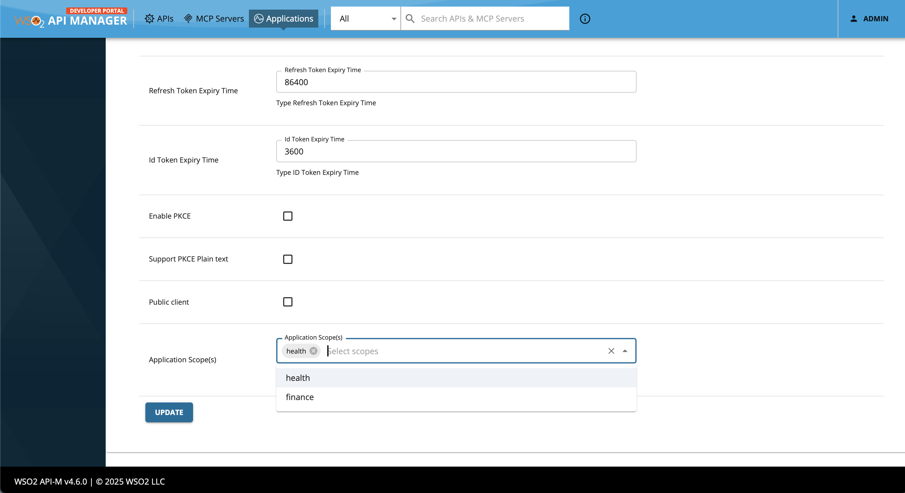

# Application Scopes

Application scopes are configured at the application level as allowed scopes for specific application. In the client credentials grant type, if these scopes are requested during a token request, these will be granted along with the other approved scopes.

Only the scopes which are available under the subscribed scopes (scopes available from all the subscribed APIs) can be added as application scopes.

## Step 1 - Configuring Application Scopes

Application scopes can be added to both **Resident Key Manager** and **Global Key Manager**.

!!! Warning
    Application scopes feature is only supported for the key managers of type `default` and `WSO2-IS`. 

For the Resident Key Manager, the application scopes can be enabled by adding the following configurations to the `<API-M_HOME>/repository/conf/deployment.toml` file.

``` toml
[apim.key_manager]
enable_application_scopes_for_resident_km = true
```

For the Global Key Manager, the application scopes can be enabled by switching the toggle button in the Global Key Manager connector configuration section in the **Key Manager** page of the Admin Portal as follows.

[](../../../../assets/img/administer/enable-application-scopes.png)

!!! Note
    By default, the application scopes are disabled for both the Resident Key Manager and Global Key Manager.

## Step 2 - Adding Application Scopes

To add application scopes, first navigate to the **DevPortal** and log in as an application owner. Create a new application or edit an existing application. In the **Application Details** page, you can find the **Application Scopes** section.

Initially, the **Application Scopes** section will be empty and disabled if there are no subscribed APIs with scopes. Once you subscribe to an API that has scopes, the **Application Scopes** section will be enabled and scopes can be added as follows.

[](../../../../assets/img/administer/add-application-scopes.png)

Now these scopes can be requested in the client credentials grant type token request. The scopes will be granted along with the other approved scopes.

!!! tip
    In order to govern, adding any scope as an application scope, application key generation workflow can be used. For more information, see [Configuring Key Generation Workflow](../../../../api-developer-portal/manage-application/advanced-topics/adding-an-application-key-generation-workflow.md).