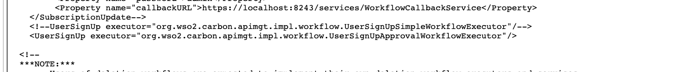
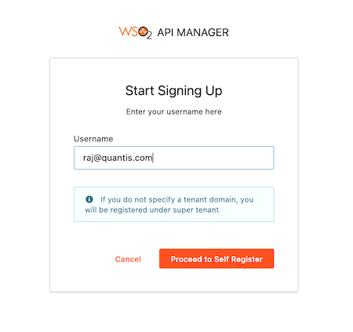
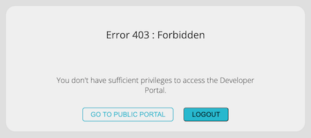
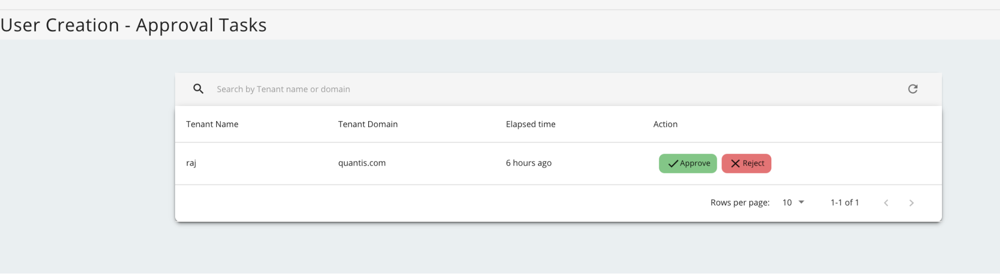

# Scenario 4 - Signing up a New User

This is a tutorial that is part of a series and can be used as a standalone tutorial on how to sign up a new user. For more details on the scenario and general prerequisites, please see [the scenario overview page](../../tutorials/scenarios/scenario-overview.md).

**_Time to Complete : 3 minutes_**

## User Story

Quantis allows external users to access their APIs. To take the full benefit out of these APIs, they have decided to open the registration to outside users since it can be a burden to enter all the details for every single user/consumer. Therefore, they request an approval workflow for user registration in such a way that the users will be registered to the system when a user with administrative privileges approves their registration after a manual validation of the user.  By allowing external parties to register to their system under a supervision, Quantis expects higher revenue in future.

## Step 1: Set up the self-signup workflow

WSO2 API Manager provides extension points to trigger workflow tasks for many operations such as Application creation, subscription creation, user signup, etc. By default, WSO2 API Manager comes with a simple approval workflow. 

This demo setup already comes with self-signup and signup workflow enabled for the Qantis tenant domain. If you need to check how to configure this check [enabling self-signup](../../reference/customize-product/customizations/customizing-the-developer-portal/enabling-or-disabling-self-signup.md) and [enabling signup workflow](../../reference/customize-product/customizations/adding-a-user-signup-workflow.md) documentation. 

!!! Note
    You could see **UserSignUpApprovalWorkflowExecutor** is now engaged if you login to the [https://localhost:9443/carbon](https://localhost:9443/carbon) using Qantis admin credentials (admin@qantis.com:admin) and navigate to `/_system/governance/apimgt/applicationdata/workflow-extensions.xml` location.

    

## Step 2: Test the flow

To try this out, do the following.

1. Go to the Developer Portal [https://localhost:9443/devportal/](https://localhost:9443/devportal/) and select Qantis tenant domain.
2. Select Sign In button on the top right corner. This will show a signup page.
3. Select **Create Account** Link.
4. Add the desired username (with the tenant domain) and proceed to self register. Let's say `raj@quantis.com`.

    

5. Fill the required fields and proceed with the registration.
6. If you try to login using this credentials, you will be shown an unauthorized-access page.
   
    

## Step 3: Approve the signup request

To approve the signup request, do the following.

1. Log on to the [https://localhost:9443/admin/](https://localhost:9443/admin/) Admin Portal using `admin@quantis.com` and password `admin`.
2. Under the **Task → User Creation** you will notice a pending task. Approve it.

    
3. Now you will be able to log on to the Developer Portal using `raj@quantis.com` user and his password.

## What's next

Try out the next scenario in the series, [Getting the Developer Community Involved](../../tutorials/scenarios/scenario5-developer-community-feature.md).