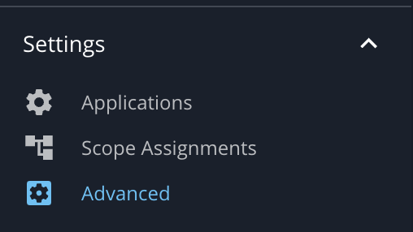
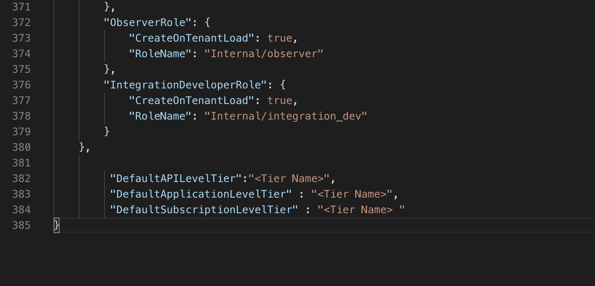

# Change Default Tiers

Users can change the default tiers by appending configurations to the Advanced Configurations in the Admin Portal.

## Steps to Change Default Tiers

1. Log in to the API Manager's Admin Portal ( `https://localhost:9443/admin` ) and go to the **Settings &gt; Advanced** menu.

   

2. Append the following configurations to the **Advanced Configurations** as required.

    ```
         "DefaultAPILevelTier":"<Tier Name>",
         "DefaultApplicationLevelTier" : "<Tier Name>",
         "DefaultSubscriptionLevelTier" : "<Tier Name> "
    ```

   