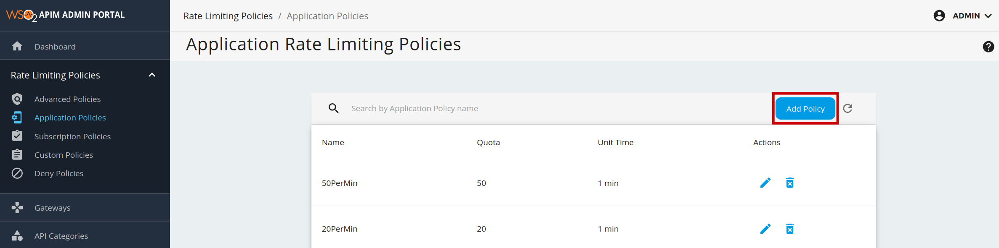
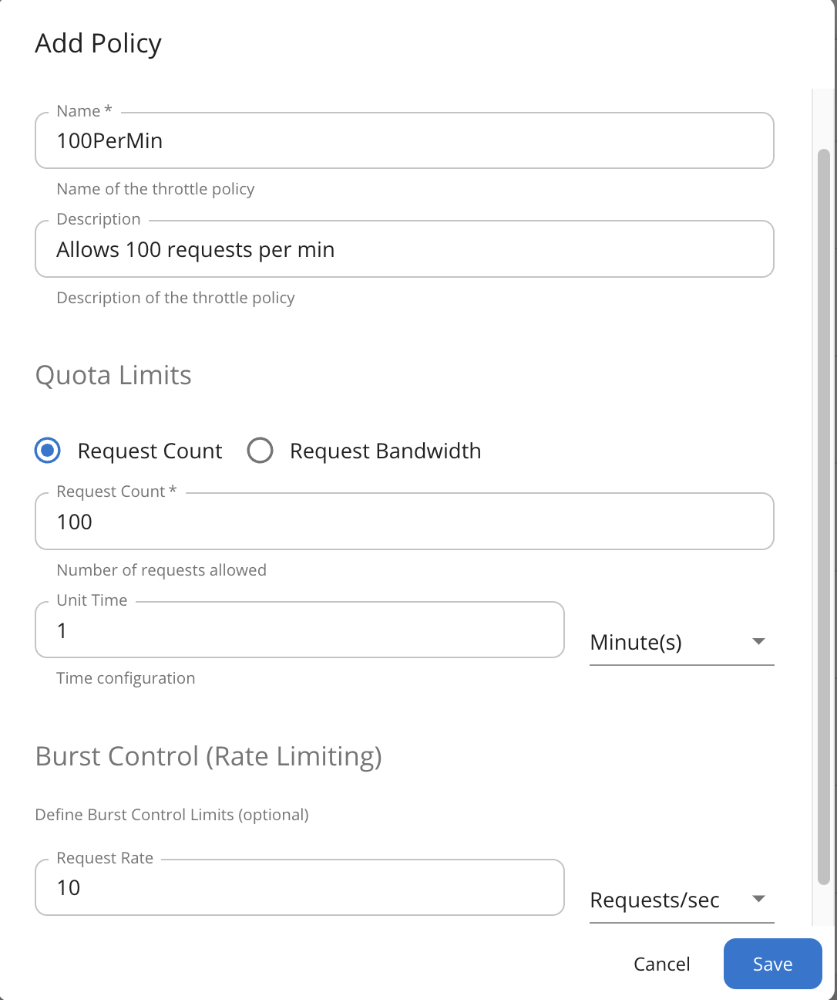

# Manage Application Policies

Application-level rate limiting policies are applicable per access token generated for an application.

### Default Application Tiers

The default rate limiting tiers are as follows:

| **Tier** | **Limit** |
|----------|-----------|
| 10PerMin | 10 requests per minute |
| 20PerMin | 20 requests per minute |
| 50PerMin | 50 requests per minute |
| Unlimited | No limit (available by default) |

## Adding a New Application-Level Rate Limiting Tier

1.  Sign in to the Admin Portal using the URL https://localhost:9443/admin and your admin credentials (admin/admin by default).
2.  Click **Application Policies** under the **Rate Limiting Policies** section to see the set of existing rate limiting tiers.
3.  To add a new tier, click **Add Policy**.

    

4.  Fill in the required details and click **Save**.

    [{:style="width:45%"}](../../assets/img/learn/save-new-application-policy.png)

You have added a new application-level rate limiting policy.