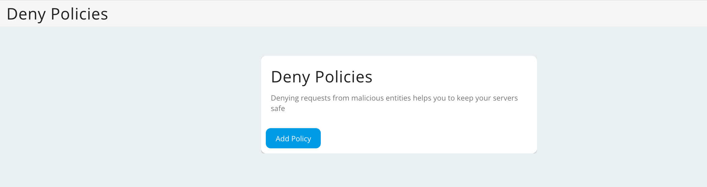
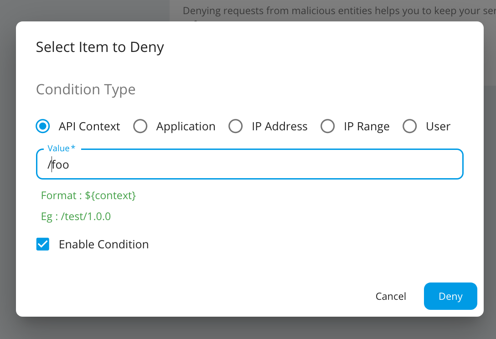
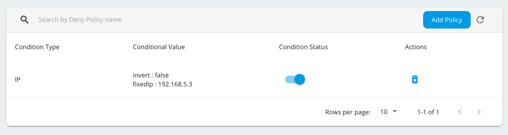
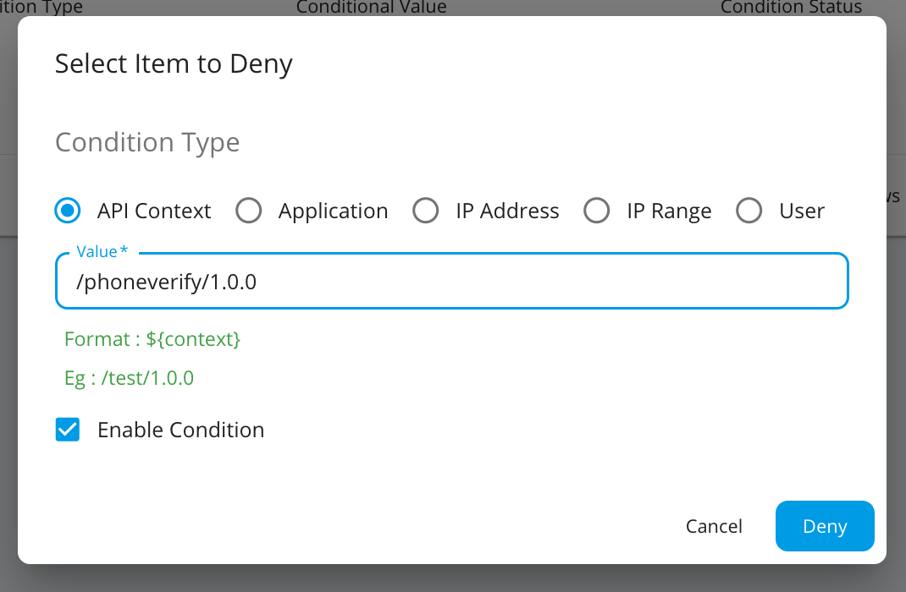

# Manage Deny Policies

By denying requests, you can protect servers from common attacks and abuse by users. Tenant administrative users can block requests based on the following parameters:

- Block calls to specific APIs
- Block all calls from a given application
- Block requests coming from a specific IP address
- Block a specific user from accessing APIs

## Adding a Deny Policy

To deny a request:

1.  Log in to the Admin Portal using the URL `https://localhost:9443/admin` and your admin credentials.
2.  Click **Deny Policies** under the **Rate Limiting Policies** section and click **Add Policy**.

    

3. Select the item to deny, enter a value and click **Deny**.

    

    
Note

You can temporary switch on/off the denied condition by enabling/disabling the <b>Condition status</b> that is auto enabled when a denied condition is created. 

## Example: Denying an API

Let's see how to deny requests to a specific API.

1.  Log in to the Admin Portal using the URL `https://localhost:9443/admin` and your admin credentials.
2.  Click **Deny Policies** under the **Rate Limiting Policies** section and click **Add Policy**.
3.  Select **API Context** and provide the Context of the API with version as the **Value.**

    

4.  Click **Deny.**

The API will now be blocked. When users attempt to invoke the blocked API, they will receive an error response.