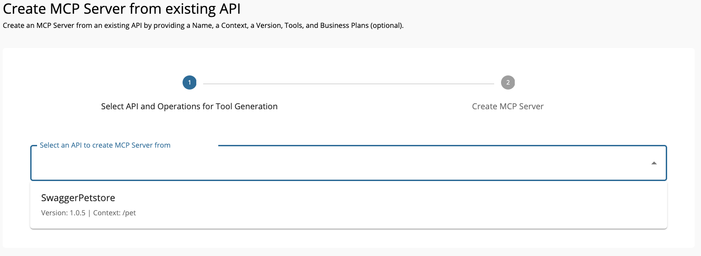
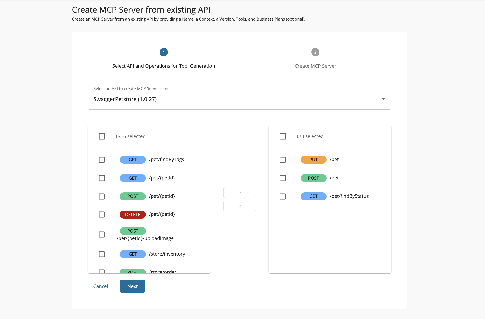
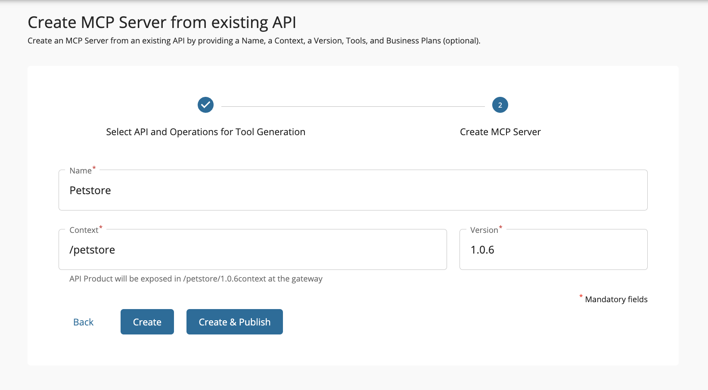

# Create a MCP Server Using an Existing API

This creation path is ideal when the API you want to expose as MCP tools is **already deployed in WSO2 API Manager**.
Instead of starting from an OpenAPI file, you can directly select the API from the Publisher Portal, choose which of its operations should become MCP tools, and configure the MCP Server details.

This approach is faster when:

* You have a stable API in APIM and want to extend it with MCP capabilities.
* You want to reuse existing API governance (security, throttling, analytics) while enabling tool-style access.

!!! tip
    Well-structured API resources with clear naming and descriptions will translate into more intuitive MCP tools.

1. **Go to the Publisher Portal**
    
    * Navigate to **MCP Servers** in the Publisher Portal.
    * If you have existing MCP Servers, click the **Create MCP Server** button.
    [{: style="width:90%"}](../../assets/img/mcp-gateway/create-mcp-server-button.png)
    * If this is your first MCP Server, you'll see the "Let’s get started!" page.
    [{: style="width:90%"}](../../assets/img/mcp-gateway/create-mcp-server-overview.png)
    * In the navigation, click **Start from Existing API** → **Create MCP Server from Existing API**.

2. **Pick the source API**

    * From the list of available APIs, select the one to generate tools from.
    * Click **Next**.

        [{: style="width:90%"}](../../assets/img/mcp-gateway/create-mcp-servers-from-api-validate.png)

3. **Select resources to become tools**

    * Choose which API operations should become tools.
    * Click **Next**.

    [{: style="width:90%"}](../../assets/img/mcp-gateway/create-mcp-servers-from-api-tools-selected.png)

4. **Enter MCP Server details**
  
    Provide the details and click **Create**.

    | Field    | Sample value                                                               |
    | -------- | -------------------------------------------------------------------------- |
    | Name     | Petstore                                                                   |
    | Context  | /petstore                                                                  |
    | Version  | 1.0.6                                                                      |

    [{: style="width:90%"}](../../assets/img/mcp-gateway/create-mcp-servers-from-api-create.png)

### Next Step → Update and Deploy Your MCP Server

Once the MCP Server is created, you may want to refine tool names and descriptions, test them in the MCP Playground, and deploy them to the desired Gateway.
For a complete walkthrough, see **[Updating Tools and Deploying the MCP Server](./update-and-deploy-mcp-server.md)**.