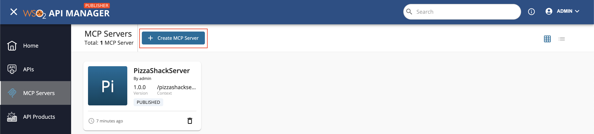
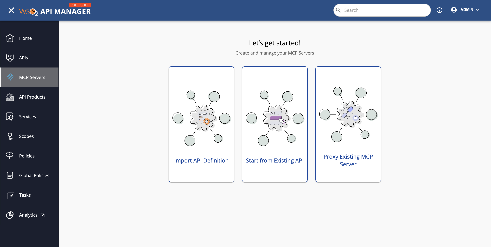
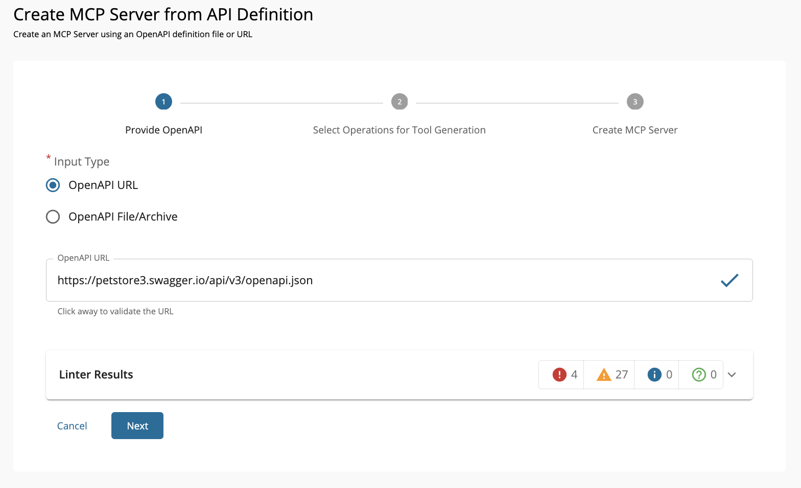
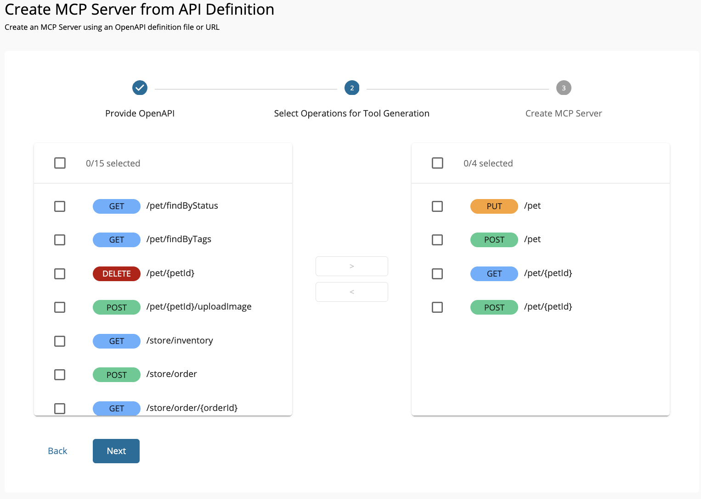
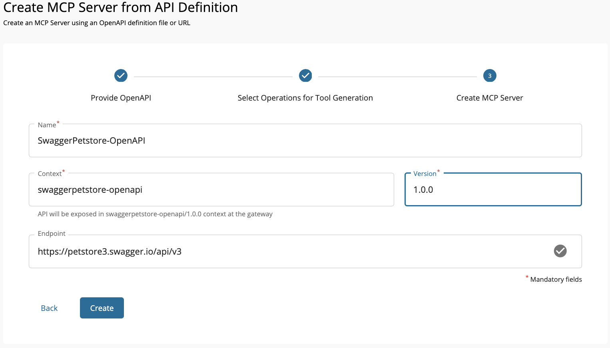

# Create a MCP Server by Importing an OpenAPI Definition

This creation path is used when you already have an OpenAPI definition for your backend service and want to quickly turn its operations into MCP tools.
The Publisher Portal will import the definition, list all available operations, and let you select which ones to expose as tools.
You can then configure your MCP Server details—such as name, context, version, and runtime endpoint—before publishing it through APIM.

!!! tip
    The quality of the imported tools depends on the quality of your OpenAPI definition. Clear operation IDs, descriptions, and parameter schemas will result in more usable and descriptive tools.

1. **Go to the Publisher Portal**
    
    * Navigate to **MCP Servers** in the Publisher Portal.
    * If you have existing MCP Servers, click the **Create MCP Server** button.
    [{: style="width:90%"}](../../assets/img/mcp-gateway/create-mcp-server-button.png)
    * If this is your first MCP Server, you'll see the "Let’s get started!" page.
    [{: style="width:90%"}](../../assets/img/mcp-gateway/create-mcp-server-overview.png)
    * In the navigation, click **Import API Definition** → **Create MCP Server from Definition**.

2. **Provide the definition**
  
    * Select **OpenAPI URL** and enter:
    `https://petstore3.swagger.io/api/v3/openapi.json`
    * Click **Next**.

    [{: style="width:90%"}](../../assets/img/mcp-gateway/create-mcp-servers-from-open-api-validate.png)

3. **Select tools to import**

    * Review all operations from the OpenAPI.
    * Select the operations to expose as tools.
    Click **Next**.

    [{: style="width:90%"}](../../assets/img/mcp-gateway/create-mcp-servers-from-open-api-tools-selected.png)

4. **Enter MCP Server details**

    Fill in the details below and click **Create**.
    
    !!! note
        The **Endpoint** must be the backend base URL your tools will call at runtime—not the OpenAPI document URL.

    | Field    | Sample value                                                               |
    | -------- | -------------------------------------------------------------------------- |
    | Name     | Petstore                                                                   |
    | Context  | /petstore                                                                  |
    | Version  | 1.0.0                                                                      |
    | Endpoint | [https://petstore3.swagger.io/api/v3](https://petstore3.swagger.io/api/v3) |

    [{: style="width:90%"}](../../assets/img/mcp-gateway/create-mcp-servers-from-open-api-create.png)

### Next Step → Update and Deploy Your MCP Server

Once the MCP Server is created, you may want to refine tool names and descriptions, test them in the MCP Playground, and deploy them to the desired Gateway.
For a complete walkthrough, see **[Updating Tools and Deploying the MCP Server](./update-and-deploy-mcp-server.md)**.