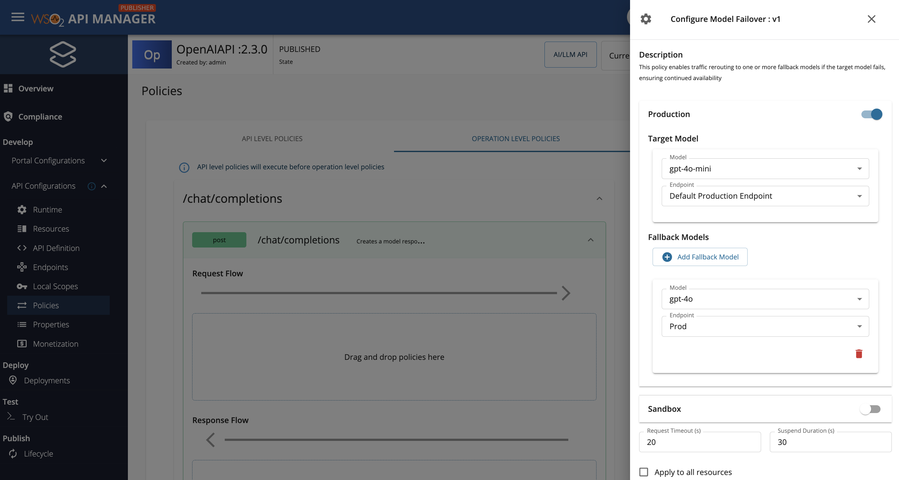
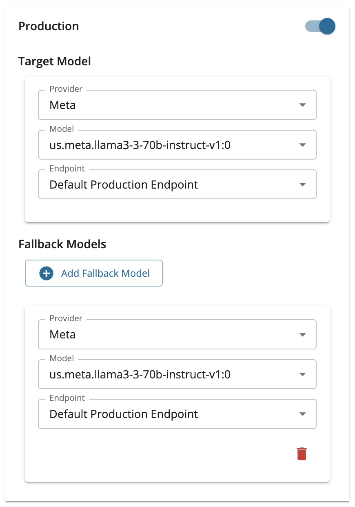

# Failover

Failover routing enhances reliability by automatically switching to an alternate AI model if the primary model becomes unresponsive or encounters an error. This strategy ensures continuous service availability without manual intervention.

!!! tip
     You can configure more than one Failover policy.

## Configure Failover

You can configure failover for your AI API by attaching the **Model Failover** policy. Here are the steps that you need to follow:

1. Login to the Publisher Portal (`https://<hostname>:9443/publisher`).
2. Select the AI API for which you want to configure load balancing.
3. Navigate to **API Configurations**, and click **Policies**.
4. Look for the policy named **Model Failover** listed under the Common Policies section within the policy list. Let's, drag and drop the **Model Failover** policy to the **Request** flow of `/chat/completions` POST operation.
5. Fill in the requested details and click **Save**.

    <table>
        <tr>
            <th>Section</th>
            <th>Description</th>
        </tr>
        <tr>
            <td>Production/Sandbox</td>
            <td>
                Select the **target model** and **target endpoint**. If the request made to this combination fails, fallback will get triggered.  
                Add any amount of fallback models by clicking on **Add Fallback Model** button.
                For each fallback model addition, select a model and an endpoint from the respective dropdowns.
            </td>
        </tr>
        <tr>
            <td>Request Timeout</td>
            <td>Request timeout in seconds.</td>
        </tr>
        <tr>
            <td>Suspend Duration</td>
            <td>Suspend duration in seconds. This will be used to suspend any failed model-endpoint pairs. If not configured, knowledge about failed invocations are not persisted.</td>
        </tr>
    </table>

    [{: style="width:90%"}](../../assets/img/learn/ai-gateway/failover-policy-configuration.png)

!!! note "AWS Bedrock Configuration"
    If you are configuring a multi model provider service, you must select both the **Provider** (model family) and the **Model** for each target and fallback model entry. The **Provider** dropdown lists the model families you have set up in the Admin Portal (such as Meta, Anthropic, DeepSeek, etc.), and once a provider is selected, the **Model** dropdown will display the specific models available under that provider.

    [{: style="width:40%"}](../../assets/img/learn/ai-gateway/aws-bedrock-failover-policy-configuration.png)

6. Finally, scroll to the bottom of the page and click on **Save and deploy**.

7. For more information on how to work with API Policies, refer to the [API Policies](../../api-design-manage/design/api-policies/overview.md) section.