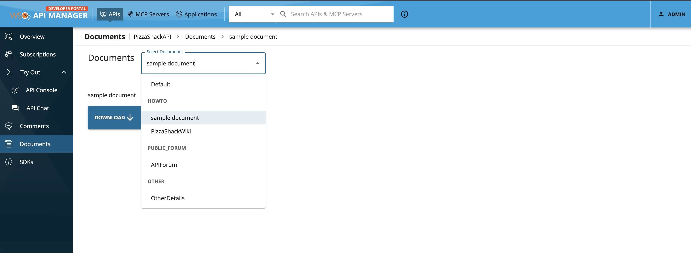
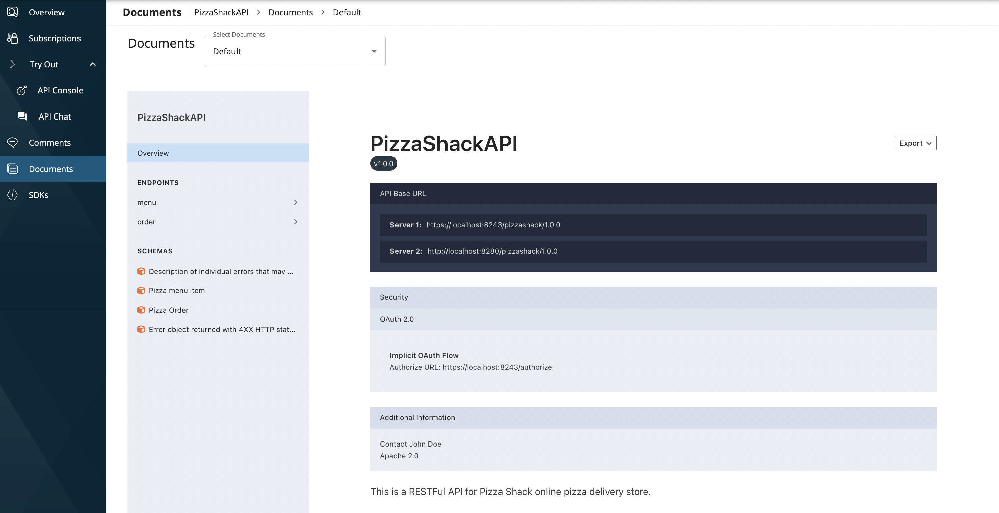
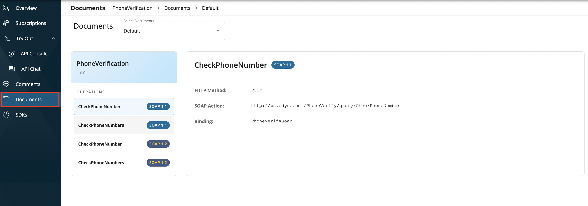

# View API Documents

You can view the Documents added to an API via the Developer Portal by following the below steps.

1. Sign in to the WSO2 Developer Portal and click on the PizzaShackAPI version 1.0.0 API.

     `https://<hostname>:9443/devportal`

2. Click Documents.

     The documents that have been added to this API, which are listed by type, appears.

3. Use the dropdown and select the document that you want to view or download.

     

## Default Documents

API Documentations are available by default for REST and SOAP APIs.

#### For REST APIs

The generated API Documentation in the Publisher Portal is available for view in the Developer Portal under **Documents** tab.
This is listed as `Default`.

#### For SOAP APIs

You can view the list of SOAP Operations available for the API directly in the Developer Portal without the need to inspect the SOAP API Definition. This is listed as `Default`.

