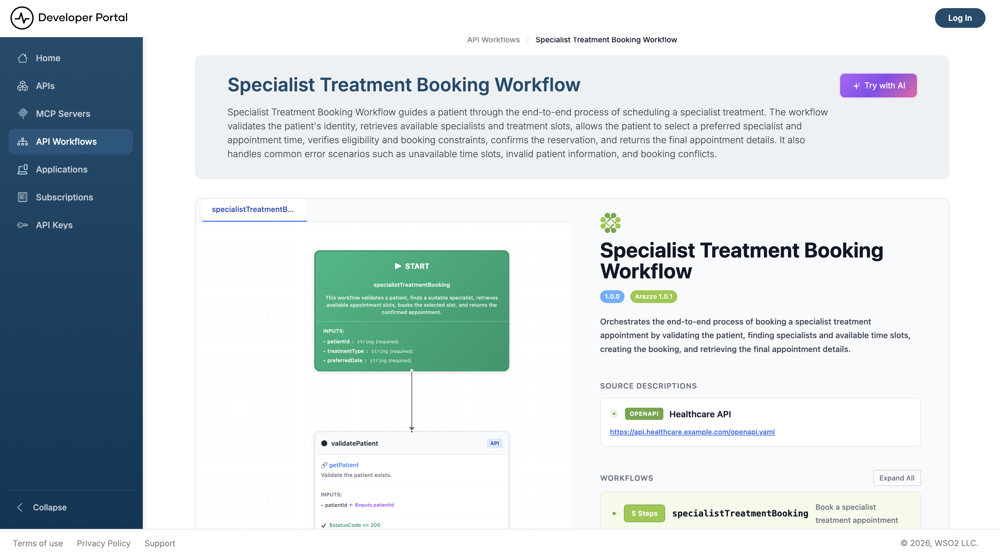

# API workflows

An API workflow is a published, multi-step sequence of API calls that solves one use case end to end—validate a patient, then book a specialist, then confirm the appointment. An admin authors the workflow once, and everyone who needs that sequence follows the same vetted path instead of piecing it together from individual specifications.

Workflows serve two audiences from the same definition. You read one in the portal to understand the calls and their order. An AI agent reads the machine-readable version and executes it, which is the point: left to reason freely, agents misorder calls, skip required steps, and invent endpoints.

## Browse the workflow gallery

Click **API Workflows** in the sidebar. The gallery shows a card for every published workflow, and you don't need to sign in to see it.

Each card carries:

- The workflow's display name and description
- A **POWERED BY** row of pills naming the APIs the workflow calls, up to four, then a `+N more` pill
- An **AI Ready** badge when AI agents can discover the workflow

Click a card to open the workflow.

!!! note
    The gallery lists only workflows an admin has published; drafts appear nowhere. Admins also get a button into the authoring page—**Manage workflows** in the header, or **Create workflow** when the gallery is empty. See [Managing API Workflows](admin-settings/manage-api-workflows.md).

## Read a workflow

The detail page opens with the workflow's name and description, then renders the definition in one of two ways, depending on how the admin authored it:

- **Arazzo workflows** render in an interactive [Arazzo](https://spec.openapis.org/arazzo/latest.html) viewer, in a split layout: a flow diagram of the steps alongside the specification behind them. Use the diagram to follow the call order, and the specification pane for each step's inputs, outputs, and success criteria.
- **Markdown workflows** render as formatted prose, exactly as the admin wrote them.

An Arazzo workflow opens with its description above the interactive viewer:



An Arazzo workflow names its source APIs in `sourceDescriptions`. Those are the APIs you'll be calling, and each one's own documentation gives you the base URL, the operations, and the authentication it expects. To fetch the raw specification for tooling that reads Arazzo, request it directly:

```text
GET /api-portal/{orgName}/views/{viewName}/api-workflows/{handle}/arazzo.json
```

## Hand a workflow to an AI agent

Click **Try with AI** on the detail page. The portal generates an agent prompt built around the workflow's own definition and shows it in a modal, where you can:

- **Copy** the prompt to paste into any assistant
- **Download** it as a `.txt` file
- **Run in Claude** to open it in a new Claude conversation

The **Try with AI** button appears only when the workflow is agent-visible.

### What the prompt contains

The generated prompt has two sections, and it opens by telling the agent which one applies:

| Section | For | What it instructs |
|---|---|---|
| **API Execution Agent** | A browser-based assistant that will call the APIs itself | Read the workflow definition, execute the steps in order, track state between them, collect credentials from you, retry 5xx responses up to three times, and stop on a 4xx |
| **App Builder Agent** | A coding or IDE agent building an application | Read the workflow, then the portal's `llms.txt`, then each API's Markdown and OpenAPI specification. Map every step to a real endpoint and confirm with you before writing code, then build one service per API behind a single orchestrator |

Both sections point at the workflow's own `.md` URL as the source of truth, so the agent works from the live definition rather than from a snapshot pasted into the prompt.

## How agents discover workflows on their own

An agent that hasn't been handed a prompt finds workflows through the portal's machine-readable endpoints. All of them are scoped to an organization and a view, and none require authentication.

| Endpoint | Returns |
|---|---|
| `/api-portal/{orgName}/views/{viewName}/llms.txt` | The portal index. Its **API Workflows** section lists every agent-visible workflow with its description, each linking to the workflow's own Markdown |
| `/api-portal/{orgName}/views/{viewName}/api-workflows.md` | A Markdown list of every agent-visible workflow, each linking to `/api-portal/{orgName}/views/{viewName}/api-workflows/{handle}.md` |
| `/api-portal/{orgName}/views/{viewName}/api-workflows/{handle}.md` | One workflow in Markdown. For an Arazzo workflow: status, description, source APIs linked to their documentation, guidance on each source's authentication, and the full Arazzo specification inlined. For a Markdown workflow: the content the admin authored, as written |
| `/api-portal/{orgName}/views/{viewName}/api-workflows/{handle}/arazzo.json` | The raw Arazzo specification. Returns `404` for a Markdown-authored workflow |
| `/api-portal/{orgName}/views/{viewName}/api-workflows/{handle}/prompt` | A JSON object with the workflow's agent prompt, description, raw content, and source APIs |

A typical agent flow is: read `llms.txt` or `api-workflows.md` to see what exists, fetch `{handle}.md` for the workflow that matches the task, follow its links to each source API's documentation for endpoints and security schemes, then execute the steps in order, passing outputs between them.

When a workflow's source URL points at an API published in this same portal, the portal rewrites that link to the API's Markdown documentation, so an agent stays inside the machine-readable surface instead of being sent to a rendered page.

For the portal's full set of agent-facing endpoints, see [AI Agent Discovery](ai-agent-discovery.md).

## Workflow visibility

Two independent settings decide who sees a workflow:

| Setting | Values | Effect |
|---|---|---|
| Status | Draft, Published | Draft workflows appear nowhere. Publishing puts a workflow in the gallery for the view it belongs to |
| Agent visibility | Visible, Hidden | A hidden workflow stays in the gallery for people, but drops out of `llms.txt`, `api-workflows.md`, and every per-workflow endpoint, and loses its **Try with AI** button |

Hiding a workflow from agents is how you publish it for human developers while it's still being validated for automated execution. Admins set both, per workflow—see [Managing API Workflows](admin-settings/manage-api-workflows.md).

Turning off **Portal is AI-discoverable** under [LLM Instructions](admin-settings/llm-instructions.md) makes every machine-readable workflow endpoint return `404`, whatever each workflow's own setting says.

## Related

- [Managing API Workflows](admin-settings/manage-api-workflows.md): author, publish, and set the visibility of workflows
- [AI Agent Discovery](ai-agent-discovery.md): the portal's full set of agent-facing endpoints
- [Consume an API](consume-an-api/overview.md): the credentials you'll need for the APIs a workflow calls
- [Artifact types](setting-up/artifact-types.md): whether this deployment serves API workflows at all