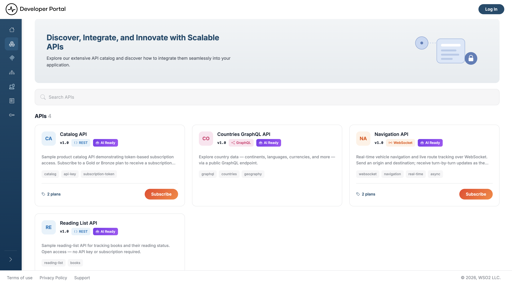

# Browse APIs

The API listing page is where you browse everything published to the API Portal & MCP Hub and narrow it down to the API you need.

## Browse the API listing

Click **APIs** in the sidebar. The listing page shows a card for every published API, above a count of how many are listed.

The listing shows one card per API, with the search bar above it:

Each card shows:

- The API's icon (or its initials), name, and version
- A **Type** badge: REST, GraphQL, WebSocket, WebSub, or SOAP
- An **AI Ready** badge when the API is visible to AI agents, and a **Deprecated** badge when the API has been deprecated
- The description, and any tags the publisher added
- The number of subscription plans and a **Subscribe** button, when the API has plans
- A **Subscribed** ribbon, when you already hold a subscription to the API

Click a card to open the API. Model Context Protocol (MCP) servers are listed separately — click **MCP Servers** in the sidebar to browse them the same way.

!!! note
    A listing covers one [view](../admin-settings/manage-views.md), and an API appears in it only if one of the API's labels is mapped to that view. If an API you expect is missing, ask your portal admin to check its labels.

## Search for an API

1. Type a term into the search bar at the top of the listing page.
2. Press <kbd>Enter</kbd>.

The page reloads with your term applied as a `query` parameter, and the results bar reports how many APIs matched. To return to the full listing, clear the search bar and press <kbd>Enter</kbd> again.

### What a search term matches

A search takes one free-text term rather than a set of separate fields. Which fields it compares that term against depends on the database the portal runs on—see the per-database differences below.

| Matched against | Example |
|---|---|
| Name | `Navigation` finds the Navigation API |
| Version | `v3.5` finds every API published at that version |
| Description | `catalog` finds any API described as a catalog |
| Type | `RestApi` finds the REST APIs |
| Tags | `finance` finds every API tagged `finance` |
| Attached documents and the API specification | `webhook` finds an API whose getting-started guide mentions webhooks |

Two details depend on which database backs your deployment:

- **PostgreSQL** searches attached documents and the API specification alongside the metadata, and matches whole words and their grammatical variants through English full-text search.
- **SQLite** (the default) and **SQL Server** search the metadata and tags only, and match substrings, so `Naviga` finds the Navigation API.

## Open an API

Clicking a card opens the API's overview page, which gathers its endpoints, operations, and plans on one screen:

What the page shows depends on the API type. **Resources** lists every operation for REST and SOAP APIs; **Channels** replaces it for WebSocket and WebSub, where WebSocket channels carry both a PUB and a SUB badge and WebSub channels carry SUB only. **Scopes** appears for REST and SOAP. GraphQL APIs show **Endpoints** alone — their operations live in the schema, which you reach through **Documentation**.

Two header buttons appear conditionally rather than always:

- **API Keys** — only for REST, WebSocket, and WebSub APIs whose specification declares API key security. Never for GraphQL, SOAP, or MCP artifacts.
- **Try with AI** — only when the API is agent-visible. It opens a ready-made prompt that briefs an agent on the API using its [machine-readable documentation](../ai-agent-discovery.md); copy it, download it as a `.txt` file, or send it straight to an assistant with **Run in Claude**.

Each plan in the **Subscription plans** panel carries its own **Subscribe** or **View subscription** button — see [Manage Subscriptions](../consume-an-api/manage-subscriptions.md) for the full flow.

## Read the specification and try it

**Documentation** in the header opens the API's specification alongside any guides the publisher attached. The viewer depends on the API type:

| API type | Viewer | What you can do |
|---|---|---|
| REST | OpenAPI reference | Read every operation, parameter, and response schema, and call operations from the built-in **Try It** console |
| GraphQL | Schema viewer | Browse types, queries, and mutations. **Tryout** opens GraphiQL, with an endpoint selector and fields for an OAuth2 token or API key |
| WebSocket, WebSub | AsyncAPI viewer | Read the channels and message payloads. **Tryout** opens a client that connects to the endpoint |
| MCP server | MCP Playground | Inspect the server's tools and invoke them with a bearer token |

!!! note
    SOAP APIs have no **Documentation** button. Their overview page offers a **Download** button for the WSDL file instead.

The **Try It** console calls the endpoint straight from your browser, so **the API's gateway has to return CORS headers for the portal's origin**. Supply every credential the operation requires, the same way your client would: an `Authorization: Bearer` header for OAuth2, the API key header for key-secured APIs, and — where the API declares one — the subscription header its specification names.

Attached guides render in the same pane and cover what a specification can't: authentication walkthroughs, worked examples, known limitations. Every one is also served as raw Markdown for AI agents.

## Related

- [APIs](overview.md): what an API is in the portal, and the types it publishes
- [Which Credentials You Need](../consume-an-api/overview.md): work out what an API expects before you call it
- [Manage Subscriptions](../consume-an-api/manage-subscriptions.md): subscribe, switch plans, and manage your subscription token
- [Customize an API's Content](../admin-settings/api-content.md): replace the generated page body with your own
- [Manage Views](../admin-settings/manage-views.md): how admins decide which APIs a view lists