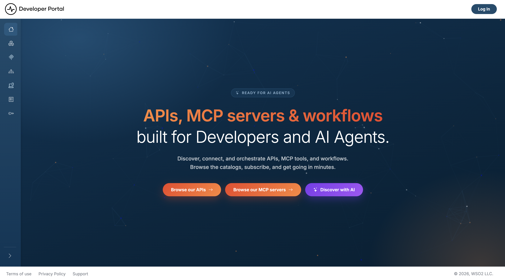

# Getting started

The API Portal & MCP Hub is where developers discover, subscribe to, and consume the APIs and MCP servers you publish. This guide gets the API Portal & MCP Hub running locally with Docker Compose in a few minutes, then walks you through publishing your first API.

## Prerequisites

- [Docker](https://docs.docker.com/get-docker/) with the Compose plugin (`docker compose version`)
- `openssl` on your `PATH` (used by the setup script to generate certificates and secrets)
- `curl` and `unzip` installed
- Ports **9543** (API Portal & MCP Hub) and **9243** (Platform API) available on your machine

## Step 1: Download the API Portal & MCP Hub

Run this command in your terminal to download and unzip the standalone API Portal distribution:

```bash
curl -sLO https://github.com/wso2/api-platform/releases/download/api-portal%2Fv1.0.0/wso2apip-api-portal-1.0.0.zip && \
unzip wso2apip-api-portal-1.0.0.zip
```

## Step 2: Run the setup script

Navigate to the API Portal directory:

```bash
cd wso2apip-api-portal-1.0.0
```
Run this command to set up the API Portal:

```bash
./scripts/setup.sh
```

This one-time script provisions everything the containers need to start:

- a self-signed TLS certificate under `resources/certificates/`
- the API Portal and Platform API secrets—the encryption keys, the session secret, and the RS256 JWT signing keypair—written as files under `resources/keys/`
- your admin credentials, bcrypt-hashed into `APIP_CP_ADMIN_USERNAME` and `APIP_CP_ADMIN_PASSWORD_HASH` in `api-platform.env`

It also prompts you for an **admin username and password**. Press Enter at the password prompt to have a strong one generated for you—it's printed once at the end, so copy it before continuing.

!!! warning "Save the printed admin credentials"
    The admin password is shown only once and is never stored in plaintext—only its bcrypt hash is written to `api-platform.env`. If you lose it, remove `APIP_CP_ADMIN_USERNAME` and `APIP_CP_ADMIN_PASSWORD_HASH` from `api-platform.env` and rerun `./scripts/setup.sh` to generate a new one.

!!! note "Re-running the script"
    The script is idempotent—re-running it only fills in what's missing and never overwrites an existing value. To rotate a secret, remove it from `api-platform.env`, or delete the relevant file under `resources/certificates/` or `resources/keys/`, then re-run.

## Step 3: Start the portal

```bash
docker compose up
```

This starts the API Portal & MCP Hub backed by SQLite by default. On first boot, the database schema and a default organization (`default`) with a `default` view are created automatically.

Verify the Platform API sidecar is healthy:

```bash
curl -fk https://localhost:9243/health
```

## Step 4: Open the portal

Navigate to:

```
https://localhost:9543/api-portal/default/views/default
```

You'll see the API Portal home page.



Click **Log In** and sign in with the admin username and password from Step 2.

!!! tip "Browser trust warning?"
    The generated TLS certificate is self-signed. Click **Advanced > Proceed** to continue.

You should see the default API catalog page. It stays empty until you add APIs—either seed the bundled samples or publish your own, both covered next.

## Step 5: Seed sample APIs (optional)

The fastest way to see a populated catalog is to deploy the bundled sample APIs and MCP servers:

```bash
./scripts/seed-samples.sh
```

This deploys everything under `resources/samples/` into the `default` organization through the public REST API. It prompts for the admin username and password from Step 2—or set `ADMIN_USERNAME` / `ADMIN_PASSWORD` to skip the prompt. It's safe to re-run: samples that already exist (matched by name and version) are skipped.

!!! note
    Requires `curl`, `jq`, and `zip` on your `PATH`, and the portal must already be running (Step 3).

Refresh the catalog page and the sample APIs appear as a grid of cards, each showing the API's name, version, type, and a **Subscribe** button.


To publish an API of your own instead, continue below.

## Step 6: Publish your first API

Publish an API by uploading a manifest and an OpenAPI definition. This example uses a Books API, whose backend is already hosted, so it works without deploying a gateway of your own.

Create the API manifest:

```yaml
# api.yaml
apiVersion: api-portal.api-platform.wso2.com/v1
kind: RestApi

metadata:
  name: books-api-v1.0

spec:
  type: REST
  displayName: Books API
  version: v1.0
  description: Sample reading-list API for tracking books and their reading status. Open access — no API key or subscription required.
  status: PUBLISHED
  referenceId: books-api-v1.0

  tags:
    - reading-list
    - books

  labels:
    - default

  subscriptionPlans: []

  agentVisibility: VISIBLE

  businessInformation:
    businessOwner: Platform Owner
    businessOwnerEmail: support@example.com
    technicalOwner: API Team
    technicalOwnerEmail: architecture@example.com

  # Points at the hosted sample backend, so the API works in a fresh portal with
  # no gateway deployed. Front it with a gateway by swapping these for its URL.
  endpoints:
    sandboxUrl: https://apis.bijira.dev/samples/reading-list-api-service/v1.0
    productionUrl: https://apis.bijira.dev/samples/reading-list-api-service/v1.0
```

Create the OpenAPI definition:

```yaml
# definition.yaml
openapi: 3.0.1
info:
  title: Books API
  version: v1.0
  description: |
    Track a personal reading list — add books, update their reading status, and
    remove them when you're done. Open access: no API key required.
servers:
  - url: https://apis.bijira.dev/samples/reading-list-api-service/v1.0
components:
  schemas:
    Book:
      type: object
      required: [title, author, status]
      properties:
        id:
          type: string
          format: uuid
          readOnly: true
        title:
          type: string
          example: The Great Gatsby
        author:
          type: string
          example: F. Scott Fitzgerald
        status:
          type: string
          enum: [to_read, reading, read]
paths:
  /books:
    get:
      summary: List books
      responses:
        '200':
          description: OK. The reading list.
    post:
      summary: Add a book
      responses:
        '201':
          description: Created. The newly added book.
  /books/{id}:
    parameters:
      - name: id
        in: path
        required: true
        schema:
          type: string
          format: uuid
    get:
      summary: Get a book
      responses:
        '200':
          description: OK. The requested book.
    put:
      summary: Update a book
      responses:
        '200':
          description: OK. The updated book.
    delete:
      summary: Remove a book
      responses:
        '204':
          description: No Content. The book was removed.
```

Then get a bearer token from the Platform API using the admin credentials from Step 2, and publish:

```bash
# Get a token from the Platform API (runs alongside the API Portal)
TOKEN=$(curl -sk -X POST "https://localhost:9243/api/portal/v0.9/auth/login" \
  -d "username=<admin-username>&password=<admin-password>" | jq -r .token)

# Publish the API — the login is scoped to the "default" organization
curl -k -X POST "https://localhost:9543/api-portal/api/v0.9/apis" \
  -H "Authorization: Bearer $TOKEN" \
  -F "metadata=@api.yaml;type=application/yaml" \
  -F "definition=@definition.yaml;type=application/yaml"
```

Refresh the portal—the **Books API** now appears in the catalog. Select the **Books API** card to open its documentation and **Try It** console.

## What's next

- [Browse APIs](discover-apis/browse-apis.md): browse and search the catalog
- [MCP Servers](mcp-servers/overview.md): publish and connect to Model Context Protocol servers
- [AI Agent Discovery](ai-agent-discovery.md): the `llms.txt` and Markdown endpoints agents use
- [Manage Applications](consume-an-api/manage-applications.md): set up a container for OAuth2 credentials
- [Manage Subscriptions](consume-an-api/manage-subscriptions.md): subscribe to a published API under a plan
- [Consume an API Secured with an API Key](consume-an-api/api-key.md) or [Consume an API Secured with OAuth2](consume-an-api/oauth2.md)
- [Theming](admin-settings/theming.md): customize the portal's look and feel