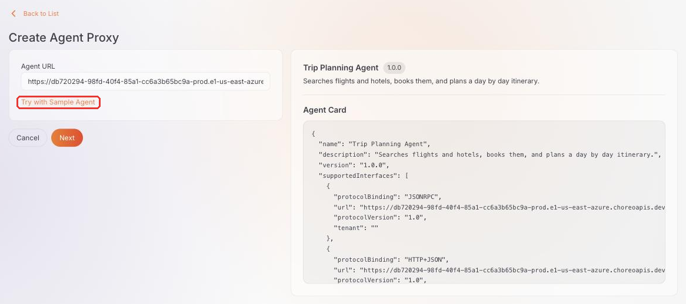
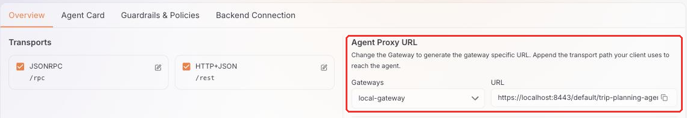
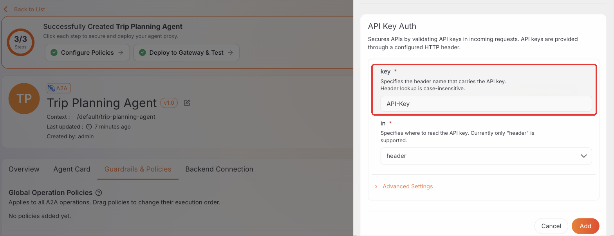

# Quick start guide

This guide puts an agent proxy between a sample Agent2Agent (A2A) agent and the agents that call it, so every call goes through the API Platform AI Gateway. You create, deploy, and secure the proxy from [AI Workspace](../overview.md), the control plane for AI traffic.

## Prerequisites

- Access to AI Workspace with the **Admin** or **Developer** role. See [Get started with AI Workspace](../getting-started.md).
- An AI Gateway registered in AI Workspace and showing a status of **Active**. See [Set up an AI Gateway](../ai-gateways/setting-up.md) and [Install the gateway](../../../ai-gateway/next/setup-and-deployment/install-the-gateway.md).
- `curl`, to call the agent from your terminal.

The `curl` commands on this page use Bash syntax. On Windows, run them from Git Bash or Windows Subsystem for Linux (WSL). In PowerShell, use `curl.exe` instead of `curl`, and replace each line-ending `\` with a backtick (`` ` ``).

## Create the agent proxy

First, create an agent proxy for a sample agent in AI Workspace.

1. Navigate to **Agents** > **Agent Proxies** in the left navigation menu.
2. If AI Workspace asks for a project, select it and click **Go to Project Level**.
3. Click **Create Agent Proxy**.
4. Click **Try with Sample Agent** to point the proxy at a public sample agent, so you don't need to run your own agent to follow along. The sample is a trip-planning agent that searches flights and hotels, books them, and plans itineraries.

    AI Workspace fetches the agent's *Agent Card* and shows it next to the URL. Every A2A agent publishes an Agent Card, which lists its name, its skills, and the address to send messages to. Other agents read this card to learn how to call the agent.

    

    !!! note "Pointing at your own agent instead"
        Enter its base URL in the **Agent URL** field and click **Fetch Agent Info** instead of clicking **Try with Sample Agent**.

5. Click **Next**, keep the details AI Workspace filled in from the Agent Card, and click **Create**.

## Deploy the proxy to your gateway

Next, deploy the proxy to your gateway, so the gateway can accept calls for the agent.

1. On the proxy page, click **Deploy to Gateway**.
2. Click **Deploy** next to your gateway.
3. Expand the gateway card and wait for **Deployment Status** to show **Active**.
4. Click **Back to Agent Proxy**.
5. On the **Overview** tab, under **Agent Proxy URL**, select your gateway from the **Gateways** dropdown and copy the **URL**.

    

Export the URL in your terminal so the commands below can use it:

```bash
export AGENT_URL=https://localhost:8443/default/trip-planning-agent
```

The commands below pass `-k` to `curl`, because a local gateway uses a self-signed certificate. When your gateway has a trusted certificate, leave out `-k`.

## Check the Agent Card

Before calling your agent, other agents read its Agent Card to find where to send messages. Fetch the card through the gateway to see what they see:

```bash
curl -sk "$AGENT_URL/.well-known/agent-card.json"
```

Look at `supportedInterfaces` in the response. On the create page, the card listed the agent's own address. Through the gateway, the card lists the gateway's address instead:

```text
"supportedInterfaces": [
  { "protocolBinding": "JSONRPC",   "url": "https://localhost:8443/default/trip-planning-agent/rpc",  ... },
  { "protocolBinding": "HTTP+JSON", "url": "https://localhost:8443/default/trip-planning-agent/rest", ... }
]
```

Any agent that reads this card sends its messages to the gateway, so the policies you attach to the proxy apply to every call.

## Send a message over HTTP+JSON

Now send the agent a message through the gateway, the same way another agent would.

Ask the agent for flights. The `SendMessage` operation is a `POST` to `/message:send` below the HTTP+JSON path:

```bash
curl -sk -X POST "$AGENT_URL/rest/message:send" \
  -H 'Content-Type: application/json' \
  -H 'A2A-Version: 1.0' \
  -d '{"message":{"messageId":"m1","role":"ROLE_USER",
       "parts":[{"text":"flights LHR CMB"}]}}'
```

The agent answers with a completed task. Its artifact lists the flights:

```text
Flights LHR → CMB
  UL390  11:30 → 20:30   USD 970
  EK567  13:45 → 00:45+1   USD 587
  QR744  15:00 → 18:00   USD 884
```

!!! important "`A2A-Version` is mandatory"
    Every operation request states its protocol version, in an `A2A-Version` header or an `A2A-Version` query parameter. The gateway validates the value and returns `400 Bad Request` for a request that doesn't state a supported version.

    Agent Card requests are exempt. A client reads the card to learn the version to state.

## Send a message over JSON-RPC

A2A agents accept messages in more than one format, called *bindings*. Send the same kind of message in the JSON-RPC format.

The JSON-RPC binding carries every operation on one endpoint, with the operation in the `method` field:

```bash
curl -sk -X POST "$AGENT_URL/rpc" \
  -H 'Content-Type: application/json' \
  -H 'A2A-Version: 1.0' \
  -d '{"jsonrpc":"2.0","id":"1","method":"SendMessage",
       "params":{"message":{"messageId":"m2","role":"ROLE_USER",
       "parts":[{"text":"hotels Colombo"}]}}}'
```

The agent answers with a JSON-RPC `result` that carries a completed task.

Both requests resolve to the same `SendMessage` operation and run the same policies. You govern the agent once, and the rules apply on either binding.

## Secure the agent with an API key

So far, any agent that can reach your gateway can call the trip planner. Because every call passes through the gateway, you can decide who gets in without changing the agent itself. Add an API key, so only callers that hold the key get through.

1. On the proxy page, open the **Guardrails & Policies** tab.
2. Under **Global Operation Policies**, click **Add Policy** and select **API Key Auth**.
3. Keep the defaults, which read the key from a header named `API-Key`, and click **Add**.

    

4. Click **Save**.
5. Click **Deploy to Gateway**, then click **Deploy** next to your gateway to roll out the change.
6. Return to the proxy page. On the **Overview** tab, under **API Keys**, click **Generate API Key**.
7. Enter a **Key Name**, for example `quick-start-key`, and click **Generate**.

!!! danger "Copy the key"
    AI Workspace shows the key only once. Copy it before you close the dialog.

Export the key in your terminal:

```bash
export API_KEY=<your-api-key>
```

Check that the gateway enforces the key. Send the HTTP+JSON request again without it. The gateway returns `401 Unauthorized` with `Valid API key required`:

```bash
curl -sk -X POST "$AGENT_URL/rest/message:send" \
  -H 'Content-Type: application/json' \
  -H 'A2A-Version: 1.0' \
  -d '{"message":{"messageId":"m3","role":"ROLE_USER",
       "parts":[{"text":"flights LHR CMB"}]}}'
```

Now send it with the key. The agent answers as before:

```bash
curl -sk -X POST "$AGENT_URL/rest/message:send" \
  -H 'Content-Type: application/json' \
  -H 'A2A-Version: 1.0' \
  -H "API-Key: $API_KEY" \
  -d '{"message":{"messageId":"m4","role":"ROLE_USER",
       "parts":[{"text":"flights LHR CMB"}]}}'
```

The Agent Card stays readable without a key, so other agents can still find your agent. To protect the card too, use **Public Agent Card Policies** on the same tab.

## Clean up

When you're done, remove the proxy.

To remove the proxy from your gateway:

1. On the proxy page, click **Deploy to Gateway**.
2. Expand your gateway's card and click **Stop**.

To delete the proxy, click the delete icon on the proxy page.

## Next steps

- Serve an Agent Card the gateway holds, and guard the extended card: [Agent Card](../../../ai-gateway/next/agent-governance/agent-card.md)
- Rate limit one operation without limiting the rest: [Apply policies](../../../ai-gateway/next/agent-governance/apply-policies.md)
- Understand the routes an agent proxy generates: [Expose an agent](../../../ai-gateway/next/agent-governance/expose-an-agent.md)
