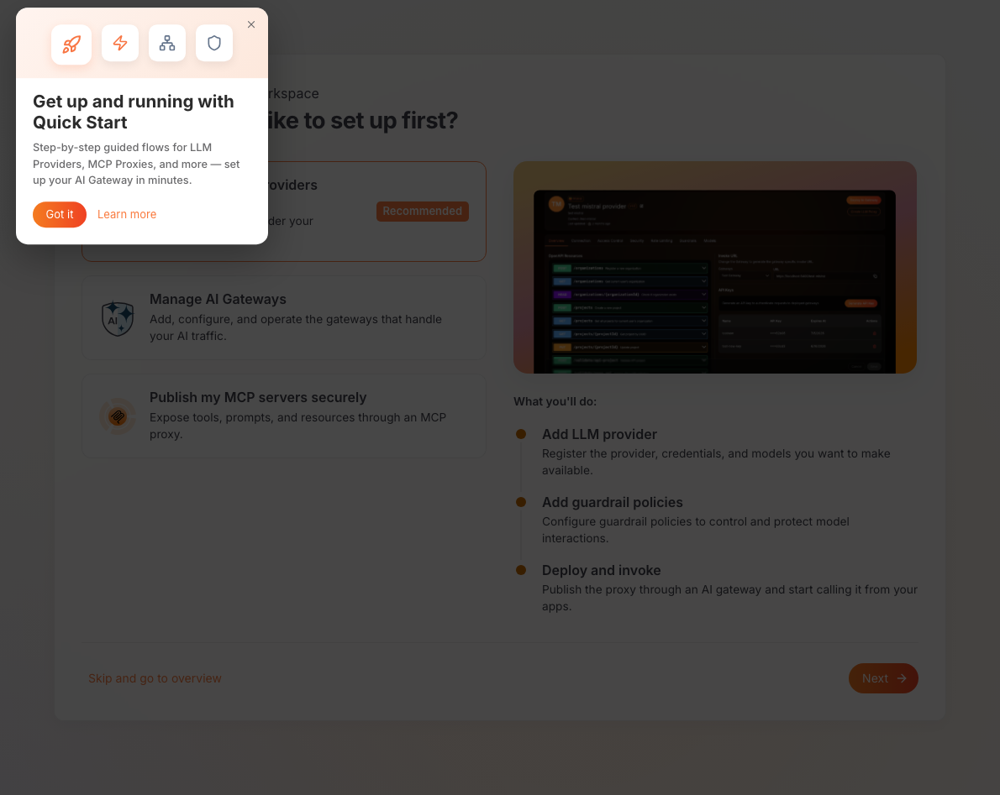
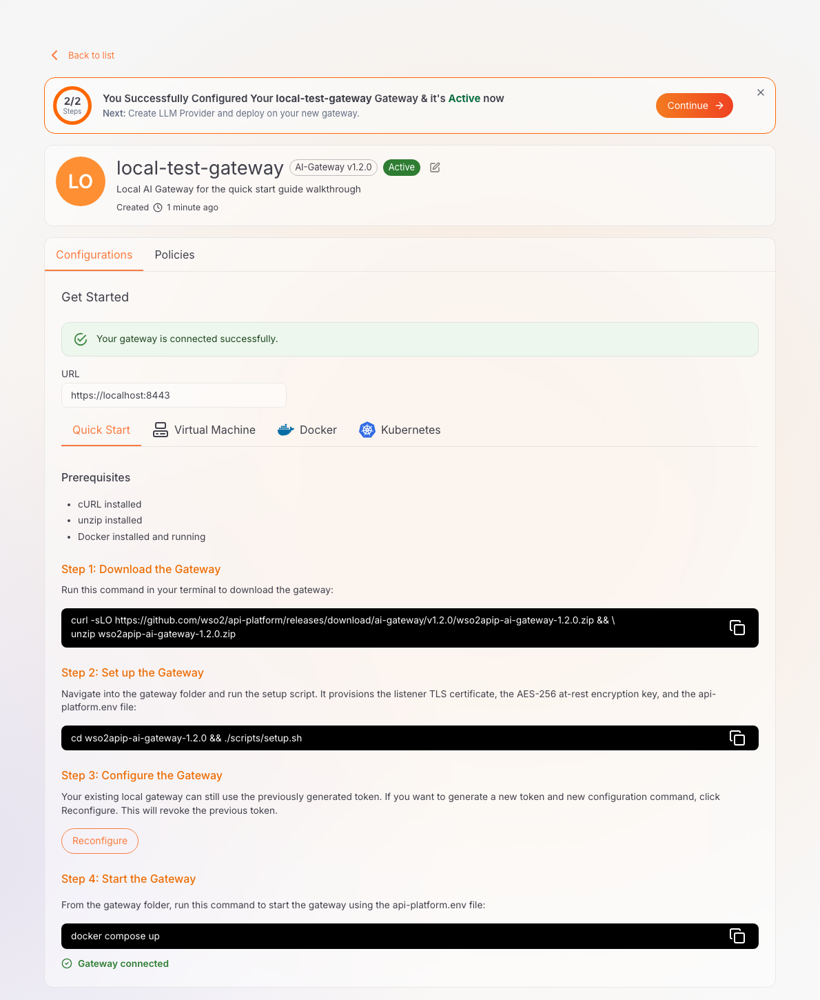
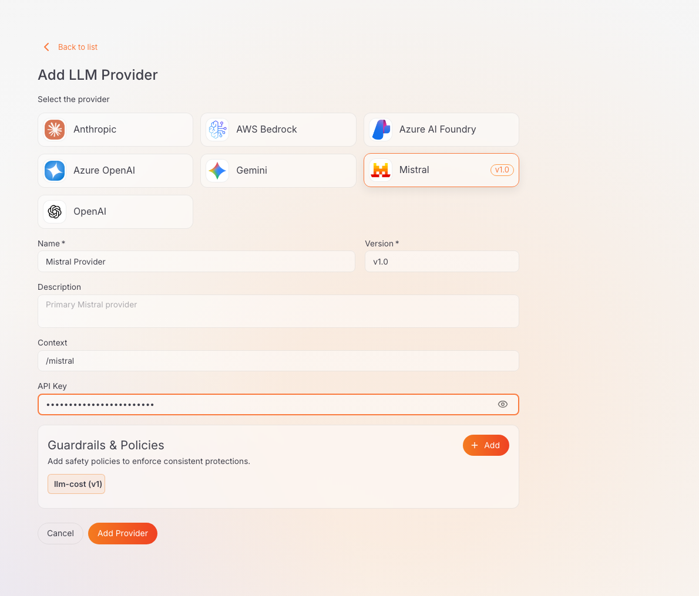
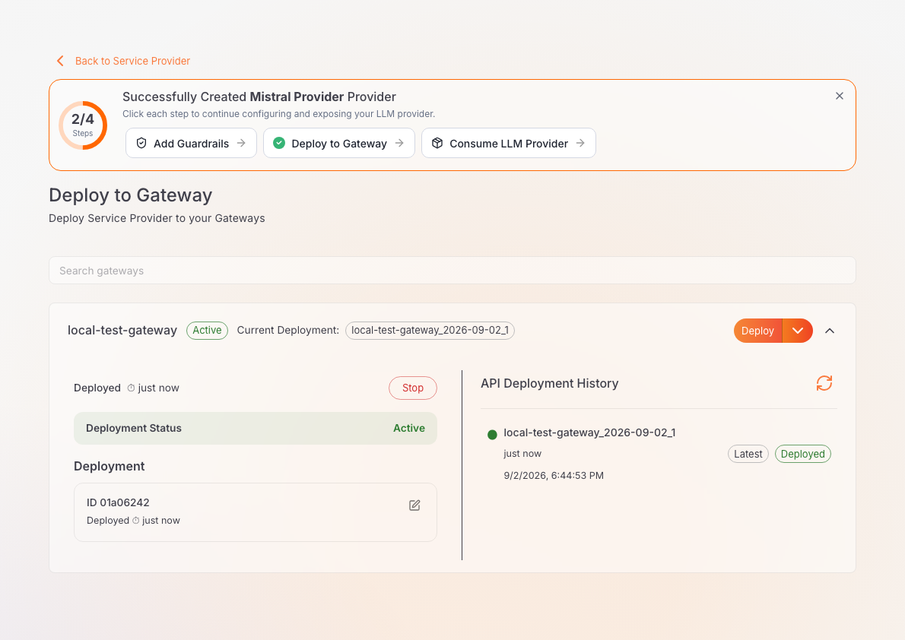
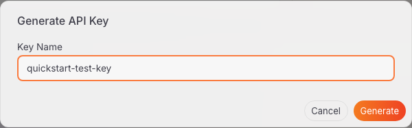

# Get started with AI Workspace

AI Workspace lets you manage the AI Gateways and large language model (LLM) providers your applications call. It's the control plane that configures those gateways and providers, then deploys the configuration to the gateway.

## Overview

This guide walks you through:

- [Part 1: Deploy AI Workspace](#part-1-deploy-ai-workspace)
- [Part 2: Connect an AI Gateway](#part-2-connect-an-ai-gateway)
- [Part 3: Configure an LLM provider](#part-3-configure-an-llm-provider)
- [Part 4: Run your first prompt](#part-4-run-your-first-prompt)

By the end, you'll have a local AI Workspace deployment managing an AI Gateway connected to an LLM provider. You'll send a real chat completion request through the resulting endpoint.

It's written for platform engineers, developers, and anyone evaluating a self-hosted AI governance layer. No prior WSO2 API Platform experience is required. For optional background on the concepts this guide uses, see:

- [AI Workspace and how it relates to the AI Gateway](overview.md)
- [LLM providers](llm-providers/overview.md)

## Prerequisites

- Install [Docker](https://docs.docker.com/get-docker/) with the Compose plugin, or another Compose-compatible container runtime such as Podman.
- Free up ports 9643 and 9243 on your machine. If either one is taken, see [Change the ports AI Workspace uses](setting-up/ports.md).
- Install `curl`, `unzip`, and `openssl`. On macOS and most Linux distributions, `openssl` is already installed.
- An API key from an LLM provider. This guide uses Mistral AI as the worked example, but any of the seven built-in providers works. Sign up with your chosen provider and generate a key before [Part 3](#part-3-configure-an-llm-provider).

This guide shows commands with `docker compose`. If you use Podman or another Compose-compatible runtime, run the equivalent Compose command instead, such as `podman compose up -d`.

## Part 1: Deploy AI Workspace

This part downloads AI Workspace, runs its setup script, starts the stack with Docker Compose, confirms you can sign in, and previews the first-run tour.

### Step 1: Download AI Workspace

Run this command in your terminal to download and unzip AI Workspace:

```bash
curl -sLO https://github.com/wso2/api-platform/releases/download/portals/ai-workspace/v1.0.0/wso2apip-ai-workspace-1.0.0.zip && \
unzip wso2apip-ai-workspace-1.0.0.zip
```

Then move into the extracted directory:

```bash
cd wso2apip-ai-workspace-1.0.0
```

This directory contains the Docker Compose file, configuration templates, database schema scripts, and the setup script you run next.

### Step 2: Run the setup script

```bash
./scripts/setup.sh
```

Run the script once before the first start. The stack never auto-generates keys or certificates. If something a service needs is missing, that service fails closed with a descriptive error rather than starting with a weaker default.

The script prompts for the admin username and password. Press <kbd>Enter</kbd> at each prompt to accept `admin` and a randomly generated password. It provisions:

| Artifact | Location | Purpose |
|----------|----------|---------|
| Transport Layer Security (TLS) certificate | `resources/certificates/cert.pem` and `key.pem` | Self-signed HTTPS pair shared by the services |
| RS256 JSON Web Token (JWT) signing keypair | `resources/keys/jwt_private.pem` and `jwt_public.pem` | The Platform API signs login tokens with the private key, and verifies them with the public key too. The API Portal also verifies them with the public key. There's no shared hash-based message authentication code (HMAC) secret |
| At-rest encryption key | `resources/keys/encryption.key` | The Platform API's 32-byte key for encrypting stored secrets, such as LLM provider API keys. Retain it: losing or changing it makes previously-encrypted data unreadable |
| API Portal encryption key | `resources/keys/api-portal-encryption.key` | Encrypts the API Portal's subscription and webhook secrets at rest. Provisioned alongside the others even if you don't run the API Portal. Retain it for the same reason |
| API Portal session secret | `resources/keys/api-portal-session-secret` | Signs API Portal session cookies. Rotating it only signs users out. Also provisioned regardless of whether you run the API Portal |
| Admin credentials | `api-platform.env` | The username and bcrypt password hash used for sign-in |
| Compose defaults | `.env` | `COMPOSE_PROFILES`, which decides the services a plain `docker compose up` starts, and `COMPOSE_PROJECT_NAME`, which namespaces this copy's containers, networks, and volumes |

!!! warning "Save the printed password"
    It's shown exactly once, and only its bcrypt hash is stored afterward. To set a new one, delete both `APIP_CP_ADMIN_USERNAME` and `APIP_CP_ADMIN_PASSWORD_HASH` from `api-platform.env` and rerun `./scripts/setup.sh`. Deleting only one of the two leaves a username with no matching hash, so the setup script stops with an error. Delete both together.

!!! warning "Don't delete or edit `COMPOSE_PROJECT_NAME`"
    The project name is pinned on the first run and never changes afterward, not on a rerun and not under any flag. The stack's data lives in volumes prefixed with it, so a different name starts the stack with an empty database. To choose the name yourself, set `COMPOSE_PROJECT_NAME` in the environment for the first run.

Rerunning `./scripts/setup.sh` later is safe. See [Rerun the setup script](setting-up/configuration.md#rerun-the-setup-script) for the flags that change what it does.

!!! note "Running on Windows"
    Use the PowerShell setup script instead. It takes the same flags and provisions the same files:

    ```powershell
    powershell -ExecutionPolicy Bypass -File .\scripts\setup.ps1
    ```

### Step 3: Start AI Workspace

```bash
docker compose up -d
```

This starts two containers: `platform-api` (the backend, on port 9243) and `ai-workspace` (the user interface (UI) and backend-for-frontend, on port 9643). The `ai-workspace` container waits for `platform-api` to report healthy before it starts.

!!! tip "Port 9243 or 9643 already taken?"
    If the start command fails with a port binding error, identify what's already listening on the default ports:

    ```bash
    # macOS or Linux
    lsof -nP -iTCP:9643 -sTCP:LISTEN
    lsof -nP -iTCP:9243 -sTCP:LISTEN
    ```

    ```powershell
    # Windows PowerShell
    Get-NetTCPConnection -State Listen -LocalPort 9643,9243 | Select-Object LocalAddress, LocalPort, OwningProcess
    ```

    Stop the conflicting service, or remap the host-side `ports:` mapping in `docker-compose.yaml`. If you remap the Platform API's port, also make the matching `configs/config.toml` change so the gateway setup commands in [Part 2](#part-2-connect-an-ai-gateway) carry the new port: see [Change the ports AI Workspace uses](setting-up/ports.md). Use the new number wherever this guide shows `9243` or `9643`, such as the health checks in [Step 4](#step-4-verify-the-installation) and the sign-in URL in [Step 5](#step-5-sign-in-to-ai-workspace).

### Step 4: Verify the installation

Confirm both services report healthy:

```bash
curl -fk https://localhost:9243/health
curl -fk https://localhost:9643/healthz
```

The `-k` flag skips certificate verification, which is fine here because the setup script's certificate is self-signed. Don't carry `-k` into a production script against a certificate you expect to be trusted.

Each command returns `{"status":"ok"}`. If either fails, check `docker compose ps` for the container's status and `docker compose logs` for details.

### Step 5: Sign in to AI Workspace

Open `https://localhost:9643` in your browser.

Your browser warns that the connection isn't private. This is expected, because the certificate `setup.sh` generated is self-signed. Click **Advanced**, then **Proceed**, to continue.

Sign in with the **Username** and **Password** fields, using the admin credentials `setup.sh` printed in [Step 2](#step-2-run-the-setup-script):


This file-based sign-in is intended for trying out AI Workspace, not for production or shared use. It supports a single organization with a static, manually managed user list. Before you share this instance with a team, connect an identity provider instead. See [Authentication in AI Workspace](setting-up/authentication/overview.md).

### Step 6: Take the first-run tour

On first sign-in, AI Workspace opens on a **Quick Start** page. A short tour introduces LLM providers and Model Context Protocol (MCP) proxies.

Click **Got it** to dismiss the tour. The page then asks **What would you like to set up first?** and offers three starting points:

- **Expose My LLM Providers Securely** (**Recommended**)
- **Manage AI Gateways**
- **Publish my MCP servers securely**

Each is a guided version of the steps this guide walks through by hand, with a **What you'll do** preview before you commit to one. The tour looks like this:



This guide doesn't follow the wizard directly. It walks through the same underlying steps with enough detail to explain what each screen and field does. Click **Skip and go to overview** if you'd rather open the **Overview** page instead.

## Part 2: Connect an AI Gateway

An AI Gateway is the runtime that routes requests to LLM providers. You need at least one connected and active before you can send a real request. This part registers a gateway in AI Workspace, then installs and starts its runtime so it shows a status of **Active**.

### Step 7: Register the gateway

1. Navigate to **AI Gateways** in the left navigation menu.
2. Click **Add AI Gateway**.
3. Fill in the gateway details:
    - **Gateway Version**: leave this at its default selection.
    - **Name**: a unique name, for example `local-test-gateway`.
    - **Description**: optional.
    - **URL**: the address the gateway is reachable at once it's running, for example `https://localhost:8443`. AI Workspace uses this to build the Invoke URL you'll call from your own terminal in [Part 4](#part-4-run-your-first-prompt). Use an address your terminal can actually reach, not `host.docker.internal`. That hostname only resolves from inside a container, not from your host machine.

4. Click **Add Gateway**.

AI Workspace creates the gateway with a status of **Inactive** and opens a **Get Started** section. This section carries the gateway installation commands for four methods:

- **Quick Start**
- **Virtual Machine**
- **Docker**
- **Kubernetes**

Its **Configure the gateway** command includes a single-use registration token. This guide uses **Quick Start**. For the other methods, see [Set up an AI Gateway](ai-gateways/setting-up.md).

!!! danger "The registration token is issued once"
    In [Step 8](#step-8-install-and-start-the-gateway-runtime), copy the **Configure the gateway** command with its **Copy** button so you capture the token with it. If you lose the token, click **Reconfigure** on the gateway's page to issue a new one. Reconfiguring revokes the previous token.

### Step 8: Install and start the gateway runtime

1. **Download the gateway:**

    ```bash
    curl -sLO https://github.com/wso2/api-platform/releases/download/ai-gateway/v1.2.0/wso2apip-ai-gateway-1.2.0.zip && \
    unzip wso2apip-ai-gateway-1.2.0.zip
    ```

2. **Set up the gateway.** This one-time script provisions the Advanced Encryption Standard (AES)-256 at-rest encryption key, the gateway's HTTPS listener certificate, the gateway-controller admin credentials, and `api-platform.env`. Like AI Workspace, the gateway fails closed if any of these is missing. The admin password is printed once. Copy it: it authenticates directly to the gateway controller, which this guide doesn't use again.

    ```bash
    cd wso2apip-ai-gateway-1.2.0 && ./scripts/setup.sh
    ```

    !!! note "Running on Windows"
        Use the PowerShell setup script instead. It takes the same flags and provisions the same files:

        ```powershell
        cd wso2apip-ai-gateway-1.2.0
        powershell -ExecutionPolicy Bypass -File .\scripts\setup.ps1
        ```

3. **Configure the gateway.** In the **Get Started** section, click the **Copy** button on the **Configure the gateway** command, then run it from the gateway directory. It appends the Platform API address and your single-use registration token to `api-platform.env`:

    ```bash
    cat >> api-platform.env << 'ENVFILE'
    APIP_GW_CONTROLLER_CONTROLPLANE_HOST=host.docker.internal:9243
    APIP_GW_CONTROLLER_CONTROLPLANE_TOKEN=<your-gateway-token>
    ENVFILE
    ```

    The command you copy has your real token in place of `<your-gateway-token>`. The control plane host is a bare `host:port`, with no scheme. Unlike the earlier warning about `host.docker.internal`, this is the reverse direction: the gateway container reaches out to the Platform API on your host machine. That's exactly what that hostname is for.

    !!! note "Running on Windows"
        The heredoc above (`<< 'ENVFILE'`) doesn't work in PowerShell. Either run this step from Git Bash or WSL, or open `api-platform.env` in a text editor and add the two lines directly.

4. **Start the gateway.** It runs in the foreground, so use a second terminal for the rest of this guide, or add `-d` to start it in the background.

    ```bash
    docker compose up
    ```

Give the gateway a few seconds to start and register itself. Back in AI Workspace, the gateway's status changes from **Inactive** to **Active**:



## Part 3: Configure an LLM provider

An LLM provider connects AI Workspace to an AI service platform, such as OpenAI, Anthropic, or Mistral AI. This part creates a provider, allows a model, deploys the provider to your gateway, and generates an API key.

### Step 9: Configure an LLM provider

This section configures Mistral AI as a worked example. The same steps apply to any of the seven built-in providers.

1. Navigate to **LLM Providers** in the left navigation menu, then click **Create Provider**.
2. Select a provider tile. The built-in options are **Anthropic**, **AWS Bedrock**, **Azure AI Foundry**, **Azure OpenAI**, **Gemini**, **Mistral**, and **OpenAI**. Select **Mistral**.
3. Fill in the provider form:
    - **Name**: for example, `Mistral Provider`.
    - **Version**: pre-filled, for example `v1.0`.
    - **Description**: optional.
    - **Context**: the URL path segment this provider is reachable under, for example `/mistral`.
    - **API Key**: your Mistral AI API key. Mistral's endpoint URL is pre-configured automatically.

    

    The **Guardrails & Policies** panel pre-selects a suggested `llm-cost` guardrail. Leave it, remove it, or add more later from the provider's **Guardrails & Policies** tab. See [Policies overview](policies/overview.md).

4. Click **Add Provider**.

AI Workspace encrypts the API key before storing it. The plaintext value is never saved. See [Secrets management](secrets-management.md) for how that works. AI Workspace also imports the provider's OpenAPI specification automatically. It shows a progress tracker with three remaining steps: **Add Guardrails**, **Deploy to Gateway**, and **Consume LLM Provider**. For other providers, including the Azure OpenAI, Azure AI Foundry, and AWS Bedrock fields, see [Configure an LLM provider](llm-providers/configure-provider.md).

### Step 10: Add a model

The provider's **Models** tab lists the models available through it.

1. On the provider's page, click the **Models** tab.
2. Confirm `mistral-small-latest` is already listed as a chip. Mistral ships with a few common models available by default. To add a different model instead, type its ID into the input field and press <kbd>Enter</kbd> to add it as a chip.

3. Click **Save**.

### Step 11: Deploy the provider to your gateway

1. On the provider's page, click **Deploy to Gateway** in the top right corner. This opens a dedicated deployment page listing your gateways.
2. Confirm the gateway from [Part 2](#part-2-connect-an-ai-gateway) shows a status of **Active**, then click **Deploy** next to it.

The deployment status changes to **Active** within a few seconds, without needing to refresh the page:



### Step 12: Generate an API key

The **API Keys** section on the provider's **Overview** tab only appears once the provider is deployed to at least one gateway. You won't see it before this point.

1. Go back to the provider's **Overview** tab.
2. Under **Invoke URL**, select your gateway from the **Gateways** dropdown and copy the URL shown, for example `https://localhost:8443/mistral`.
3. Under **API Keys**, click **Generate API Key**.
4. Enter a **Key Name**, for example `quickstart-test-key`, and click **Generate**.

    

!!! danger "Copy the key"
    An API key is displayed only once, in a dialog that also shows a ready-to-run `curl` command using one of the provider's models. Store the key securely immediately. You can't retrieve it again, though you can always generate a new one.

## Part 4: Run your first prompt

This part sends a real chat completion request through your deployed provider and confirms the response.

All requests to the gateway authenticate with the `X-API-Key` header by default. This is the same header named on the provider's **Security** tab. Mistral AI exposes an OpenAI-compatible API at `/v1`, so append that to the Invoke URL to reach the chat completions resource.

The following example assumes the Mistral AI provider from Part 3. If you configured a different kind of provider instead, this exact request path and body don't apply. Anthropic, Gemini, Azure OpenAI, and Azure AI Foundry each use their own native request shape. See [Invoke providers and proxies via SDKs](using-sdks.md) for the equivalent call. AWS Bedrock isn't covered there; check your model's Bedrock API documentation for the request format.

```bash
curl -X POST "<INVOKE_URL>/v1/chat/completions" \
  -H "Content-Type: application/json" \
  -H "X-API-Key: <YOUR_GENERATED_API_KEY>" \
  -d '{
    "model": "mistral-small-latest",
    "messages": [
      { "role": "user", "content": "Say hello in exactly five words." }
    ]
  }'
```

A successful response returns `200 OK` with a chat completion:

```json
{
  "id": "7e22aefb0dac4c3ba1080d34ad8a3da5",
  "object": "chat.completion",
  "created": 1786112464,
  "model": "mistral-small-latest",
  "choices": [
    {
      "index": 0,
      "finish_reason": "stop",
      "message": {
        "role": "assistant",
        "content": "Hello there, how are you?"
      }
    }
  ],
  "usage": { "prompt_tokens": 10, "completion_tokens": 9, "total_tokens": 19 }
}
```

Your response's `id`, `created` timestamp, and `content` differ. That's expected. What matters is a `200` status and a `choices` array with a real model reply.

At this point, you have a local AI Workspace deployment managing an AI Gateway connected to Mistral AI. You just sent a real chat completion through that gateway with a key you generated yourself. AI Workspace, the AI Gateway, and the upstream provider all worked together to complete that request.

## Verify everything works end to end

To confirm every piece is in place:

- [ ] Both AI Workspace containers (`platform-api` and `ai-workspace`) report healthy.
- [ ] You can sign in to the AI Workspace UI with the admin credentials `setup.sh` generated.
- [ ] An AI Gateway is registered and shows a status of **Active**.
- [ ] An LLM provider is configured with at least one model on its **Models** tab.
- [ ] The provider is deployed to your gateway, with a deployment status of **Active**.
- [ ] A generated API key successfully authenticates a real chat completion request through the gateway.

## Stopping AI Workspace

When you're done, you have two options, from the directory you extracted in [Step 1](#step-1-download-ai-workspace):

### Keep data and configuration

```bash
docker compose down
```

This stops the containers but preserves the `platform-api-data` volume. Every gateway, provider, and proxy you configured is still there when you run `docker compose up -d` again.

### Delete data for a fresh start

```bash
docker compose down -v
```

This also removes the `platform-api-data` volume, so the next start begins with no gateways, providers, or proxies configured. `api-platform.env` isn't part of that volume, so your admin credentials survive unchanged. To also get a new admin password, delete `APIP_CP_ADMIN_USERNAME` and `APIP_CP_ADMIN_PASSWORD_HASH` from `api-platform.env` first, then rerun `./scripts/setup.sh`.

The AI Gateway you connected in [Part 2](#part-2-connect-an-ai-gateway) is a separate Docker Compose stack, in its own directory. Stop it the same way, from there.

## Next steps

- [Manage an LLM provider](llm-providers/manage-provider.md): configure connection, access control, security, rate limiting, and guardrails for the provider you just created
- [Configure an App LLM Proxy](llm-proxies/configure-proxy.md): add an application-specific endpoint on top of a provider, with its own guardrails and access rules
- [Manage an App LLM Proxy](llm-proxies/manage-proxy.md): configure provider settings, resources, security, and guardrails for an existing proxy
- [Invoke providers and proxies via SDKs](using-sdks.md): call your deployed endpoint from the OpenAI, Anthropic, Gemini, Mistral, Azure OpenAI (including Azure AI Foundry), or LangChain software development kits (SDKs)
- [MCP Proxies overview](mcp-proxies/overview.md): govern access to a Model Context Protocol (MCP) server through the same gateway
- [GenAI applications](genai-applications.md): group API keys under a named application for usage visibility and governance
- [Change the ports AI Workspace uses](setting-up/ports.md): remap the default `9643` and `9243` ports
- [Connect a database to the Platform API](setting-up/database.md): move off the default SQLite store to PostgreSQL or SQL Server for production
- [Authentication in AI Workspace](setting-up/authentication/overview.md): connect an identity provider before sharing this instance with a team
- [Configure inbound authentication](configure-inbound-auth.md): change the header name your applications use to call a provider or proxy
- [AI Workspace CI/CD overview](ci-cd/overview.md): manage providers and proxies as version-controlled files with the `ap` command-line interface (CLI)
- [Production deployment overview](production/overview.md): take this deployment to a virtual machine or Kubernetes, with high availability and hardening
- [Troubleshoot AI Workspace](troubleshooting.md): fixes for the most common setup problems
