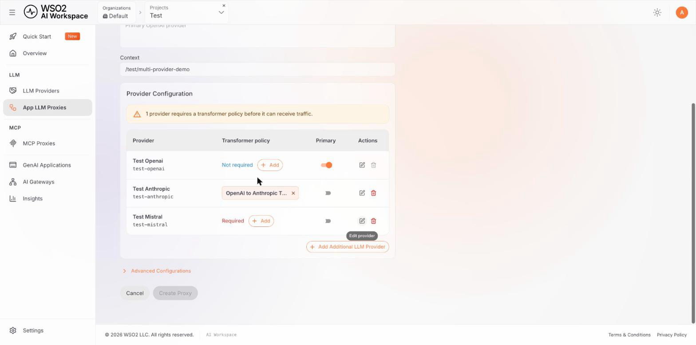
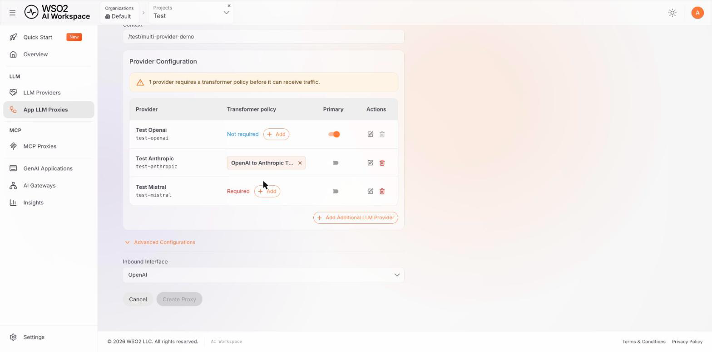
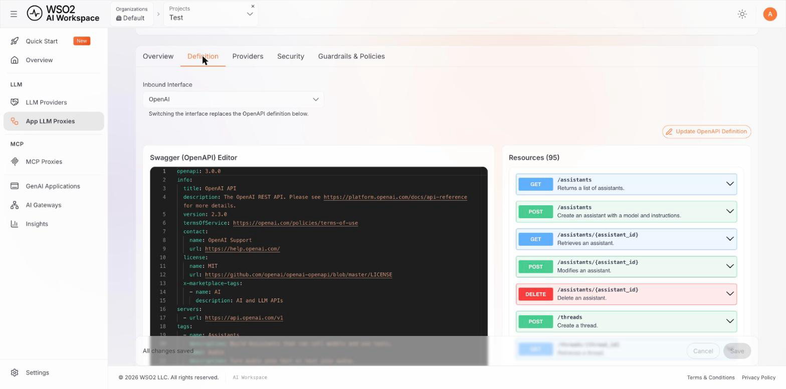
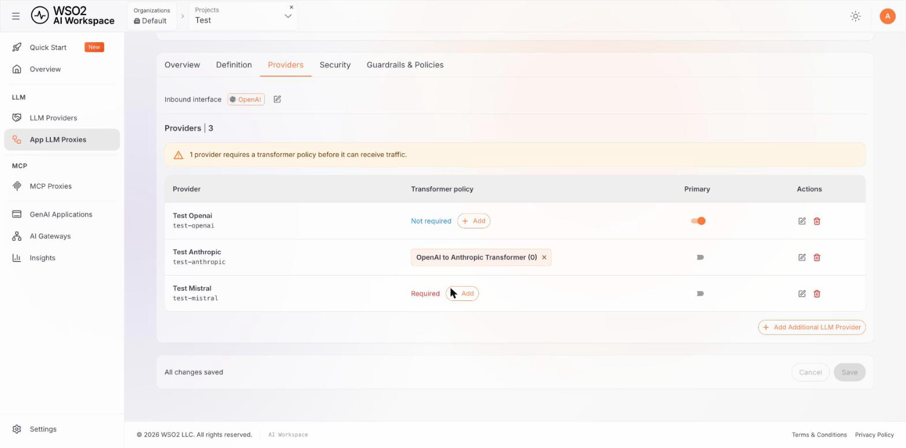
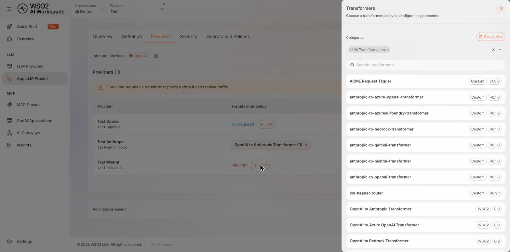

# Route an App LLM proxy to several providers

An App LLM proxy can front more than one LLM provider. Applications keep sending requests in one
format to one endpoint, and each request reaches whichever provider it selects.

This is useful when you want to compare providers on identical requests, fail over between vendors without touching application code, or keep several vendor credentials in the workspace instead of distributing them.

A proxy with one provider needs none of this. The extra controls appear only once you attach a second one.

## Prerequisites

- Two or more LLM providers configured in your workspace. See [Configure an LLM provider](../llm-providers/configure-provider.md).
- A gateway to deploy to. Multi-provider routing needs a gateway at **1.2.0 or later** - see [What needs a newer gateway](#what-needs-a-newer-gateway).

## How a multi-provider proxy fits together

Three things decide what happens to a request:

| Concept | What it does |
|---------|--------------|
| **Inbound interface** | The format the proxy accepts from client applications. |
| **Provider** | An LLM provider attached to the proxy. One is the primary. |
| **Transformer policy** | Translates between the inbound interface and a provider's own format. |

A provider needs a transformer when its own format differs from the inbound interface. A provider that already speaks the inbound format needs nothing, and the workspace shows it as **Not required**.

The gateway performs the selection, translation and authentication at request time. For how that works - the routing policy, the header it reads, and the order things execute in - see [Multi-provider routing](../../../ai-gateway/next/routing/multi-provider-routing.md) in the AI Gateway documentation.

## Create a proxy with several providers

1. Navigate to **LLM** > **App LLM Proxies** in the left navigation menu.

2. Click **Create App LLM Proxy**.

3. Fill in the proxy details - **Name**, **Version**, and optionally **Description** and **Context** - as you would for any proxy. The context is derived from the name as you type. See [Configure an App LLM proxy](configure-proxy.md) for what each field does.

4. Under **Provider Configuration**, select the first provider from the **LLM Provider** dropdown. This becomes the proxy's **primary** provider by default but it can be switched later.

5. Click **+ Add Additional LLM Provider**. The form turns into a provider table, and a **New provider** panel opens below it with the proxy's inbound interface shown in its top-right corner.

6. Choose the provider from the panel's **LLM Provider** dropdown. Providers already attached are not listed, so the same one cannot be added twice.

    If a transformer in the catalogue matches the conversion this provider needs, the workspace attaches it automatically and shows it under **Transformer**. If none matches, the panel says **No transformer configured** and offers **Configure transformer** so you can pick one yourself.

7. Give the provider a credential - enter one under **Enter API Key Manually**, or click **Generate API Key** and name the key. A generated key is attached when the proxy is created.

8. Click **Add provider** to put it in the table, then repeat from step 5 for any further providers.

    The table shows each provider's **Provider ID** beneath its name, its **Transformer policy**, which one is **Primary**, and row **Actions**. Use the **Primary** toggle to move the primary marker to a different provider.

    

9. Click **Create Proxy**.

!!! note
    **Create Proxy** stays disabled until every provider that requires one has a credential. Hovering the disabled button says which condition is unmet. A provider still showing **Required** in the **Transformer policy** column does *not* block creation. The proxy is created, and the gateway still routes to that provider - but the request arrives in the proxy's inbound format, untranslated, so the provider is likely to reject it until you attach a transformer.

## Choose the inbound interface

The **inbound interface** is the request format the proxy accepts from client applications. It decides what each provider needs translating to.

By default you do not choose it:

- **With one provider**, the interface is that provider's own format, so nothing needs translating.
- **With several providers**, it defaults to OpenAI, which has the widest transformer coverage and so leaves the most providers matching automatically.

To set it yourself while creating the proxy, expand **Advanced Configurations** and pick from **Inbound Interface**.

After creation you can change it in two places - the **Providers** tab, next to the **Inbound interface** label, or the **Definition** tab, which also shows the OpenAPI definition it implies.

!!! warning
    Switching the inbound interface replaces the proxy's OpenAPI definition, and changes what every attached provider needs. A provider that needed no transformer may now need one, and the proxy reports it as **Required** until you attach it.

## Manage providers after creation

Open the proxy and go to the **Providers** tab. It shows the inbound interface, the provider count, and the same table you used while creating the proxy.

From here you can:

- **Add Additional LLM Provider** to attach another.
- **Edit provider** to change its credential or transformer.
- **Remove provider** to detach one. The last remaining provider cannot be removed - a proxy always has at least one.
- Move the **Primary** marker with the toggle.

Changes are held on the page until you save, so you can adjust several providers and apply them together. The bar at the bottom of the page reports whether there is anything unsaved.

## Select a provider at request time

Each provider row shows a **Provider ID** beneath the provider's name - `test-openai` in the screenshots above. That is the value an application sends to select that provider, in the header the gateway's routing policy is configured to read.

A request that names no provider, or names one the proxy does not have, goes to whichever provider the routing policy names as its default. When the policy sets no default, it goes to the primary.

For the routing policy itself - which header it reads, how to map header values to providers, and how to set a different default - see
[Multi-provider routing](../../../ai-gateway/next/routing/multi-provider-routing.md).

## Attach a transformer policy

Click **Add** in a provider's **Transformer policy** column to open the **Transformers** panel. It is pre-filtered to the **LLM Transformation** category with an empty search box, and lists both the transformers shipped with the product and any custom policies deployed on your gateway.

Each entry shows its source - **WSO2** for a catalogue policy, **Custom** for one built for your gateway - and its version. Clearing the category filter widens the list to every policy. Selecting a transformer opens its parameters for configuration.

A transformer is recorded on the proxy only when it is attached. A provider left showing **Required** still receives requests, but they arrive untranslated in the proxy's inbound format.

!!! note
    Automatic matching looks for a policy named for the exact conversion - for example `openai-to-anthropic-transformer`. A provider whose template handle does not match any policy name is reported as unmatched even when a suitable transformer exists in the catalogue under a slightly different name. Pick it manually in that case.

## What needs a newer gateway

A gateway at **1.2.x** serves multi-provider proxies, but reads only the older `provider` plus `additionalProviders` configuration. The capabilities added since then need a newer gateway:

| Capability | Minimum gateway |
|------------|-----------------|
| Several providers, each with its own credential | 1.2.0 |
| An inbound interface that differs from the primary provider's own format | **2026.09.24** |
| A transformer on the primary provider | **2026.09.24** |
| Routing to a provider that carries no transformer | **2026.09.24** |

A proxy using a capability its target gateway does not support fails when you deploy it, rather than deploying and behaving unexpectedly.

## Next steps

- [Manage an App LLM proxy](manage-proxy.md) - security, guardrails and resources
- [Multi-provider routing](../../../ai-gateway/next/routing/multi-provider-routing.md) - how the gateway selects, translates and authenticates
- [Configure an LLM provider](../llm-providers/configure-provider.md) - adding providers to attach
