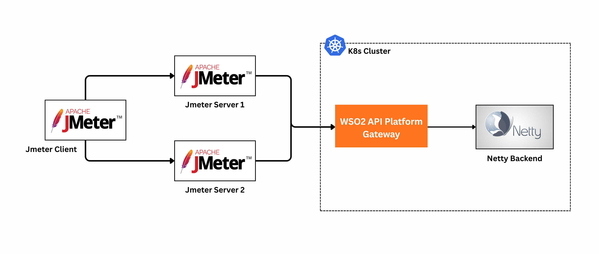

# API Platform Gateway Performance

The performance of the WSO2 API Platform Gateway was evaluated using the following APIs, both of which invoke a simple Netty HTTP Echo Service running on the same Amazon EKS cluster as the gateway. As the name suggests, the Netty service echoes back any request it receives.

- **API without policies**: An API configured with eight routes that directly forward requests to the backend service through the gateway.
- **API with mediation policies**: An API configured with the same eight routes, with a Set Header policy applied to both the request and response flows.

The performance tests were conducted with 100, 500, and 1000 concurrent users, where concurrent users represent multiple clients accessing the gateway simultaneously. The backend response delay was configured to 0 ms.

Apache JMeter was used as the test client. Each test scenario was executed for 15 minutes, including a 3-minute warm-up period. Performance metrics were calculated after excluding the warm-up period from the analysis.

The following key metrics were used to evaluate gateway performance:

- **Throughput**: The number of API requests processed by the gateway per unit of time (requests per second).
- **Response time**: The end-to-end time taken to process an API request. The complete response time distribution, including the 90th, 95th, and 99th percentile response times, was recorded and analyzed.

## Deployment used for the test

The WSO2 API Platform Gateway and Netty HTTP Backend are deployed on an Amazon Elastic Kubernetes Service (EKS) cluster. Apache JMeter client and servers run on separate Amazon EC2 instances outside the cluster.

The diagram below shows the deployment architecture used for the performance tests documented here.

{ width="900" }

| Component                 | Deployment   | Instance Type | vCPU | Memory (GiB) |
| ------------------------- | ------------ | ------------- | :--: | :----------: |
| Apache JMeter Client      | Amazon EC2   | `c5.2xlarge`  |   8  |      16      |
| Apache JMeter Servers     | Amazon EC2   | `c5.2xlarge`  |   8  |      16      |
| Netty HTTP Backend        | Amazon EKS   | `c5.2xlarge`  |   8  |      16      |
| WSO2 API Platform Gateway | Amazon EKS   | `c5.2xlarge`  |   8  |      16      |

- The EKS worker nodes run Amazon Linux 2023.11.
- Java version is Temurin JDK 21.
- Gateway pod CPU and memory allocations for each test scenario are documented in the [Results](#results) section.

## Performance test scripts

All scripts used to analyze results are in the following repository.

- [https://github.com/wso2/performance-common](https://github.com/wso2/performance-common).

## Results

The tests were executed using the user counts and payload sizes described above across two concurrency levels. For each concurrency level, the gateway runtime was allocated the corresponding CPU resources before deploying the API Gateway test configurations. The table below summarizes the test scenarios covered in this document.

| Test Scenario | CPU Allocation (Gateway Controller) | CPU Allocation (Gateway Runtime) | Router Concurrency | Test Results |
| ------------- | ----------------------------------- | -------------------------------- | ------------------ | ------------ |
| 1             | 1                                   | 2                                | 2                  | [Gateway runtime with two CPUs](./gateway-runtime-with-two-cpus.md) |
| 2             | 1                                   | 4                                | 3                  | [Gateway runtime with four CPUs](./gateway-runtime-with-four-cpus.md) |
