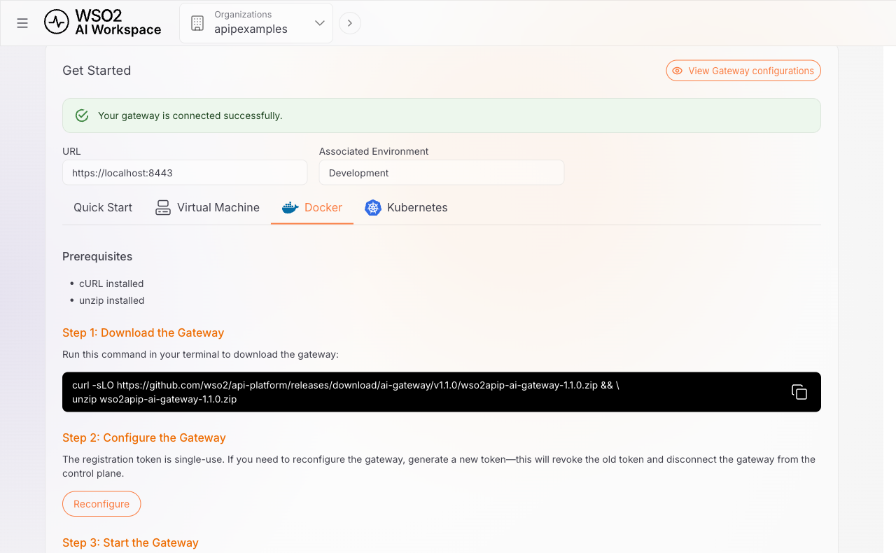
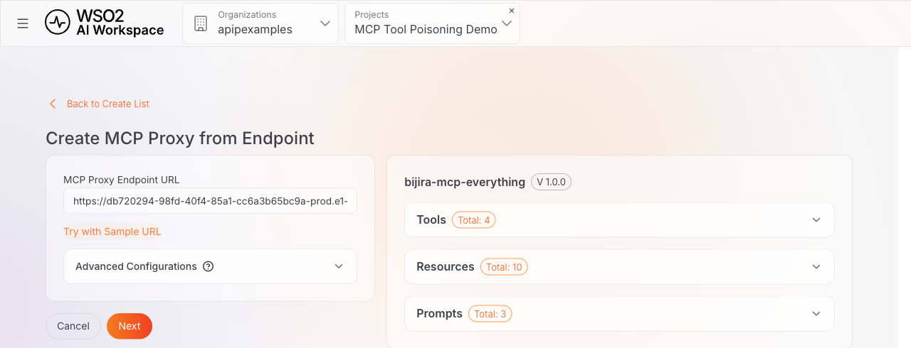
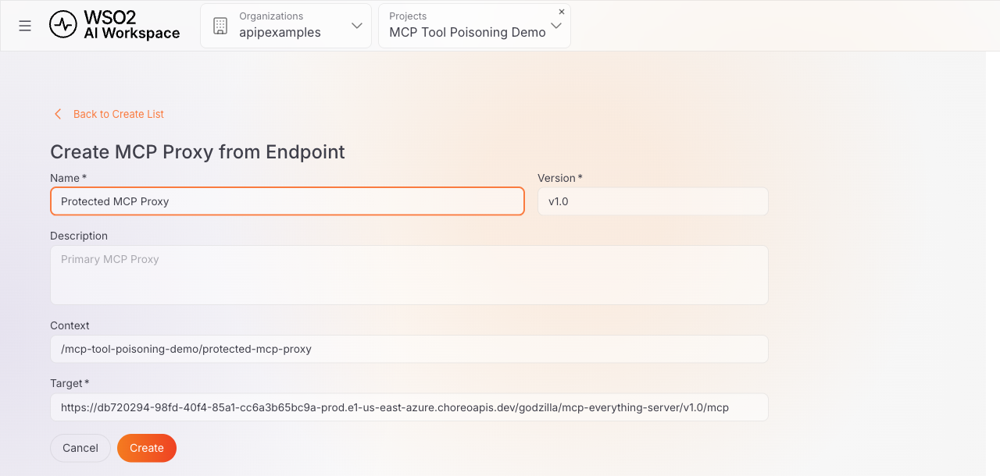
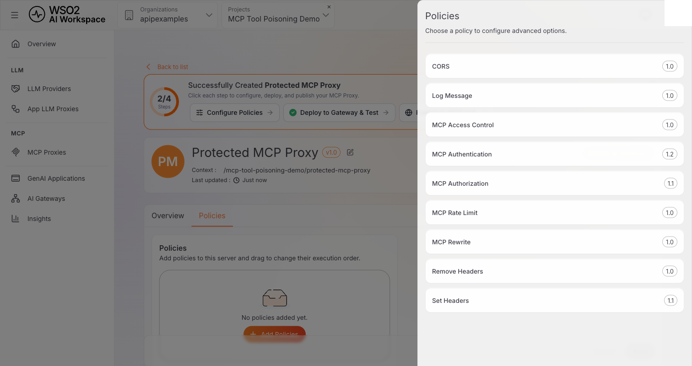
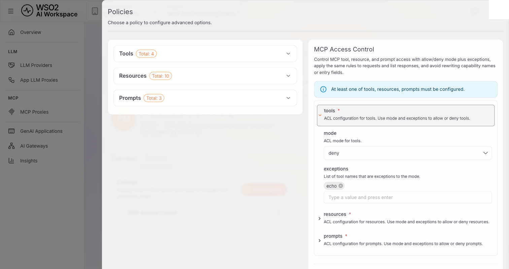
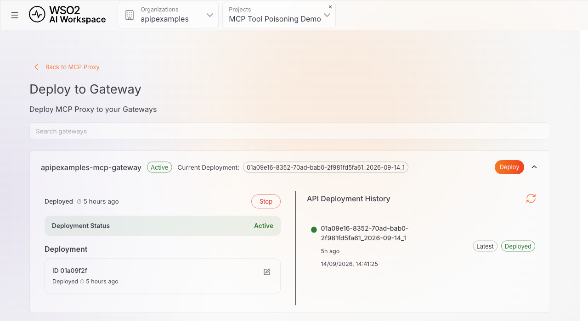
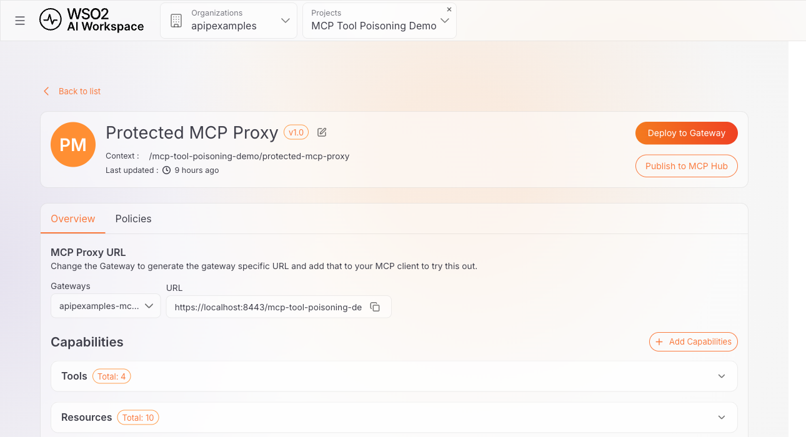

# Reduce MCP tool poisoning risk with the MCP Access Control policy

## Overview

MCP tool poisoning is a prompt-injection technique. A malicious or compromised MCP server embeds malicious instructions in tool metadata, such as a tool's `description` field. An MCP client may pass that metadata to an LLM. A person reviewing a tool list in a UI can easily miss wording that a model still reads. This guide explains what tool poisoning is and why it's a real risk for any agent connected to an MCP server you don't fully control. It also explains how attaching the **MCP Access Control** policy to an **MCP Proxy** in WSO2 API Platform reduces your exposure to it.

The MCP Access Control policy is one layer of defense, not a complete solution. It's described precisely in that context throughout this guide.

If you'd rather see the problem in action first, jump to the [companion sample](#try-the-sample).

## What is MCP tool poisoning?

The Model Context Protocol (MCP) lets a client discover a server's tools by calling `tools/list`. Each tool definition in the response includes a `name` and can include a human-readable `description` and other metadata such as `annotations`, all supplied by the server. The `description` is meant to tell a person or a model what the tool does and when to use it.

MCP itself doesn't specify whether, when, or how often a client passes that description to the underlying model. That's a client or host implementation choice, not a protocol requirement. The MCP specification explicitly requires clients to treat tool annotations as untrusted unless they come from trusted servers. More generally, server-supplied tool metadata should not automatically be treated as trusted instructions. If a client incorporates a malicious tool description into the model's context, that text can become a prompt-injection vector. Tool poisoning is what happens when server-supplied tool metadata is weaponized. A malicious or compromised server embeds directives in it, such as instructions to read a local file, ignore a previous rule, or send data somewhere. These directives are worded to survive a quick skim of tool names in a UI. A client that forwards the full text gives the model something to act on. The tool still looks completely ordinary: same name, a plausible-sounding purpose, a normal input schema. Only the full metadata text gives it away, and that's exactly the part a busy reviewer is least likely to read in full.

## Why it matters

Tool poisoning is dangerous less because of any one technique it uses and more because of where it sits: inside server-supplied metadata that a client may pass to a model, and that a person rarely audits closely. A poisoned description is a prompt-injection attempt: on its own, it has no way to reach outside the conversation. What it can lead to depends entirely on what the agent already has:

- **It can attempt to trigger data exfiltration if the agent has the means.** A poisoned description can try to persuade the model to use another tool the agent already has access to, such as one that reads local files or environment variables, and then disclose that content through some other capability the agent is already permitted to use. The description itself can't read anything; it can only try to talk the model into using capabilities and permissions the agent already has.
- **It can lead to unintended use of other tools.** An agent that already has several tools available can be steered by one poisoned description into invoking another tool. That tool serves a purpose the person operating the agent never asked for, though still within the agent's existing permissions. The exact behavior depends on the client or host implementation. This isn't a case of the injection bypassing an authorization boundary; it's the model being manipulated into using a capability it was already authorized to use.
- **It's not a one-time check.** MCP servers can change their tools between sessions: a compromised upstream, a malicious update, or a rogue maintainer can all result in a tool's description changing after you last reviewed it. A client's next `tools/list` call reflects whatever the server currently returns, so a server that was clean when you first reviewed it isn't guaranteed to stay that way.
- **It doesn't scale to manual review.** Reading every tool's full metadata end to end, for every server an agent connects to, isn't something a person can keep doing as the number of connected servers grows, and a client that forwards this metadata to a model doesn't skip that step just because a human didn't read it.

## Why gateway-level enforcement helps, as part of defense in depth

Tool poisoning has no single point of defense. A client or host should already treat server-supplied tool metadata as untrusted, per the MCP specification's own guidance. An operator should review a server's tools before connecting to it at all. On top of both of those, an API gateway has long been the place organizations enforce access control for REST and GraphQL APIs, rather than relying solely on every backend to behave and every client to check. MCP benefits from the same governance point: putting an **MCP Proxy** in front of an upstream MCP server lets an AI Gateway enforce an organization-wide capability allowlist on every request, independent of what any individual client does.

This adds a layer where the capabilities exposed through the gateway can be restricted according to centrally configured access-control policies, rather than relying solely on whatever the upstream MCP server makes available. This works **on top of**, not instead of, client-side caution and MCP Authentication/Authorization controls. The policy does not attempt to detect or remove prompt-injection content from tool descriptions, since reliably identifying adversarial text can be difficult and attack wording can vary. Instead, it limits which MCP capabilities are available to the client. When configured in deny mode with an explicit exception list, the policy can implement an allowlist in which capabilities that are not explicitly permitted are denied and filtered from capability-list responses.

## How the MCP Access Control policy reduces this risk

The **MCP Access Control** policy, attached to an MCP Proxy, allows or denies MCP capabilities (tools, resources, and prompts) by name, using a mode (`allow` or `deny`) plus a list of exceptions per capability type. Configured as `deny` with a short exception list, it filters `tools/list` responses and rejects direct calls to anything not on the list, regardless of what that capability's own metadata says. At the policy configuration level, a capability type left out of the config entirely is unrestricted; configure `tools`, `resources`, and `prompts` independently, for whichever types your upstream server actually exposes. Step 4 covers how this plays out in the AI Workspace console specifically.

!!! warning "What this policy does not do"
    The MCP Access Control policy has no visibility into a tool's `description` or `annotations` text. It doesn't scan for prompt-injection phrasing or otherwise evaluate content. It only checks whether a capability's *name* is on the exception list. That's precisely why it's effective here: you don't need to detect that a tool is poisoned. You only need to *not* have added it to the exceptions list. But the reverse also holds: allowlisting a tool you haven't actually reviewed gives it the same free pass. The policy enforces a decision; it doesn't make the decision for you, and it doesn't validate or sanitize the metadata of a capability once that capability is allowlisted.

Two related policies show up alongside it when you add a policy to an MCP Proxy, and it's worth knowing where they stop:

- **MCP Authentication** verifies who's calling, per the MCP specification.
- **MCP Authorization** applies fine-grained rules to MCP capabilities and JSON-RPC methods.

Neither inspects a tool's description or annotations either. No MCP policy in this platform scans capability content for malicious instructions. Allowlisting by name is the primary technique it gives you against tool poisoning specifically, and it works by reducing which capabilities can reach a client at all, not by identifying which ones are malicious.

### Practices beyond the policy itself

Attaching the policy reduces your exposure to unreviewed capabilities; it doesn't validate or sanitize what an allowlisted capability actually does. Treat it as one part of a broader practice:

- Read a tool's full description and annotations before adding it to the exceptions list. The policy enforces your review; it doesn't replace it.
- Start every MCP Proxy in `deny` mode and grow the exceptions list deliberately, rather than starting from `allow` and trying to keep up with a blocklist.
- Re-review your exceptions list when an upstream server changes. A new version or redeployment can ship a different description for a tool you already approved.
- Use AI Workspace's [**Insights**](../../cloud/ai-workspace/insights.md) page to review request volume and errors for the proxy, including denied-capability errors surfaced by the gateway. This complements, but doesn't replace, reviewing tool metadata before allowlisting it.
- Treat MCP Authentication and MCP Authorization as complementary controls on *who* can call the proxy and *which methods* they can use, on top of *which capabilities* MCP Access Control exposes.

## Set up the MCP Access Control policy

The rest of this guide walks through attaching the policy to a real MCP Proxy in AI Workspace, using the AI Gateway to enforce it. It points the proxy at a public reference MCP server so you don't need to stand up anything of your own to follow along.

### Prerequisites

- A WSO2 API Platform account. [Sign up for free](https://console.bijira.dev).
- AI Workspace access with an **Admin** or **Developer** role.
- Docker and Docker Compose, to run the self-hosted AI gateway.
- `curl`, for testing.

### Architecture

```
MCP Client
    |
    |  Without a proxy in front: connects directly to the server
    v
Untrusted MCP server
    returns tools/list, including whatever tools the server chooses to expose
    -- nothing inspects the response; every tool reaches the client --

MCP Client
    |
    |  With an MCP Proxy in front of it
    v
+---------------------------------------------------+
|  WSO2 AI Gateway                                   |
|  [ MCP Proxy ]                                     |
|  MCP Access Control (tools.mode=deny,               |
|             tools.exceptions=[<your reviewed tools>]) |
+---------------------------------------------------+
    |  The proxy still calls the upstream server to get its
    |  capability list, then applies the policy to that result
    |  before responding to the client
    v
Untrusted MCP server
    returns the same tools/list as above
    -- only the reviewed, allowlisted tools reach the client --
```

The upstream server continues to return its own full capability list to the proxy, unchanged. The MCP Access Control policy is applied to that result before the proxy responds to the client: a denied capability is removed from what the client sees, whatever the server itself returned.

### Step 1: Create an organization and project

Go to the [WSO2 API Platform console](https://console.bijira.dev) and sign in. If this is your first time, you're prompted to create an organization first. Full walkthrough: [Quick start guide](../../cloud/introduction/quick-start-guide.md).

Then create a project. Once it exists, click **AI Workspace** in the top navigation bar to enter AI Workspace. It opens in a new tab. Confirm that your project is selected via **Select Project**.

### Step 2: Create and start an AI gateway

The AI gateway is the runtime that hosts your proxy and enforces the MCP Access Control policy. If you already have one running and shown as **Active**, skip to Step 3. Full reference, including Virtual Machine and Kubernetes install options: [Setting up an AI Gateway](../../cloud/ai-workspace/ai-gateways/setting-up.md).

1. Click **AI Gateways** > **+ Add AI Gateway**, and enter a name. Leave **URL** at its default, `https://localhost:8443`, and select an associated environment.
2. Click **Add Gateway**. On the gateway detail page, open **Get Started**, select the **Docker** or **Quick Start** instructions, and follow the displayed commands to download the gateway and configure its registration credentials. The commands provide the registration token and other required values; do not commit them to source control.

    {.cInlineImage-full}

3. Start the gateway using the command shown in the setup instructions:

    ```bash
    cd <the-extracted-gateway-directory>
    docker compose --env-file configs/keys.env up
    ```

    The extracted directory name matches the archive the console gave you to download, and can change between gateway releases. Use the exact name from your own download rather than assuming a fixed version.

**Expected result:** The gateway shows **Active** in AI Workspace within about a minute, with a confirmation that it's connected successfully.

!!! tip "Testing over plain HTTP avoids a self-signed certificate, on a local gateway only"
    The gateway's HTTPS listener uses a self-signed certificate, so calling it directly with `curl` needs `-k`. If your gateway runs on `localhost` and isn't reachable from another host, and your gateway distribution also exposes a plain HTTP listener, you can use that instead to avoid the certificate entirely. Its port is deployment-specific. For example, use `http://localhost:8080/<proxy-context>/mcp` only if your own gateway configuration maps HTTP traffic to port 8080. If your gateway is reachable over a network, don't use `-k` or plain HTTP: configure `curl` to trust the gateway's certificate instead, since both practices send requests, and any session ID or future API key, without transport encryption or certificate validation.

### Step 3: Create the MCP Proxy

1. Click **MCP Proxies** > **+ Create MCP Proxy**.
2. Click **Try with Sample URL** to point the proxy at a public reference MCP server hosted by WSO2, so you don't need to stand up your own server to follow along. It exercises the full MCP protocol (tools, resources, and prompts) with a small pizza-ordering scenario. AI Workspace fetches its capabilities immediately.

    {.cInlineImage-full}

    !!! note "Pointing at your own MCP server instead"
        Enter its URL in the **MCP Proxy Endpoint URL** field instead of clicking **Try with Sample URL**. If that server runs locally in Docker on the same machine as AI Workspace, remember that `localhost` inside a container refers to the container, not your host. Use `host.docker.internal` to reach the host instead (on Linux, this needs an explicit mapping such as `extra_hosts: ["host.docker.internal:host-gateway"]` in Docker Compose, available on Docker Engine 20.10 and later). If AI Workspace can't reach your server at all, for example because it only runs on your local network, you can still continue and add its capabilities manually from the proxy's **Overview** tab afterward. The gateway, which calls the upstream server at request time, may succeed even when AI Workspace's own fetch step can't.

3. Click **Next**, then fill in the remaining details and click **Create**:

    | Field | Value |
    |---|---|
    | **Name** | A name for the proxy, for example `Protected MCP Proxy`. |
    | **Version** | Leave the prefilled value, for example `v1.0`. |
    | **Context** | Leave the auto-generated value. |
    | **Target** | Leave it set to the endpoint URL from the previous step. |

    {.cInlineImage-full}

**Expected result:** The proxy is created and its detail page opens, showing **Overview** and **Policies** tabs. The **Overview** tab lists the same discovered capabilities shown in the previous step.

### Step 4: Attach the MCP Access Control policy

1. On the proxy's **Policies** tab, click **Add Policies**, then select **MCP Access Control** from the list.

    {.cInlineImage-full}

2. Expand **tools** and configure it:

    | Field | Value |
    |---|---|
    | **mode** | `deny` (the default) |
    | **exceptions** | Type the exact name of each tool you've read in full and approved, pressing <kbd>Enter</kbd> after each one so it appears as a tag. Using the sample server, `echo` is a reasonable one to approve. |

    This guide leaves **resources** and **prompts** collapsed to match a proxy that's meant to expose tools only. AI Workspace still submits an explicit `mode: deny` with no exceptions for a collapsed capability type, so this denies all of that type rather than leaving it unrestricted. The sample server does expose 10 resources and 3 prompts, and this configuration denies all of them; if your own proxy needs to expose resources or prompts too, expand that section and set its `mode` explicitly (`allow` with no exceptions to leave it fully open, or `deny` with the reviewed names as exceptions).

    {.cInlineImage-full}

3. Click **Add**, then click the page-level **Save** button.

Every tool is denied except the ones you listed as exceptions. Anything you didn't explicitly review and add (on the sample server, that's `add`, `viewPizzaMenu`, and `orderPizza`, alongside whatever a poisoned tool on a different server might be called) is denied by default. This happens because it was never approved, not because its content was scanned.

**Expected result:** The Policies tab shows one **MCP Access Control** entry.

### Step 5: Deploy the proxy to the gateway

1. Click **Deploy to Gateway** in the top-right corner of the proxy page.
2. Find your gateway in the list and click **Deploy**.

**Expected result:** The gateway card shows **Deployment Status: Active** and a deployment ID.

!!! note
    The gateway must be **Active** before you can deploy the proxy. If the gateway shows **Not Active**, the **Deploy** action is disabled until the gateway runtime connects to AI Workspace.

{.cInlineImage-full}

### Step 6: Get the MCP Proxy URL

On the proxy's **Overview** tab, select your gateway from the **Gateways** dropdown to reveal the invoke URL, then copy it.

{.cInlineImage-full}

The URL follows the pattern `https://<gateway-host>/<proxy-context>/mcp`. Per the tip in Step 2, use the gateway's plain HTTP port instead only if the gateway runs on `localhost` and isn't reachable over a network. For a gateway reachable from another host, keep using HTTPS and configure `curl` to trust its certificate rather than skipping verification.

This proxy has no client API key or subscription step. Unlike an LLM proxy, no App LLM Proxy Key is generated here. If your own deployment adds one, for example through the MCP Authentication policy, pass it as you would any other API key, typically as a header on each request.

## Verify

MCP's Streamable HTTP transport starts with an `initialize` request, followed by an `initialized` notification, then normal calls like `tools/list`. A server may return a session ID in an `Mcp-Session-Id` response header on `initialize`; if it does, the MCP specification requires including that same header on every later request, or the server rejects them. The sample server used here issues one, so the commands below capture and reuse it. A server that doesn't issue one doesn't need this. Check what your own server does before assuming either way.

```bash
INVOKE_URL="<the invoke URL from Step 6>"

INIT_HEADERS=$(mktemp)
curl -k -s -D "$INIT_HEADERS" -X POST "$INVOKE_URL" \
  -H "Content-Type: application/json" -H "Accept: application/json, text/event-stream" \
  -d '{"jsonrpc":"2.0","id":1,"method":"initialize","params":{"protocolVersion":"2025-06-18","capabilities":{},"clientInfo":{"name":"test","version":"1.0.0"}}}'

SESSION_ID=$(grep -i '^mcp-session-id:' "$INIT_HEADERS" | cut -d' ' -f2 | tr -d '\r')

curl -k -s -X POST "$INVOKE_URL" \
  -H "Content-Type: application/json" -H "Accept: application/json, text/event-stream" \
  -H "Mcp-Session-Id: $SESSION_ID" \
  -d '{"jsonrpc":"2.0","method":"notifications/initialized"}'

curl -k -s -X POST "$INVOKE_URL" \
  -H "Content-Type: application/json" -H "Accept: application/json, text/event-stream" \
  -H "Mcp-Session-Id: $SESSION_ID" \
  -d '{"jsonrpc":"2.0","id":2,"method":"tools/list","params":{}}'
```

**Expected result:** the `tools/list` response contains only the tool names you added as exceptions. Using the sample server as an example, only `echo` is returned. Depending on the server, the response may arrive as a plain JSON object or as a Server-Sent Events stream with the JSON payload inside a `data:` line. Either way, the payload looks like this:

```json
{
  "id": 2,
  "jsonrpc": "2.0",
  "result": {
    "tools": [
      {
        "description": "Echoes back the input",
        "inputSchema": {
          "properties": {
            "message": { "description": "Message to echo", "type": "string" }
          },
          "required": ["message"],
          "type": "object"
        },
        "name": "echo"
      }
    ]
  }
}
```

The other three tools on the sample server (`add`, `viewPizzaMenu`, `orderPizza`) never appear in this response, whatever the upstream server itself returns. `tools/list` can also be paginated (`nextCursor` in the response, `cursor` in the next request) if a server has many tools; the sample server returns everything in one response, so pagination doesn't come up here, but don't assume one call always returns everything from a server you haven't checked.

### Optional: try calling a denied tool directly

The MCP Access Control policy enforces on individual requests too, not only on list responses. A tool omitted from `tools/list` is also rejected if you try to call it directly:

```bash
curl -k -s -X POST "$INVOKE_URL" \
  -H "Content-Type: application/json" -H "Accept: application/json, text/event-stream" \
  -H "Mcp-Session-Id: $SESSION_ID" \
  -d '{"jsonrpc":"2.0","id":3,"method":"tools/call","params":{"name":"add","arguments":{"a":1,"b":2}}}'
```

**Expected result:** the call is rejected with a JSON-RPC error instead of the tool's own response. In this gateway version, that's an HTTP 400 with:

```json
{"error":{"code":-32000,"message":"MCP capability not allowed"},"id":3,"jsonrpc":"2.0"}
```

The `-32000` code and message are this gateway's own choice within the JSON-RPC-reserved range for implementation-defined server errors. MCP itself doesn't standardize an error code for a policy-denied capability. Treat the exact code, message, and HTTP status as gateway-specific and subject to change between versions; the invariant this guide relies on is that the call is rejected and the denied tool is never executed.

## Troubleshooting

| Symptom | Resolution |
|---|---|
| A tool you didn't approve still appears in `tools/list` | Confirm the MCP Access Control policy shows on the **Policies** tab, that you clicked the page-level **Save** after adding it, and that you redeployed the proxy after saving. A saved-but-undeployed policy change doesn't reach the gateway. |
| `notifications/initialized` or `tools/list` returns `"Server not initialized"` | The server issued a session ID on `initialize` (check for an `Mcp-Session-Id` response header) and expects it on every later request. Add `-H "Mcp-Session-Id: $SESSION_ID"` to the call, as shown in Verify. |
| `curl` fails with a TLS or certificate error | You're calling the gateway's `https://` port with its self-signed certificate. If the gateway runs on `localhost` only, use the plain HTTP port instead (see the tip in Step 2), or add `-k` to the `curl` command. For a network-reachable gateway, configure `curl` to trust the certificate instead of using `-k` or plain HTTP. |
| `tools/list` returns no tools at all, or a connection error | Check that the **Context** in the invoke URL matches the proxy's actual context (visible on the proxy's detail page), and that the deployment status still shows **Active**. |
| **Fetch Server Info** or **Try with Sample URL** shows "AI Workspace cannot reach this server URL" | Expected when the upstream server is only reachable from the gateway's network, not from AI Workspace's own backend (see the note in Step 3). Continue and add capabilities manually from the proxy's **Overview** tab. The gateway resolves the URL at request time. |
| `resources/list` or `prompts/list` returns empty, even though the upstream server has resources or prompts | AI Workspace submits an explicit `mode: deny` with no exceptions for a capability type left collapsed in the MCP Access Control policy, denying all of it. Expand that section and set `mode` explicitly (`allow` with no exceptions to expose everything, or `deny` with reviewed names as exceptions). |

## What you learned

- What MCP tool poisoning is: a hidden instruction embedded in a tool's `description` field, read by the model on every turn but easy for a person to miss.
- Why it matters: it can lead to data exfiltration and unauthorized use of other tools, it can appear later in a server you already trusted, and it doesn't scale to manual review.
- Why the fix belongs at the gateway: a name-based, default-deny allowlist doesn't require detecting malicious content, only controlling what's exposed.
- How to attach the MCP Access Control policy to an MCP Proxy in default-deny mode, and that it complements, but doesn't replace, actually reviewing what you allowlist.

## Next steps

- [MCP governance](../../ai-gateway/next/mcp-governance.md), the full set of MCP policy categories this platform offers
- [MCP Proxies overview](../../cloud/ai-workspace/mcp-proxies/overview.md)
- [Configure an MCP Proxy](../../cloud/ai-workspace/mcp-proxies/configure-proxy.md)
- [Apply policies to an MCP proxy](../../cloud/ai-workspace/mcp-proxies/apply-policies.md)
- [MCP Access Control List policy reference](../../cloud/ai-gateway/mcp/policies/mcp-acl-list.md)
- [Block prompt injection and unsafe requests with LLM proxy guardrails](block-prompt-injection-and-unsafe-requests-with-llm-proxy-guardrails.md), the same defense-in-depth idea applied to LLM prompts instead of MCP tool metadata

## Try the sample

If you want to see an actual poisoned tool being filtered out, rather than an allowlist applied to a clean reference server, the [`mcp-tool-poisoning-demo`](https://github.com/wso2/api-platform/tree/main/samples/mcp-tool-poisoning-demo) sample sets one up locally. It runs a safe, defanged MCP server with one clean tool and one tool carrying a real (harmless, disclosed) prompt-injection payload in its description. Run `./setup.sh` to start it, then `./demo.sh pass1` to see both tools reach a client unfiltered. After you've attached the MCP Access Control policy to a proxy pointed at the sample's server instead of the public reference server used above, run `./demo.sh pass2` (or `./demo.sh all` for both passes back to back) to see the poisoned tool disappear. The sample's `README.md` has a full disclaimer covering why it's safe to run.
