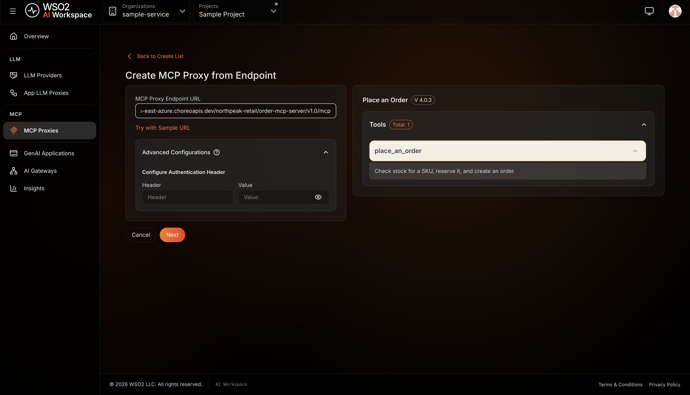
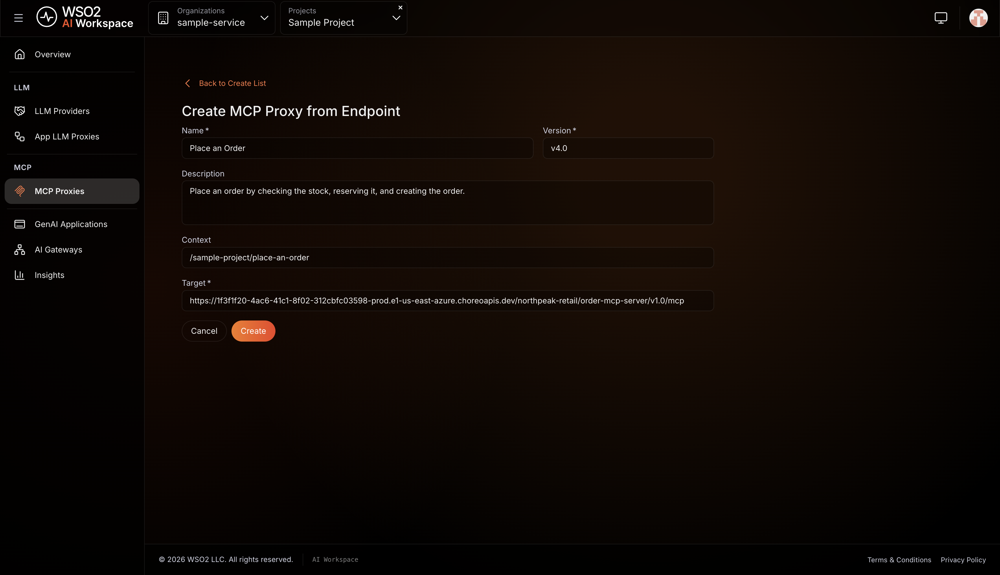
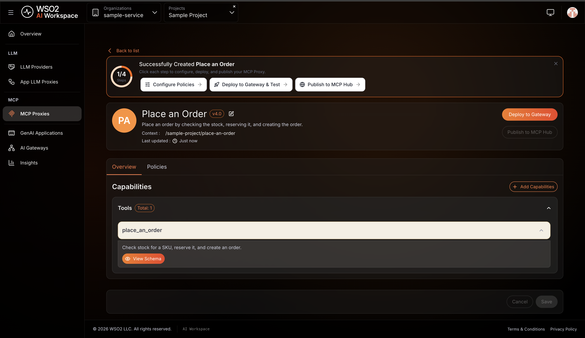
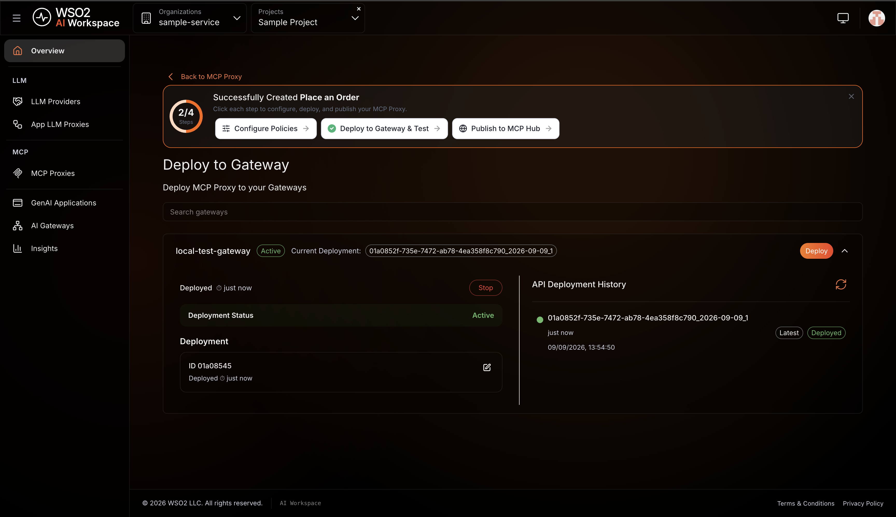

# Expose a multi-step API workflow as an MCP tool

## Overview

A REST API can be given to an AI agent as one MCP tool per endpoint. That's
manageable for a small API. It gets harder to rely on as the API grows, and it
falls short whenever the calls have to happen in a particular order.

- **The order of the calls has nowhere to live.** It survives only in the prompt
  you wrote for the agent, so you can't version it, test it, or review it.
- **The tool list fills up.** Every tool's schema is sent to the model on every
  request, and similar tools compete, so the model picks the wrong one or calls
  them out of order.
- **A half-finished sequence becomes the agent's problem.** The reservation
  succeeds, the order fails, and stock is held for an order that was never created.

The alternative: describe the sequence once as a workflow, and give the agent a
single tool that runs it.

In this guide you take three APIs, describe an ordering sequence over them in an
[Arazzo](https://spec.openapis.org/arazzo/latest.html) specification, generate an
MCP server from it, and expose that server through AI Workspace as a governed
MCP proxy.

## What you build

One tool, `place_an_order`, that runs three calls in order:

| Step | Call | Why it comes here |
|---|---|---|
| 1 | Check stock for the SKU | No point reserving what isn't there |
| 2 | Reserve the quantity | Holds the stock while the order is created |
| 3 | Create the order | Needs the reservation identifier from step 2 |

The agent makes one call and never sees the three.

## Prerequisites

- The APIs the workflow calls, and their OpenAPI definitions.
- Docker, to build and run the generated server.
- [`arazzo-mcp-gen`](https://github.com/wso2/arazzo-mcp-generator), from the
  releases page.
- Access to AI Workspace with the **Admin** or **Developer** role.
- An [AI Gateway](../../cloud/ai-workspace/ai-gateways/setting-up.md) you have set
  up and that shows **Active**.

## Step 1: Describe the sequence in Arazzo

Create a folder holding your OpenAPI definitions and one Arazzo file.

Name the APIs and the inputs the sequence takes:

```yaml
arazzo: "1.0.0"

info:
  title: Place an Order
  summary: Check stock, reserve it, and create the order.
  version: "1.0.0"

sourceDescriptions:
  - name: inventoryApi
    url: inventory-openapi.yaml
    type: openapi
  - name: reservationsApi
    url: reservations-openapi.yaml
    type: openapi
  - name: ordersApi
    url: orders-openapi.yaml
    type: openapi

workflows:
  - workflowId: placeAnOrder
    summary: Check stock for a SKU, reserve it, and create an order.
    description: >
      Use this when a customer wants to buy a product. Provide the SKU, the
      quantity, and the customer identifier. The workflow returns the order
      identifier and its status, or ends without ordering if stock is short.
    inputs:
      type: object
      required: [sku, quantity, customerId]
      properties:
        sku:
          type: string
          description: The product identifier to order.
        quantity:
          type: integer
          description: How many units the customer wants.
        customerId:
          type: string
          description: The customer placing the order.
```

Then the steps. Each names an operation by its `operationId`, says what counts as
success, and captures the values later steps need:

```yaml
    steps:
      - stepId: checkAvailability
        description: Check how many units are in stock.
        operationId: checkStock
        parameters:
          - name: sku
            in: path
            value: $inputs.sku
        successCriteria:
          - condition: $statusCode == 200
        outputs:
          available: $response.body#/available
        onSuccess:
          - name: enoughStockSoReserve
            type: goto
            stepId: reserveStock
            criteria:
              - context: $response.body
                condition: $.available >= 1
                type: jsonpath

      - stepId: reserveStock
        description: Reserve the requested quantity.
        operationId: reserveStock
        requestBody:
          contentType: application/json
          payload:
            sku: $inputs.sku
            quantity: $inputs.quantity
        successCriteria:
          - condition: $statusCode == 201
        outputs:
          reservationId: $response.body#/reservationId

      - stepId: createOrder
        description: Create the order against the reservation.
        operationId: createOrder
        requestBody:
          contentType: application/json
          payload:
            reservationId: $steps.reserveStock.outputs.reservationId
            customerId: $inputs.customerId
        successCriteria:
          - condition: $statusCode == 201
        outputs:
          orderId: $response.body#/orderId
          status: $response.body#/status

    outputs:
      orderId: $steps.createOrder.outputs.orderId
      status: $steps.createOrder.outputs.status
```

Three pieces of syntax carry the sequence:

- `$inputs.sku` passes a caller-supplied value into a step.
- `$steps.reserveStock.outputs.reservationId` passes a value from an earlier step
  into a later one. This is what the agent no longer has to track.
- `onSuccess` with a `goto` moves forward only when the condition holds. If stock
  is short, the workflow ends without reserving or ordering.

Validate before generating anything:

```bash
arazzo-mcp-gen validate -f ./order-workflow
```

!!! tip
    The workflow's `summary` and `description` become the tool description an AI
    model reads when it chooses a tool. Write them as guidance to a colleague.

## Step 2: Generate the MCP server

```bash
arazzo-mcp-gen mcp-server generate -f ./order-workflow -p 5000 -o ./artifacts
```

This produces `mcp_server.py`, a `Dockerfile`, and a built Docker image. Each
workflow becomes one tool, so `placeAnOrder` becomes `place_an_order`.

## Step 3: Run the MCP server

```bash
docker run -d --name order-mcp -p 5000:5000 <image-name>
```

Confirm it answers:

```bash
curl -X POST http://localhost:5000/mcp \
  -H 'Content-Type: application/json' \
  -H 'Accept: application/json, text/event-stream' \
  -d '{"jsonrpc":"2.0","id":1,"method":"initialize","params":{"protocolVersion":"2025-06-18","capabilities":{},"clientInfo":{"name":"probe","version":"1.0"}}}'
```

!!! warning "The server must be reachable from the internet"
    AI Workspace connects to this URL to fetch the tool list, and the gateway
    calls it at runtime, so a server on `localhost` won't work.
    To give it a public address, deploy the image on Choreo. See
    [Develop a service with Docker](https://wso2.com/choreo/docs/develop-components/develop-services/develop-a-service-with-docker/).

## Step 4: Create the MCP proxy

1. In AI Workspace, click **MCP** > **MCP Proxies** in the left navigation menu.
2. Click **+ Create MCP Proxy**.
3. Enter your MCP server URL, ending in `/mcp`. AI Workspace connects to it and
   lists the tools it finds. Wait for `place_an_order` to appear before continuing.

    

    If your MCP server requires credentials, enter them under **Advanced
    Configurations** before this step. AI Workspace uses them to fetch the tools.

4. Click **Next**.
5. Fill in the proxy details:

    | Field | What to enter |
    |---|---|
    | **Name** | A name for the proxy, such as `Place an Order` |
    | **Version** | Pre-filled, editable |
    | **Description** | What the proxy exposes |
    | **Context** | The base path for the proxy endpoint |
    | **Target** | Filled in from the URL you entered |

    

6. Click **Create**.

## Step 5: Check the tool

The proxy's **Overview** tab lists the capabilities it exposes. One tool,
`place_an_order`, with the description you wrote in the workflow. Click
**View Schema** to see the inputs it takes.



Nothing here was typed into a form. The tool, its description and its schema all
came from the Arazzo specification.

## Step 6: Deploy the proxy to a gateway

A proxy isn't reachable until you deploy it.

1. Click **Deploy to Gateway** on the proxy page.
2. Find the gateway you want, and click **Deploy**.
3. Expand the gateway card to confirm the **Deployment Status** is Active.



The proxy endpoint follows this format:

```text
https://{gateway-host}/{proxy-context}/mcp
```

That endpoint is what an AI agent connects to. Every call passes through the
gateway, where authentication, policies and observability apply, before the
workflow runs its three API calls.

## Step 7: Call the tool through the gateway

Ask the gateway endpoint what tools it exposes:

```bash
curl -sk -X POST https://{gateway-host}/{proxy-context}/mcp \
  -H 'Content-Type: application/json' \
  -H 'Accept: application/json, text/event-stream' \
  -d '{"jsonrpc":"2.0","id":1,"method":"tools/list"}'
```

One tool comes back, `place_an_order`, with `sku`, `quantity` and `customerId`
as its required inputs. That schema came from the Arazzo specification, not from
anything typed into a form.

You can also test it from the Developer Portal. Publish the proxy to the MCP Hub,
open it there, and use the **MCP Playground** to connect and run the tool.

!!! warning "The proxy has no authentication until you add it"
    A newly created proxy accepts any caller. Use the **Policies** tab to apply
    authentication and access control before exposing it to anything real.

## Troubleshooting

| Symptom | Resolution |
|---|---|
| AI Workspace can't fetch the tool list | The URL must end in `/mcp` and be reachable from the internet. A `localhost` address won't work. If the server needs credentials, set them under Advanced Configurations. |
| `arazzo-mcp-gen` reports an unresolved operation | An `operationId` in the workflow doesn't match any operation in the referenced OpenAPI definition. |
| A later step receives an empty value | The earlier step's `outputs` block doesn't capture the field, or the JSON pointer doesn't match the response body. |
| The tool runs but returns no outputs | A step didn't reach its API. Check that the `servers` URL in each OpenAPI definition is reachable from inside the container. |
| The proxy exists but calls fail | The proxy isn't deployed to a gateway. Deploying is a separate step from creating. |
| The workflow ends without creating an order | Expected when stock is short. The `onSuccess` condition stops the sequence. |
| macOS blocks `arazzo-mcp-gen` | The released binaries aren't signed. Run `xattr -d com.apple.quarantine arazzo-mcp-gen`. |

## What you learned

- Why a sequence of API calls is better described once, as a workflow, than left
  for an agent to work out each time.
- How to describe that sequence in an Arazzo specification.
- How to turn the specification into an MCP server, where one workflow becomes
  one tool.
- How to expose that server through AI Workspace as a governed MCP proxy, and
  call the tool through the gateway.

## Next steps

- **Apply policies to the proxy.** Use the **Policies** tab for access control,
  authorization and rewrite policies.
- **Add more workflows.** Each one becomes another tool.

## Try the sample

The companion sample runs this setup locally using a self-hosted gateway, so you
can generate an MCP server from an Arazzo workflow and call it through a gateway
without a cloud account.

[View the sample on GitHub](https://github.com/wso2/api-platform/tree/main/samples/rest-to-mcp)
